# Easter Eggs

Every year my plan is to find all the Easter eggs and every year I fail miserably. It's simply amazing how many things you can find once you start looking around for them, like movie references, jokes, nods to popular culture, memes, secret areas, references to past Holiday Hack Challenge, and funny WebSocket response messages. Below, in no particular order, are just a few.

## Four Calling Birds

Probably to no one's surprise, this year's [event announcement](https://www.sans.org/mlp/holiday-hack-challenge/) continues the KringleCon title trend set by previous iterations. 2019 was named *KringleCon 2: Turtle Doves*, in 2020 it was *KringleCon 3: French Hens*, and this time around we get *KringleCon 4: Calling Birds* which is a reference to the fourth verse from the [Twelve Days of Christmas](https://genius.com/Christmas-songs-the-twelve-days-of-christmas-lyrics) carol.

!!! abstract "The Twelve Days Of Christmas"
    ... 
    On the second day of Christmas 
    My true love gave to me: 
    **Two turtle doves** 
    ... 
    On the third day of Christmas 
    My true love gave to me: 
    **Three french hens** 
    ... 
    On the forth day of Christmas 
    My true love gave to me: 
    **Four calling birds** 
    ...

## The Third Kind

The big reveal at this year's event is of course the spaceship on the roof of Frost Tower. *The Third Kind* map destination, the [Speak & Spell music](https://speakandspell.kringlecastle.com/audio/tones.mp3), and the sound the spaceship makes [as it lands](https://2021.kringlecon.com/sfx/descent.mp3) are of course direct references to Spielberg's movie [Close Encounters of the Third Kind](https://www.imdb.com/title/tt0075860/). It seemed only fitting to make this year's [write-up poster](./img/misc/close_encounters.png) a reference to that movie as well.

<iframe width="850" height="478" src="https://www.youtube.com/embed/_yIp2huYgD8?start=81" title="YouTube video player" frameborder="0" allow="accelerometer; autoplay; clipboard-write; encrypted-media; gyroscope; picture-in-picture" allowfullscreen></iframe>

## Klatu Barada Nikto!

There's a second science-fiction movie reference when you first talk to Numby Chilblain on the Frost Tower rooftop and he says *"Klatu Barada Nikto!"*. This is a nod to the 1951 movie [The Day the Earth Stood Still](https://www.imdb.com/title/tt0043456/).

<iframe width="850" height="478" src="https://www.youtube.com/embed/v2vHJU_rFps?start=17" title="YouTube video player" frameborder="0" allow="accelerometer; autoplay; clipboard-write; encrypted-media; gyroscope; picture-in-picture" allowfullscreen></iframe>

## The Discworld

If you ride the Santavator or Frostavator to a floor that does not exist you end up in an area named *\_\_Shenanigans\_\_*. The room's [backdrop](./img/misc/turtles.jpg) is an image of [the Discworld](https://en.wikipedia.org/wiki/Discworld_(world)), a fictional setting for all of Terry Pratchett's Discworld fantasy novels. How to get here is explained as part of the [Frostavator](./hints/h13.md#shenanigans) terminal write-up.

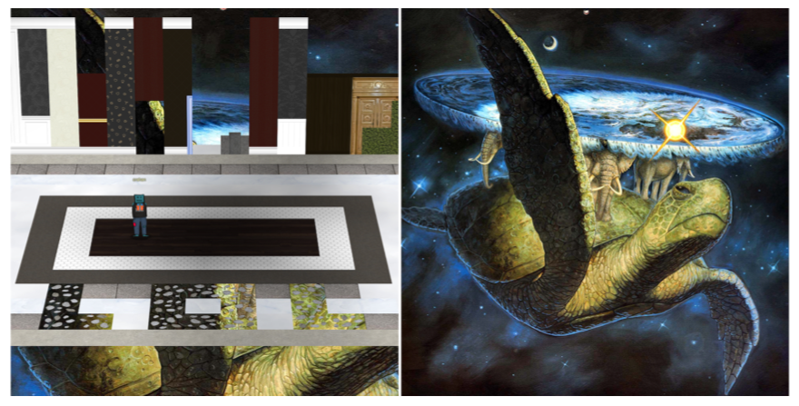

## Those darn interns!

Using [`get_ssrf_data.py`](./tools/objectives/o10/get_ssrf_data.py) to retrieve `/var/www/html/index.html` from the [Now Hiring!](./objectives/o10.md) challenge reveals a reference to the [SolarWinds](https://www.sans.org/blog/what-you-need-to-know-about-the-solarwinds-supply-chain-attack/) supply chain attack, where an intern was blamed for the insecure *solarwinds123* password.

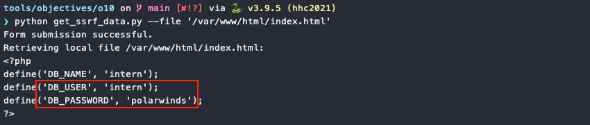

## Carmen Sandiego

The [first challenge](./objectives/o2.md) is a reference to the 1985 video game [Where in the World is Carmen Sandiego](https://en.wikipedia.org/wiki/Where_in_the_World_Is_Carmen_Sandiego%3F_(1985_video_game)).

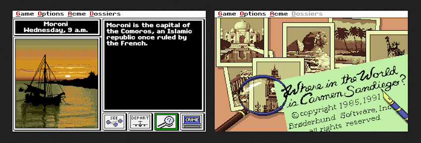

## Jason... the flush handle

Anyone who's played SANS Holiday Hack Challenge a few times before know he's always hidden somewhere in the game. This time around poor [Jason](https://twitter.com/BanjoCrashland/) gets assigned the not so glamorous role of toilet flush handle. At least it's a golden one.

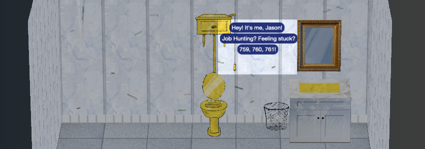

There's also some whimsicalness going on with some of the image assets in Jack's restroom. First, the asset name for the toilet image is `terrrlet.png` which, according to [Urban Dictionary](https://www.urbandictionary.com/define.php?term=Terlet), is how some people pronounce toilet. Secondly, the [back](./img/misc/restroom_wall_back.png), [left](./img/misc/restroom_wall_left.png), and [right](./img/misc/restroom_wall_right.png) walls are covered by transparent image overlays containing an assortment of signatures.

## Rihanna's umbrella

Another funny asset name can be found as part of the satellite dish contraption that Crunchy Squishter created to communicate with the Frostians. The asset name of the umbrella, `ellaellaeheheh.png`, is a reference to the song [Umbrella](https://www.youtube.com/watch?v=CvBfHwUxHIk) by Rihanna.

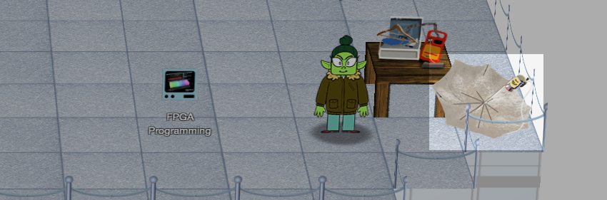{ class=border }

## Printer queue document

One of the PDF documents in the [printer queue](./objectives/o7.md) is a reference to [How to Win Friends and Influence People](https://en.wikipedia.org/wiki/How_to_Win_Friends_and_Influence_People) by Dale Carnegie.

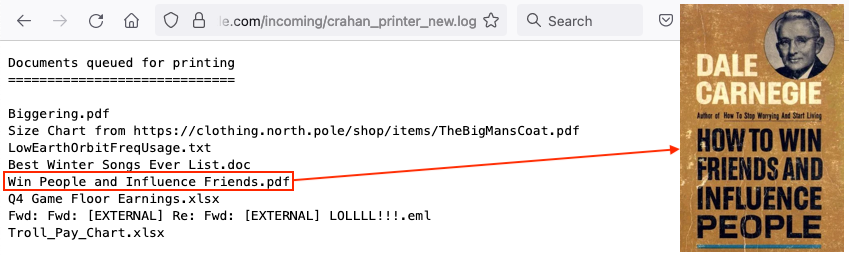{ class=border }

## Painting peephole

Last year's painting has been replaced, leaving a discolored outline on the wall. The [peephole eyes](https://n00.be/HolidayHackChallenge2020/easter_eggs/#painting-peephole-trope) are still present though!

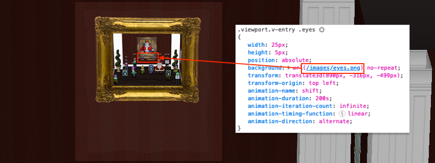{ class=border }

## Castle artwork

It looks like [last year's artwork](https://n00.be/HolidayHackChallenge2020/easter_eggs/#castle-artwork), which is cut from a single image, is still hanging on the walls in Santa's castle. If you [download](./tools/misc/get_artwork.sh) all the textures from `https://2021.kringlecon.com/textures/art/f{1-39}.png`, you can recreate [this painting](https://riseoftheguardians.fandom.com/wiki/Jack_Frost_(The_Guardians_of_Childhood)?file=JackFrost-PicBookWJ.jpg) of Jack Frost.

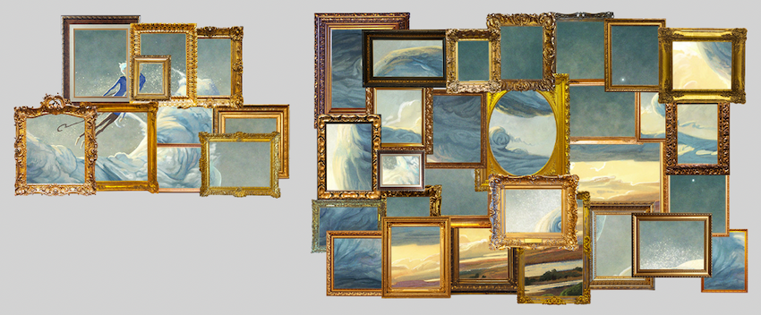

## Ille te videt dum dormit

The phrase *Ille te videt dum dormit* on the ElfU logo is Latin and translates to *he sees you while you're sleeping*.

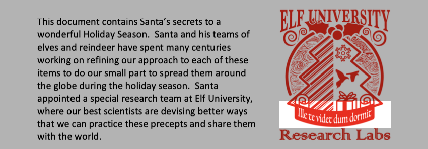

## Web socket messages

The WebSocket at `wss://2021.kringlecon.com/ws` is a lot of fun to play around with. The `WS_OHHIMARK` and `DENNIS_NEDRY` response message types are references to the movies [The Room](https://www.youtube.com/watch?v=aekfPU0SwNw) and [Jurassic Park](https://www.youtube.com/watch?v=aekfPU0SwNw), respectively.

=== ":material-message-text: WS_OHHIMARK"
    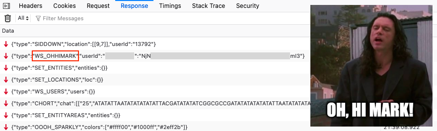{ class=border }

=== ":material-message-text: DENNIS_NEDRY"
    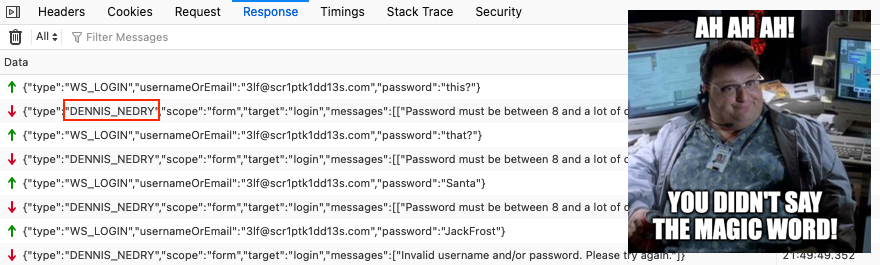{ class=border }

## Stolen KringleCon talks

!!! quote "Pat Tronizer"
    I'm SO glad to have all these first-rate talks here. 
    We issued a Call for Talks, but only one person responded… We put him in track 1. 
    But Jack came up with an ingenious way to borrow additional talks for FrostFest! You can hardly tell where we got these great speakers!

Jack Frost put absolutely 0 effort in creating original content which is pretty apparent when you put the [KringleCon 4](https://downloads.holidayhackchallenge.com/2021/KringleCon4_SpeakerAgenda.pdf) and [FrostFest](https://downloads.jackfrosttower.com/2021/FrostFest_SpeakerAgenda.pdf) speaker agendas side by side. The best part though is the camcorder overlay which was added to all the KringleCon talks.

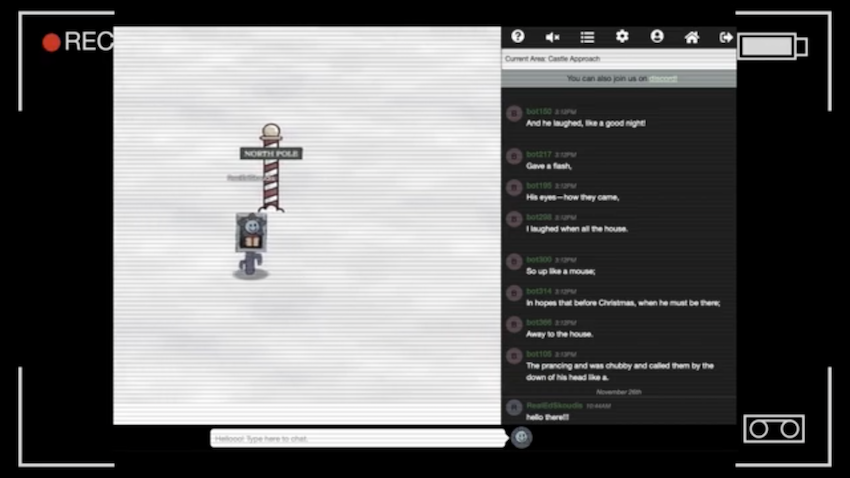

## Portrait painting

The [portrait painting](./img/misc/santa_portrait.png) in Jack's studio was a [key plot item](https://n00.be/HolidayHackChallenge2020/objectives/o5/#being-santa-claus) in last year's events. It features Ed Skoudis as Santa Claus and was painted by Ed's daughter Jessica Skoudis. The initials on the portrait not only refer to *Jack Frost: Santa*, as per the narrative, but are in fact Jessica's initials. The items on the desk are references to [past Holiday Hack Challenges](https://holidayhackchallenge.com/past-challenges/).

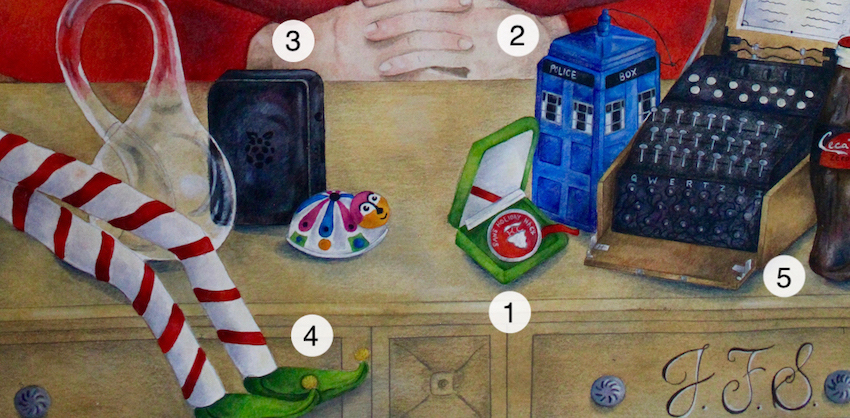

| :material-pound: | :material-egg-easter: Item | :material-pine-tree: Holiday Hack Challenge |
| :- | :------------- | :-------------------------------------------------------------------------------------------------------------------|
| 1  | Challenge coin | First introduced as an award in HHC 2019                                                                            |
| 2  | Tardis         | Seen on the [dorm wall](https://n00.be/HolidayHackChallenge2019/misc/interesting_ui/#dorm-access-code) in HHC 2019  |
| 3  | Cranberry Pi   | First appeared in HHC 2018                                                                                          |
| 4  | Gnome legs     | Also [created by Jessica Skoudis](https://twitter.com/edskoudis/status/675068303430295553) and featured in HHC 2015 |
| 5  | Enigma machine | Seen in [an image](./img/misc/hhc2012.jpg) for HHC 2012                                                             |
