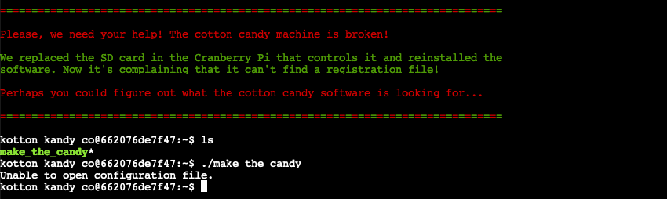
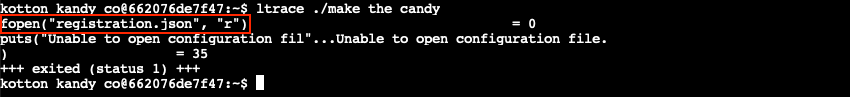
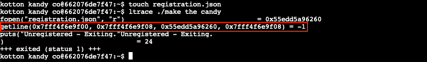
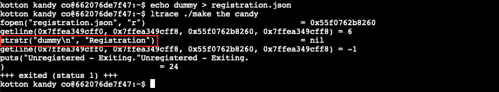
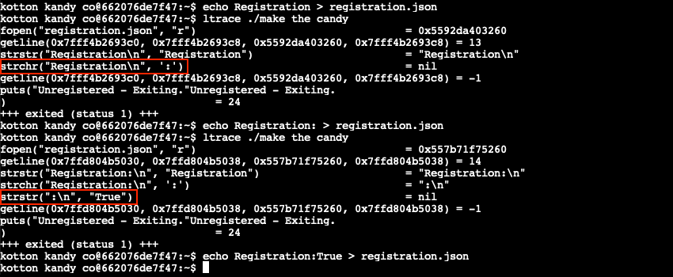
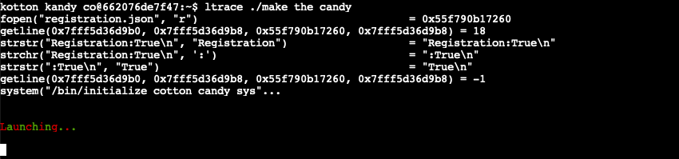

# Strace Ltrace Retrace

**Elf**: Tinsel Upatree<br/>
**Direct link**: [ltrace terminal](https://docker2021.kringlecon.com/?challenge=ltrace&id=b2a96a8d-52b6-4671-9f07-95bdfbc11f31)<br/>
**Objective**: [Customer Complaint Analysis](../objectives/o11.md)


## Request

!!! quote "Tinsel Upatree"
    Hiya hiya, I'm Tinsel Upatree!<br/>
    Say, do you know what's going on next door?<br/>
    I'm a bit worried about the whole FrostFest event.<br/>
    It feels a bit... ill-conceived, somehow. Nasty even.<br/>
    Well, regardless – and more to the point, what do you know about tracing processes in Linux?<br/>
    We rebuilt this here Cranberry Pi that runs the cotton candy machine, but we seem to be missing a file.<br/>
    Do you think you can use `strace` or `ltrace` to help us rebuild the missing config?<br/>
    We'd like to help some of our favorite children enjoy the sweet spun goodness again!<br/>
    And, if you help me with this, I'll give you some hints about using Wireshark filters to look for unusual options that might help you achieve Objectives here at the North Pole.


## Solution

??? abstract "Welcome message"
    ```text
    ================================================================================

    Please, we need your help! The cotton candy machine is broken!

    We replaced the SD card in the Cranberry Pi that controls it and reinstalled the
    software. Now it's complaining that it can't find a registration file!

    Perhaps you could figure out what the cotton candy software is looking for...

    ================================================================================
    ```

Debugging tools like [`ltrace`](https://www.man7.org/linux/man-pages/man1/ltrace.1.html) allow us to trace a program's execution flow by intercepting all of the dynamic library and system calls the program makes. Its verbose output can help to determine where and why exactly things are going wrong. Start by running the program normally using `./make_the_candy` to confirm we're indeed missing a configuration file.



Use `ltrace ./make_the_candy` to trace the program's execution and reveal the expected file name is `registration.json`.



Create the registration file with `touch registration.json` and run `ltrace` again. This time we get a different message telling us that the program is trying to *get* or read a line from the file. Since `registration.json` is still empty, this fails as well.



So, add some dummy data using `echo dummy > registration.json` and keep repeating the process.



From this point on the program will try to read data from the configuration file and compare it to several expected values, starting with *Registration*. Use the `ltrace` output to determine what the final string should look like and gradually update the configuration file's content using `echo` statements like we did in the previous step.



After updating the contents of `registration.json` with *Registration:True* the program runs as expected!




## Response

!!! quote "Tinsel Upatree"
    Great! Thanks so much for your help!<br/>
    I'm sure I can put those skills I just learned from you to good use.<br/>
    Are you familiar with [RFC3514](https://datatracker.ietf.org/doc/html/rfc3514)?<br/>
    [Wireshark](https://www.wireshark.org/) uses a different name for the Evil Bit: `ip.flags.rb`.<br/>
    HTTP responses are often gzip compressed. Fortunately, Wireshark decompresses them for us automatically.<br/>
    You can search for strings in Wireshark fields using [display filters](https://wiki.wireshark.org/DisplayFilters) with the `contains` keyword.
