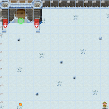
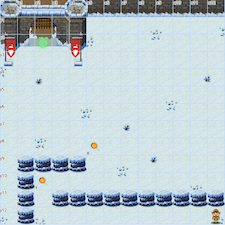
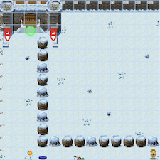
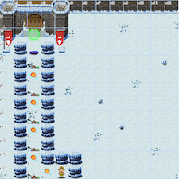
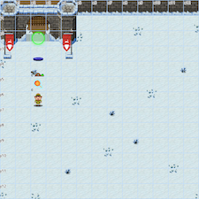
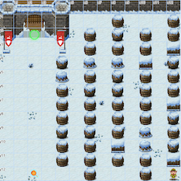
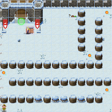
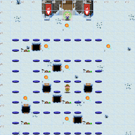
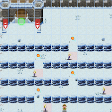

# The Elf C0de

**Elf**: Ribb Bonbowford<br/>
**Direct link**: [elfcode website](https://elfcode21.kringlecastle.com?challenge=elfcode&id=af3a9316-2aac-4707-b8ae-b765255b6f30)<br/>
**Objective**: [Frost Tower Website Checkup](../objectives/o12.md)


## Request

!!! quote "Ribb Bonbowford"
    Hello, I'm Ribb Bonbowford. Nice to meet you!<br/>
    Are you new to programming? It's a handy skill for anyone in cyber security.<br/>
    This here machine lets you control an Elf using Python 3. It's pretty fun, but I'm having trouble getting beyond Level 8.<br/>
    Tell you what… if you help me get past Level 8, I'll share some of my SQLi tips with you. You may find them handy sometime around the North Pole this season.<br/>
    Most of the information you'll need is provided during the game, but I'll give you a few more pointers, if you want them.<br/>
    Not sure what a lever requires? Click it in the `Current Level Objectives` panel.<br/>
    You can move the elf with commands like `elf.moveLeft(5)`, `elf.moveTo({"x":2,"y":2})`, or `elf.moveTo(lever0.position)`.<br/>
    Looping through long movements? Don't be afraid to `moveUp(99)` or whatever. You elf will stop at any obstacle.<br/>
    You can call functions like `myFunction()`. If you ever need to pass a function to a munchkin, you can use `myFunction` without the `()`.


## Hints

??? hint "Moving the Elf"
    You can move the elf with commands like `elf.moveLeft(5)`, `elf.moveTo({"x":2,"y":2})`, or `elf.moveTo(lever0.position)`.

??? hint "Lever Requirements"
    Not sure what a lever requires? Click it in the `Current Level Objectives` panel.

??? hint "Bumping into Walls"
    Looping through long movements? Don't be afraid to `moveUp(99)` or whatever. You elf will stop at any obstacle.

??? hint "Function Calls"
    You can call functions like `myFunction()`. If you ever need to pass a function to a munchkin, you can use `myFunction` without the `()`.


## Solution

This is a [similar challenge](https://n00.be/HolidayHackChallenge2020/hints/h4b/) to last year's event, but using Python instead of JavaScript. Only the first 8 levels count towards solving the challenge. Bonus levels 9 and 10 are not required (but are a lot of fun). Some of the scripts include additional empty lines to enhance readability, but all solutions still fit within the maximum line requirements. 


### Main levels

!!! done "Level 1"
    { align=left }
    ```python linenums="1"
    import elf, munchkins, levers, lollipops, yeeters, pits
    elf.moveLeft(10)
    elf.moveUp(100)
    ```

!!! done "Level 2"
    { align=left }
    ```python linenums="1"
    import elf, munchkins, levers, lollipops, yeeters, pits
    elf.moveTo(lollipops.get(1).position)
    elf.moveTo(lollipops.get(0).position)
    elf.moveLeft(3)
    elf.moveUp(100)
    ```

!!! done "Level 3"
    { align=left }
    ```python linenums="1"
    import elf, munchkins, levers, lollipops, yeeters, pits
    lever = levers.get(0)
    elf.moveTo(lever.position)
    lever.pull(lever.data() + 2)
    elf.moveTo(lollipops.get(0).position)
    elf.moveUp(100)
    ```

!!! done "Level 4"
    { align=left }
    ```python linenums="1"
    import elf, munchkins, levers, lollipops, yeeters, pits
    data = [{}, [], 1, True, "A String"]

    for i in [4, 3, 2, 1, 0]:
        elf.moveTo(levers.get(i).position)
        levers.get(i).pull(data[i])
        
    elf.moveUp(100)
    ```

!!! done "Level 5"
    { align=left }
    ```python linenums="1"
    import elf, munchkins, levers, lollipops, yeeters, pits
    lever0, lever1, lever2, lever3, lever4 = levers.get()
    elf.moveTo(lever4.position)
    lever4.pull(lever4.data() + " concatenate")

    elf.moveTo(lever3.position)
    lever3.pull(not lever3.data())

    elf.moveTo(lever2.position)
    lever2.pull(lever2.data() + 1)

    elf.moveTo(lever1.position)
    data = lever1.data()
    data.append(1)
    lever1.pull(data)

    elf.moveTo(lever0.position)
    data = lever0.data()
    data['strkey'] = 'strvalue'
    lever0.pull(data)

    elf.moveUp(100)
    ```

!!! done "Level 6"
    { align=left }
    ```python linenums="1"
    import elf, munchkins, levers, lollipops, yeeters, pits
    lever = levers.get(0)
    data = lever.data()

    if type(data) == bool:
        data = not data
    elif type(data) == int:
        data = data * 2
    elif type(data) == list:
        data = [x+1 for x in data]
    elif type(data) == str:
        data += data
    elif type(data) == dict:
        data['a'] += 1

    elf.moveTo(lever.position)
    lever.pull(data)
    elf.moveUp(100)
    ```

!!! done "Level 7"
    { align=left }
    ```python linenums="1"
    import elf, munchkins, levers, lollipops, yeeters, pits
    action = [elf.moveUp, elf.moveDown]

    for num in range(5):
        elf.moveLeft(3)
        action[num%2](15)
    ```

!!! done "Level 8"
    { align=left }
    ```python linenums="1"
    import elf, munchkins, levers, lollipops, yeeters, pits

    for lollipop in lollipops.get():
        elf.moveTo(lollipop.position)

    elf.moveLeft(8)
    munchkin = munchkins.get(0)
    elf.moveTo(munchkin.position)
    much_dict = munchkin.ask()
    munchkin.answer(list(much_dict.keys())[list(much_dict.values()).index('lollipop')])
    elf.moveUp(100)
    ```


### Bonus levels

!!! done "Level 9"
    { align=left }
    ```python linenums="1"
    import elf, munchkins, levers, lollipops, yeeters, pits

    def tally_ints(list_of_lists):
        the_sum = 0
        
        for a_list in list_of_lists:
            for item in a_list:
                if type(item) == int:
                    the_sum += item
        
        return the_sum

    all_levers = levers.get()
    moves = [elf.moveDown, elf.moveLeft, elf.moveUp, elf.moveRight] * 2

    for i, move in enumerate(moves):
        move(i+1)
        if i < len(all_levers):
            all_levers[i].pull(i) 

    elf.moveUp(2)
    elf.moveLeft(4)
    munchkin = munchkins.get(0)
    munchkin.answer(tally_ints)
    elf.moveUp(100)
    ```

!!! done "Level 10"
    { align=left }
    ```python linenums="1"
    import elf, munchkins, levers, lollipops, yeeters, pits
    import time
    muns = munchkins.get()
    steps_horiz = [3, 4, 4, 4]
    move_horiz = [elf.moveLeft, elf.moveRight] * 2

    for index, mun in enumerate(muns):
        while abs(elf.position["x"]-mun.position['x']) < 6:
            time.sleep(0.05)
        
        move_horiz[index](steps_horiz[index])
        elf.moveUp(2)

    elf.moveLeft(6)
    elf.moveUp(100)
    ```


## Response

!!! quote "Ribb Bonbowford"
    Gosh, with skills like that, I'll bet you could help figure out what's really going on next door...<br/>
    And, as I promised, let me tell you what I know about SQL injection.<br/>
    I hear that having source code for vulnerability discovery dramatically changes the vulnerability discovery process.<br/>
    I imagine it changes how you approach an assessment too.<br/>
    When you have the source code, API documentation becomes [tremendously](https://www.npmjs.com/package/express-session) [valuable](https://github.com/mysqljs/mysql).<br/>
    Who knows? Maybe you'll even find more than one vulnerability in the code.<br/>
    Wow - even the bonus levels! That's amazing!
