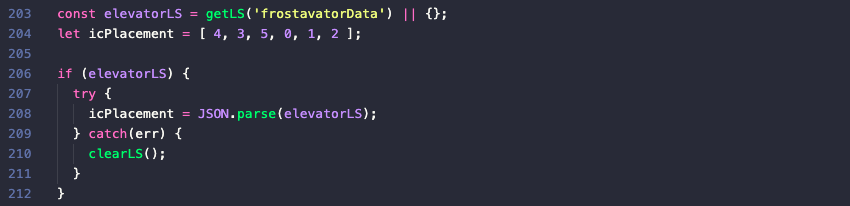
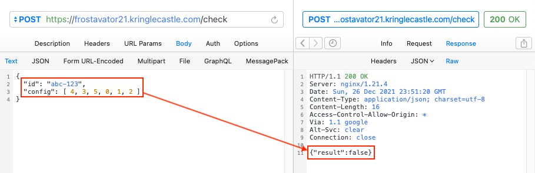
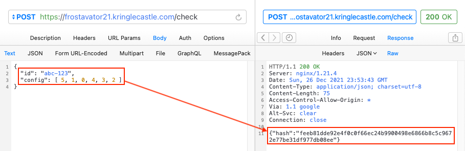
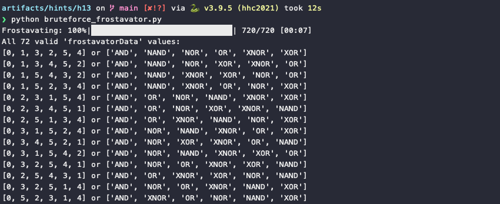
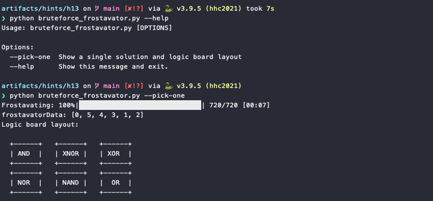
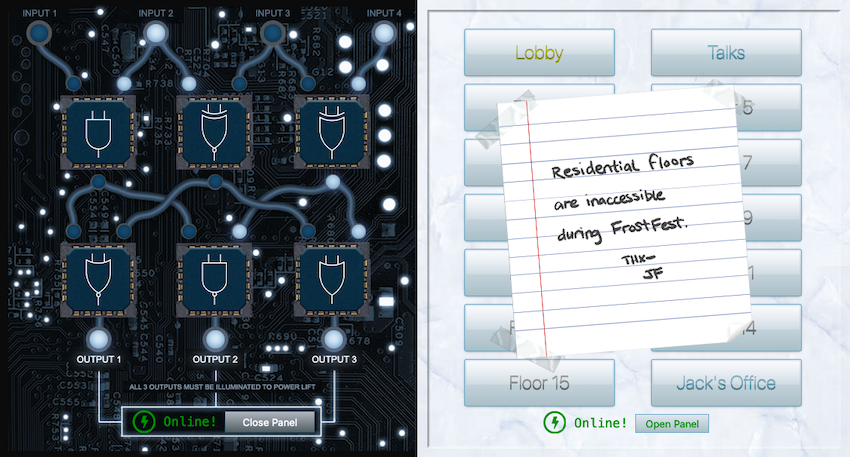

# Frostavator

**Elf**: Grody Goiterson<br/>
**Direct link**: [frostavator website](https://frostavator21.kringlecastle.com?challenge=frostavator&id=105dca6f-8473-4bc6-b97f-ff0132c0f812)<br/>
**Objective**: [FPGA Programming](../objectives/o13.md)


## Request

!!! quote "Grody Goiterson"
    Hrmph. Snrack! Pthbthbthb.<br/>
    Gnerphk. Well, on to business.<br/>
    I'm Grody Goiterson. ... It's a family name.<br/>
    So hey, this is the Frostavator. It runs on some logic chips... that fell out.<br/>
    I put them back in, but I must have mixed them up, because it isn't working now.<br/>
    If you don't know much about logic gates, it's something you should look up.<br/>
    If you help me run the elevator, maybe I can help you with something else.<br/>
    I'm pretty good with FPGAs, if that's worth something to ya'.


## Hints

??? hint "Logic Gate Iconography"
    [This](https://www.geeksforgeeks.org/introduction-of-logic-gates/)


## Solution

There's three ways to approach this. The first option is to ignore the elevator and just use the stairs. Option two is take the time to learn about [logic gates](https://www.geeksforgeeks.org/introduction-of-logic-gates/) and drag and drop the components on the Frostavator panel around until we end up with a valid solution. The final option is to bruteforce the Frostavator and compile a list of all the valid panel layouts. The first leaves us without a hint, the second is the most educational, the third however is probably the most fun! :smile:

The [`app.js`](../artifacts/hints/h13/app.js) code tells us that the panel layout is stored as an Array of 6 integers ranging from 0 to 5. The code first tries to load the data from a local storage variable called `frostavatorData`. If that's not available, the layout defaults to [ 4, 3, 5, 0, 1, 2 ]. Each number in the list corresponds with a type of logic gate, while the number's position in the list defines its location on the panel.



Each time we drag one of the ICs around and let go of the mouse button, the `gateCheck()` function is executed which validates the current panel layout. If everything checks out the layout is then sent via a POST request to `/check`. While the POST request is shielded by some validation logic in `app.js`, all it really requires as input is an ID and a list representation of a panel layout. We can confirm this by sending a manual POST request and capturing the response.

=== ":material-web-cancel: POST request with an invalid layout"
    {: class=border }

=== ":material-web-check: POST request with a valid layout"
    {: class=border }

An invalid panel layout returns a `result` field set to *false*. Generating all 720 [permutations](https://en.wikipedia.org/wiki/Permutation) of [ 0, 1, 2, 3, 4, 5 ] and sending each one to the `/check` endpoint for validation will at some point respond with a `hash` field and value instead, indicating that particular sequence is a valid one. Now that we know the difference between valid and invalid, we can finalize the "automation".

??? example ":material-file-outline: bruteforce_frostavator.py"
    ```python linenums="1"
    #!/usr/bin/env python
    import asyncio
    import itertools
    import random
    from typing import Optional, Tuple

    import aiohttp
    import click
    import tqdm

    GATES = ['AND', 'NAND', 'OR', 'NOR', 'XOR', 'XNOR']


    def create_ascii_board(layout: list):
        """Print an ASCII board layout."""
        g0 = f"{GATES[layout[0]]:^6}"
        g1 = f"{GATES[layout[1]]:^6}"
        g2 = f"{GATES[layout[2]]:^6}"
        g3 = f"{GATES[layout[3]]:^6}"
        g4 = f"{GATES[layout[4]]:^6}"
        g5 = f"{GATES[layout[5]]:^6}"

        return (
            "Logic board layout:\n\n"
            "  +------+   +------+   +------+\n"
            f"  |{g0}|   |{g1}|   |{g2}|\n"
            "  +------+   +------+   +------+\n"
            "  +------+   +------+   +------+\n"
            f"  |{g3}|   |{g4}|   |{g5}|\n"
            "  +------+   +------+   +------+"
        )


    async def fetch(session: aiohttp.ClientSession, perm: Tuple[int, ...]) -> Tuple[Optional[str], Tuple[int, ...]]:
        """Have the Frostavator check a single permutation.time"""
        url = "https://frostavator21.kringlecastle.com/check"
        headers = {'dataType': 'json', 'contentType': 'application/json'}
        data = {'id': "abc-123", 'config': perm}

        async with session.post(url, headers=headers, json=data) as response:
            resp = await response.json()
            return resp.get('hash', None), perm


    async def bruteforce(pick_one: bool):
        """Bruteforce the Frostavator."""
        async with aiohttp.ClientSession() as session:
            # Calculate all possible permutations for the 6 logic gates
            perms = itertools.permutations([0, 1, 2, 3, 4, 5])

            # Send out a '/check' request for each permutation
            tasks = []

            for perm in perms:
                tasks.append(asyncio.create_task(fetch(session, perm)))

            # Gather the results
            results = []
            bar_format = "{l_bar}{bar:30}| {n_fmt}/{total_fmt} [{elapsed}]"
            progressbar = tqdm.tqdm(asyncio.as_completed(tasks), total=len(tasks), bar_format=bar_format)
            progressbar.set_description("Frostavating")

            for step in progressbar:
                results.append(await step)

            # Filter out invalid values
            valids = [x[1] for x in results if x[0]]

            if pick_one:
                # Print one random entry
                winner = list(valids[random.randrange(0, len(valids))])
                print(f"frostavatorData: {winner}")
                print(create_ascii_board(winner))
            else:
                # Print all entries
                print(f"All {len(valids)} valid 'frostavatorData' values:")

                for valid in valids:
                    print(f"{list(valid)} or {[GATES[x] for x in valid]}")


    @click.command()
    @click.option('--pick-one', is_flag=True, help='Show a single solution and logic board layout.')
    def cli(pick_one: bool):
        asyncio.run(bruteforce(pick_one))


    if __name__ == '__main__':
        cli()
    ```

Using the custom [`bruteforce_frostavator.py`](../tools/hints/h13/bruteforce_frostavator.py) script we end up with [72 valid](../tools/hints/h13/valid_combinations.txt) panel layouts. In other words, if you opted for randomly dragging ICs around to solve this challenge, you had a 1 in 10 chance of hitting a valid layout.



To make life a little easier, the script also supports a `--pick-one` option which prints an additional ASCII panel layout. :thumbsup:



Now that we have all the [valid layouts](../tools/hints/h13/valid_combinations.txt), we can copy one of the solutions from the script output into the `frostavatorData` local storage variable and reload the page to have the JavaScript code pick up the new value. Alternatively we can drag and drop the ICs on the panel to match the ASCII representation provided by the `--pick-one` option.




!!! note "Secret *\_\_Shenanigans\_\_* area<span id="shenanigans"></span>"
    There's a note on the Frostavator panel telling us that the residential floors aren't accessible during FrostFest. But hey, might as well poke around at that panel some more, right? Use your web browser's console to set `targetFloor` to an unused value (line 1) and run the below code snippet taken from [`app.js`](../artifacts/hints/h13/app.js). You'll be taken to a hidden *\_\_Shenanigans\_\_* area. See the [Easter Eggs](http://127.0.0.1:8000/HolidayHackChallenge2021/easter_eggs/#the-discworld) section for additional details. This works for both the Santavator and Frostavator.

    ```javascript linenums="1" hl_lines="1" title="Change to another floor"
    targetFloor = 100

    $.ajax({
        type: 'POST',
        url: POST_URL,
        dataType: 'json',
        contentType: 'application/json',
        data: JSON.stringify({ 
            targetFloor,
            id: getParams.id,
        }),
        success: (res, status) => {
            if (res.hash) {
            __POST_RESULTS__({
                resourceId: getParams.id || '1111',
                hash: res.hash,
                action: `goToFloor-${targetFloor}`,
            });
            closeChallenge();
            }
        }
    });
    ```


## Response

!!! quote "Grody Goiterson"
    Oooo... That's it!<br/>
    A deal's a deal. Let's talk FPGA.<br/>
    First, did you know there are people who do this stuff [for fun](https://www.fpga4fun.com/MusicBox.html)??<br/>
    I mean, I'm more into picking on other trolls for fun, but whatever.<br/>
    Also, that Prof. Petabyte guy is giving [a talk](https://www.youtube.com/watch?v=GFdG1PJ4QjA) about FPGAs. Weirdo.<br/>
    So hey, good luck or whatever.
