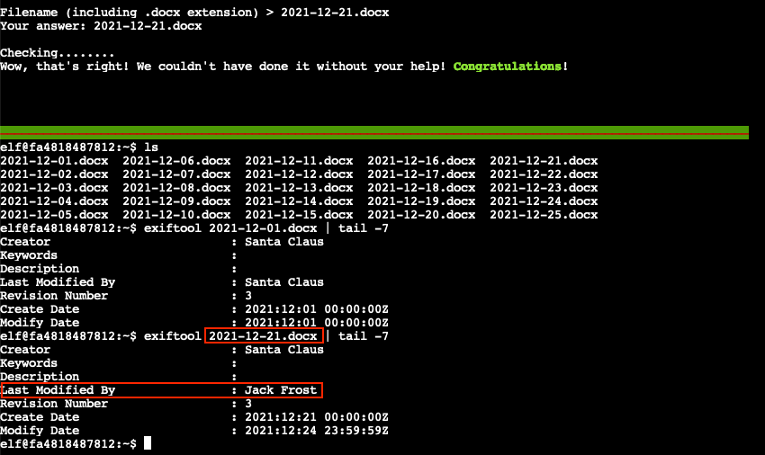
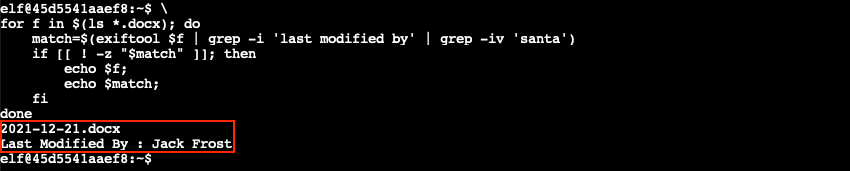

# Exif Metadata

**Elf**: Piney Sappington<br/>
**Direct link**: [exif terminal](https://docker2021.kringlecon.com/?challenge=exif&id=b0f366cc-14c0-4ac3-b418-1814082c4130)<br/>
**Objective**: [Where in the World is Caramel Santaigo?](../objectives/o2.md)


## Request

!!! quote "Piney Sappington"
    Hi ho, Piney Sappington at your service!<br/>
    Well, honestly, I could use a touch of your services.<br/>
    You see, I've been looking at these documents, and I know someone has tampered with one file.<br/>
    Do you think you could log into this Cranberry Pi and take a look?<br/>
    It has exiftool installed on it, if that helps you at all.<br/>
    I just... Well, I have a feeling that someone at that other conference might have fiddled with things.<br/>
    And, if you help me figure this tampering issue out, I'll give you some hints about OSINT, especially associated with geographic locations!


## Solution

??? abstract "Welcome message"
    ```text
    HELP! That wily Jack Frost modified one of our naughty/nice records, and right 
    before Christmas! Can you help us figure out which one? We've installed exiftool
    for your convenience!

    Filename (including .docx extension) > 
    ```

Using `exiftool` we can check the `Last Modified By` field in each document's metadata to verify who tampered with it last. For convenience we pipe the output to `tail -7` to only print the last 7 lines. `2021-12-21.docx` stands out from the rest because it shows that Jack Frost was the one who made the final edit and not Santa Claus. 



Instead of manually checking each file, we can also write a short [Bash script](../tools/hints/h2/find_file.sh) which loops over each file (line 2) and retrieves the `Last Modified By` property from the document's metadata if it doesn't contain the word *santa* ([line 3](https://explainshell.com/explain?cmd=exiftool+%24f+%7C+grep+-i+%27last+modified+by%27+%7C+grep+-iv+%27santa%27)). When there's a match, the filename and the `Last Modified By` information are printed (lines 5-6).

!!! example "find_file.sh"
    ```bash linenums="1"
    #!/usr/bin/env bash
    for f in $(ls *.docx); do 
        match=$(exiftool $f | grep -i 'last modified by' | grep -iv 'santa')
        if [[ ! -z "$match" ]]; then 
            echo $f;
            echo $match;
        fi
    done
    ```



Looking at the file's [revision history](../artifacts/hints/h2/2021-12-21.docx), it appears that Jack Frost added Noxious O. D'or to the top of the *Nice* list!

{ class=border }

!!! done "Answer"
    `2021-12-21.docx`


## Response

!!! quote "Piney Sappington"
    Wow, you figured that out in no time! Thanks!<br/>
    I knew they were up to no good.<br/>
    So hey, have you tried the Caramel Santaigo game in this courtyard?<br/>
    Carmen? No, I haven't heard of her.<br/>
    So anyway, some of the hints use obscure coordinate systems like [MGRS](https://en.wikipedia.org/wiki/Military_Grid_Reference_System) and even [what3words](https://what3words.com/).<br/>
    In some cases, you might get an image with location info in the metadata. Good thing you know how to see that stuff now!<br/>
    (And they say, for those who *don't* like gameplay, there might be a way to bypass by looking at some flavor of cookie...)<br/>
    Oh, and don't forget to learn about your target elf and filter in the Interrink system!
