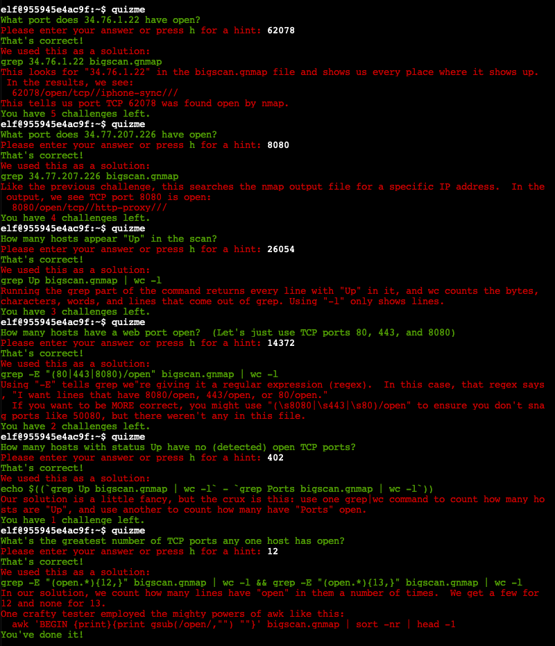
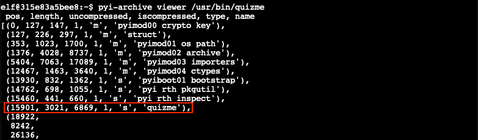
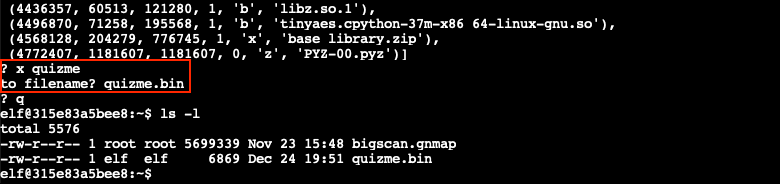
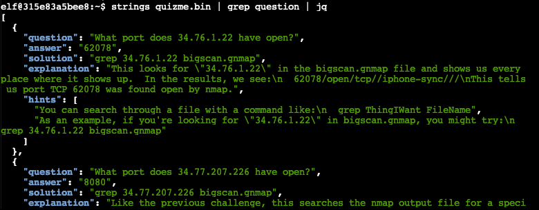

# Grepping for Gold

**Elf**: Greasy Gopherkins<br/>
**Direct link**: [gnmap terminal](https://docker2021.kringlecon.com/?challenge=gnmap&id=5fa54eec-71f4-4608-b9ed-b07ec8f93c4a)<br/>
**Objective**: [Thaw Frost Tower's Entrance](../objectives/o3.md)


## Request

!!! quote "Greasy Gopherguts"
    Grnph. Blach! Phlegm.<br/>
    I'm Greasy Gopherguts. I need help with parsing some Nmap output.<br/>
    If you help me find some results, I'll give you some hints about Wi-Fi.<br/>
    Click on the terminal next to me and read the instructions.<br/>
    Maybe search for a cheat sheet if the hints in the terminal don't do it for ya'.<br/>
    You'll type `quizme` in the terminal and `grep` through the Nmap bigscan.gnmap file to find answers.


## Hints

??? hint "Grep Cheat Sheet"
    Check [this](https://ryanstutorials.net/linuxtutorial/cheatsheetgrep.php) out if you need a `grep` refresher.


## Solution

??? abstract "Welcome message"
    ```text
    Howdy howdy!  Mind helping me with this homew- er, challenge?
    Someone ran nmap -oG on a big network and produced this bigscan.gnmap file.
    The quizme program has the questions and hints and, incidentally,
    has NOTHING to do with an Elf University assignment. Thanks!

    Answer all the questions in the quizme executable:
    - What port does 34.76.1.22 have open?
    - What port does 34.77.207.226 have open?
    - How many hosts appear "Up" in the scan?
    - How many hosts have a web port open?  (Let's just use TCP ports 80, 443, and 8080)
    - How many hosts with status Up have no (detected) open TCP ports?
    - What's the greatest number of TCP ports any one host has open?

    Check out bigscan.gnmap and type quizme to answer each question.
    ```

Many of the terminals at KringleCon are designed to help you get acquainted with a specific technology or tool. Last year it was a [Linux primer](https://n00.be/HolidayHackChallenge2020/hints/h3/), this time around we get to learn all about [`grep`](https://www.man7.org/linux/man-pages/man1/grep.1.html). The Answers section below provides a copy/pastable overview of all commands. All entries also link to [explainshell.com](https://explainshell.com/) which provides a more in-depth explanation.

Oh, and if you don't have time for all of that, scroll down a little... :smile:

!!! done "Answers"
    Q: What port does 34.76.1.22 have open?<br/>
    C: [`grep '34.76.1.22' bigscan.gnmap`](https://explainshell.com/explain?cmd=grep+%2734.76.1.22%27+bigscan.gnmap)<br/>
    A: 62078

    Q: What port does 34.77.207.226 have open?<br/>
    C: [`grep '34.77.207.226' bigscan.gnmap`](https://explainshell.com/explain?cmd=grep+%2734.77.207.226%27+bigscan.gnmap)<br/>
    A: 8080

    Q: How many hosts appear "Up" in the scan?<br/>
    C: [`grep -i 'Status: Up' bigscan.gnmap | wc -l`](https://explainshell.com/explain?cmd=grep+-i+%27Status%3A+Up%27+bigscan.gnmap+%7C+wc+-l)<br/>
    A: 26054

    Q: How many hosts have a web port open? (Let's just use TCP ports 80, 443, and 8080)<br/>
    C: [`grep '80/open/tcp\|443/open/tcp\|8080/open/tcp' bigscan.gnmap | wc -l`](https://explainshell.com/explain?cmd=grep+%2780%2Fopen%2Ftcp%5C%7C443%2Fopen%2Ftcp%5C%7C8080%2Fopen%2Ftcp%27+bigscan.gnmap+%7C+wc+-l)<br/>
    A: 14372

    Q: How many hosts with status Up have no (detected) open TCP ports?<br/>
    C: [`echo $(expr $(grep -i 'Status: Up' bigscan.gnmap | wc -l) - $(grep -i '/open/' bigscan.gnmap | wc -l))`](https://explainshell.com/explain?cmd=echo+%24%28expr+%24%28grep+-i+%27Status%3A+Up%27+bigscan.gnmap+%7C+wc+-l%29+-+%24%28grep+-i+%27%2Fopen%2F%27+bigscan.gnmap+%7C+wc+-l%29%29)<br/>
    A: 402

    Q: What's the greatest number of TCP ports any one host has open?<br/>
    C: [`grep -E '(.*/open/.*///,?\s){12}' bigscan.gnmap`](https://explainshell.com/explain?cmd=grep+-E+%27%28.*%2Fopen%2F.*%2F%2F%2F%2C%3F%5Cs%29%7B12%7D%27+bigscan.gnmap) and [`grep -E '(.*/open/.*///,?\s){13}' bigscan.gnmap`](https://explainshell.com/explain?cmd=grep+-E+%27%28.*%2Fopen%2F.*%2F%2F%2F%2C%3F%5Cs%29%7B13%7D%27+bigscan.gnmap)<br/>
    A: 12



!!! note "Extracting the answers from the `quizme` binary<span id="cheating"></span>"

    If putting in the time and effort to learn about `grep` isn't your thing, then you're in luck! Someone was nice enough to leave a copy of the [`pyi-archive_viewer`](https://pyinstaller.readthedocs.io/en/stable/advanced-topics.html#using-pyi-archive-viewer) command in `/usr/local/bin` which you can use to inspect and extract data from archives and executables created with [PyInstaller](https://pyinstaller.readthedocs.io/en/stable/), like `/usr/bin/quizme`.
    
    Run `pyi-archive_viewer /usr/bin/quizme` to view all available components in the `quizme` binary.

    

    Extract the `quizme` component to `quizme.bin` using `x quizme`.

    
    
    Finally, use `strings quizme.bin | grep question | jq` to grab the [JSON data](../artifacts/hints/h3/quizme.json) with the answers from the `quizme.bin` file. :joy:

    


## Response

!!! quote "Greasy Gopherguts"
    Grack. Ungh. ... Oh!<br/>
    You really did it?<br/>
    Well, OK then. Here's what I know about the wifi here.<br/>
    Scanning for Wi-Fi networks with iwlist will be location-dependent. You may need to move around the North Pole and keep scanning to identify a Wi-Fi network.<br/>
    Wireless in Linux is supported by many tools, but `iwlist` and `iwconfig` are commonly used at the command line.<br/>
    The `curl` utility can make HTTP requests at the command line!<br/>
    By default, `curl` makes an HTTP GET request. You can add `--request POST` as a command line argument to make an HTTP POST request.<br/>
    When sending HTTP POST, add `--data-binary` followed by the data you want to send as the POST body.
