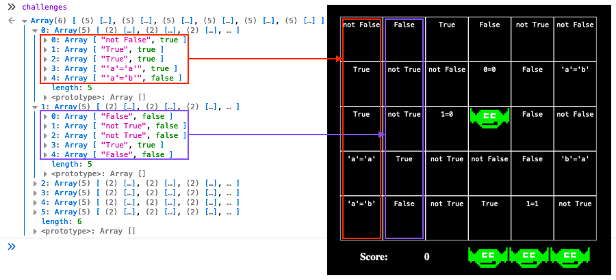

# Logic Munchers

**Elf**: Noel Boetie<br/>
**Direct link**: [logicmunchers terminal](https://logic.kringlecastle.com/?challenge=logicmunchers&id=1fd18a8e-7997-463c-9c0c-79f6bf7e0612)<br/>
**Objective**: [Slot Machine Investigation](../objectives/o4.md)


## Request

!!! quote "Noel Boetie"
    Hello there! Noel Boetie here. We're all so glad to have you attend KringleCon IV and work on the Holiday Hack Challenge!<br/>
    I'm just hanging out here by the Logic Munchers game.<br/>
    You know... logic: that thing that seems to be in short supply at the tower on the other side of the North Pole?<br/>
    Oh, I'm sorry. That wasn't terribly kind, but those frosty souls do confuse me...<br/>
    Anyway, I'm working my way through this Logic Munchers game.<br/>
    A lot of it comes down to understanding boolean logic, like `True And False` is `False`, but `True And True` is `True`.<br/>
    It *can* get a tad complex in the later levels.<br/>
    I need some help, though. If you can show me how to complete a stage in Potpourri at the Intermediate (Stage 3) or higher, I'll give you some hints for how to find vulnerabilities.<br/>
    Specifically, I'll give you some tips in finding flaws in some of the web applications I've heard about here at the North Pole, especially those associated with slot machines!


## Hints

??? hint "Boolean Logic"
    There are lots of special symbols for logic and set notation. [This one](http://notes.imt-decal.org/sets/cheat-sheet.html) covers AND, NOT, and OR at the bottom.

??? hint "AND, OR, NOT, XOR"
    [This](http://www.natna.info/English/Teaching/CSI30-materials/Chapter1-cheat-sheet.pdf) might be a handy reference too.


## Solution

To unlock the achievement we need to complete a stage in *Potpourri* on *Intermediate* or higher. We can either play the game as intended and learn about boolean logic or we can cheat. Each grid is represented by a JavaScript variable named `challenges` which contains both the statement shown in each cell as well as the associated *true* or *false* result. 

{ class=border }

The [`chompy.js`](../artifacts/hints/h4/chompy.js) game code contains a `checkWin()` function which iterates over this `challenges` variable and checks if any items are still set to *true* (i.e., still need to be chomped) and if not, levels up the game. Start a stage in *Potpourri* on *Intermediate* or higher and paste the below JavaScript code in your web browser's console. This will set all item results in `challenges` to *false* (line 3), satisfying the `checkWin()` function, and level up the game.

```javascript linenums="1" hl_lines="3" title="Skip to the next level"
for (var col = 0; col < challenges.length; col++) {
    for (var cell = 0; cell < challenges[col].length; cell++) {
        challenges[col][cell][1] = false;
    }
}
checkWin()
```

The [`autoplay_chompers.js`](../tools/hints/h4/autoplay_chompers.js) script below takes this a step further by adding a timer that repeats this logic for each new level. The biggest difference with the code snippet above is that it more closely mimics a user playing the game by searching for items in `challenges` that are set to *true* and calling a `chomp()` function on those cells.

??? example "autoplay_chompers.js"
    ```javascript linenums="1"
    // Modified chomp function that checks the cell at position (x,y)
    function chomp(x, y) {
        if (challenges[x][y][0] != "") {
            // Clear the cell
            document.getElementById(x + ',' + y).innerHTML = "";
            if (challenges[x][y][1]) {
                // Update the score
                score += 100;
                document.getElementById("score").innerHTML = "<h2>" + score + "</h2>";
            } else {
                // Leave this in as a sanity check
                wigwags("Oh no! Ate a wrong answer!")
            }
        }
        challenges[x][y] = [[],[]]; 
        checkWin();
    }             

    // Play the level by chomping each cell containing a true statement
    function playLevel() {
        for (var col = 0; col < challenges.length; col++) {
            for (var cell = 0; cell < challenges[col].length; cell++) {
                if (challenges[col][cell][1] == true) {chomp(col,cell);}
            }
        }
    }

    // Call playLevel() every 2 seconds
    setInterval(playLevel, 2000); 
    ```

The `chomp()` function will verify that the cell's result is in fact *true* and run through the game mechanics like updating the score, clearing out the cell, and calling `checkWin()` to level up the game. To use the script, start a new game, paste the contents of [`autoplay_chompers.js`](../tools/hints/h4/autoplay_chompers.js) in your web browser's console, sit back, and enjoy the show.

<iframe width="850" height="478" src="https://www.youtube.com/embed/Bm5vUI7o3-o" title="YouTube video player" frameborder="0" allow="accelerometer; autoplay; clipboard-write; encrypted-media; gyroscope; picture-in-picture" allowfullscreen></iframe>


## Response

!!! quote "Noel Boetie"
    Wow - amazing score! Great work!<br/>
    So hey, those slot machines. It seems that in his haste, Jack bought some terrible hardware.<br/>
    It seems they're susceptible to [parameter tampering](https://owasp.org/www-community/attacks/Web_Parameter_Tampering).<br/>
    You can modify web request parameters with an intercepting proxy or tools built into Firefox.
