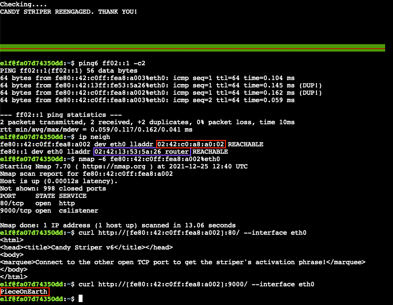

# IPv6 Sandbox

**Elf**: Jewel Loggins<br/>
**Direct link**: [ipv6 terminal](https://docker2021.kringlecon.com/?challenge=ipv6&id=177d58a1-891b-4b5c-aad6-2021a20bbf0e)<br/>
**Objective**: [Strange USB Device](../objectives/o5.md)


## Request

!!! quote "Jewel Loggins"
    Well hello! I'm Jewel Loggins.<br/>
    I have to say though, I'm a bit distressed.<br/>
    The con next door? Oh sure, I'm concerned about that too, but I was talking about the issues I'm having with IPv6.<br/>
    I mean, I know it's an old protocol now, but I've just never checked it out.<br/>
    So now I'm trying to do simple things like Nmap and cURL using IPv6, and I can't quite get them working!<br/>
    Would you mind taking a look for me on this terminal?<br/>
    I think there's a [Github Gist](https://gist.github.com/chriselgee/c1c69756e527f649d0a95b6f20337c2f) that covers tool usage with IPv6 targets.<br/>
    The tricky parts are knowing when to use [] around IPv6 addresses and where to specify the source interface.<br/>
    I've got a deal for you. If you show me how to solve this terminal, I'll provide you with some nice tips about a topic I've been researching a lot lately – Ducky Scripts! They can be really interesting and fun!


## Hints

??? hint "IPv6 Reference"
    Check out this [Github Gist](https://gist.github.com/chriselgee/c1c69756e527f649d0a95b6f20337c2f) with common tools used in an IPv6 context.


## Solution

??? abstract "Welcome message"
    ```text
    Welcome, Kringlecon attendee! The candy striper is running as a service on                       
    this terminal, but I can't remember the password. Like a sticky note under the                   
    keyboard, I put the password on another machine in this network. Problem is: I                   
    don't have the IP address of that other host.

    Please do what you can to help me out. Find the other machine, retrieve the                      
    password, and enter it into the Candy Striper in the pane above. I know you                      
    can get it running again!
    ```

To find all hosts on the local network, ping the all-nodes (i.e., `ff02::1`) and all-routers (i.e., `ff02::2`) multicast addresses (lines 1-2). The latter is optional as `ip neigh` (line 3) will indicate which device is the router regardless. Now that we've determined that the non-router host is `fe80::42:c0ff:fea8:a002` we can run a port scan against it (line 4). Finally, an HTTP GET request using `curl` on port 80 tells us the striper's activation phrase, *PieceOnEarth*, can be found on TCP port 9000 (lines 5-6).

```shell linenums="1" title="Terminal commands"
ping6 ff02::1 -c2  # ping the all-nodes multicast address
ping6 ff02::2 -c2  # ping the all-routers multicast address (optional)
ip neigh  # show the neighbour cache which includes hosts and routers
nmap -6 fe80::42:c0ff:fea8:a002%eth0  # run a port scan against the non-router host
curl http://[fe80::42:c0ff:fea8:a002]:80/ --interface eth0  # send a GET request to port 80
curl http://[fe80::42:c0ff:fea8:a002]:9000/ --interface eth0  # send a GET request to port 9000
```



!!! done "Answer"
    PieceOnEarth


## Response

!!! quote "Jewel Loggins"
    Great work! It seems simpler now that I've seen it once. Thanks for showing me!<br/>
    Prof. Petabyte warned us about random USB devices. They might be malicious keystroke injectors!<br/>
    A troll could program a keystroke injector to deliver malicious keystrokes when it is plugged in.<br/>
    Ducky Script is a language used to specify those keystrokes.<br/>
    What commands would a troll try to run on our workstations?<br/>
    I heard that SSH keys [can be used as backdoors](https://attack.mitre.org/techniques/T1098/004/). Maybe that's useful?
