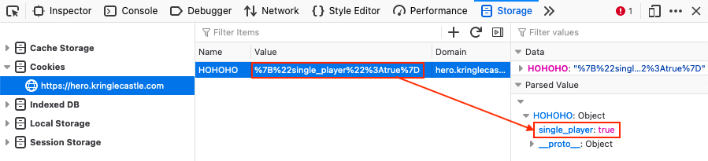
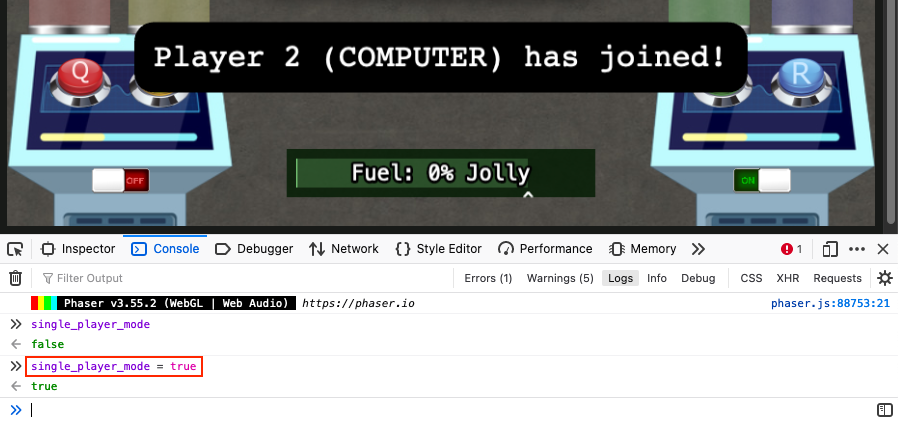
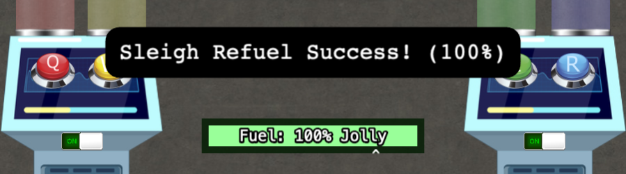

# Holiday Hero

**Elf**: Chimney Scissorsticks 
**Direct link**: [hero website](https://hero.kringlecastle.com?challenge=hero&id=47009301-4307-4f2c-9ef2-12079616e37e) 
**Objective**: [Shellcode Primer](../objectives/o6.md)

## Request

!!! quote "Chimney Scissorsticks"
    Woo! I'm Chimney Scissorsticks, and I'm having a great time up here! 
    I've been hanging out with all these NetWars players and *not* worrying about what's going on next door. 
    In fact, I've really been having fun playing with this Holiday Hero terminal. You can use it to generate some jamming holiday tunes that help power Santa's sleigh! 
    It's more fun to play with a friend but I've also heard there's a clever way to enable single player mode. 
    Single player mode? I heard it can be enabled by fiddling with two client-side values, one of which is passed to the server. 
    It's so much more fun and easier with a friend though! 
    Either way, we'd really appreciate your help getting the sleigh all fueled up. 
    Then I can get back to thinking about shellcode...

## Solution

The most fun way to solve this challenge is by teaming up with a friend, but if you want to try out the single player mode that Chimney refers to you'll need to do two things. First, change the `HOHOHO` cookie's `single_player` field to *true* and refresh the web browser window to ensure the updated value is picked up.

{ class=border }

Next, create a room (option 2), change the `single_player_mode` variable defined in the [`holidayhero.min.js`](../artifacts/hints/h6/holidayhero.min.js) script to *true* using the web brower's console, and wait for the message stating *"Player 2 (COMPUTER) has joined"* to appear on screen.

{ class=border }

That's it! Single player mode is now active. Toggle the switch on the left console to the *ON* position and have fun!

## Response

!!! quote "Chimney Scissorsticks"
    You did it - rock on! We're all set now that the sleigh is fueled! 
    So hey, let me talk to you a bit about manual exploitation. 
    If you run into any shellcode primers at the North Pole, be sure to read the directions and the comments in the shellcode source! 
    Also, troubleshooting shellcode can be difficult. Use the debugger step-by-step feature to watch values. 
    Lastly, be careful not to overwrite any register values you need to reference later on in your shellcode. 
    That's it! I know you can do it!
