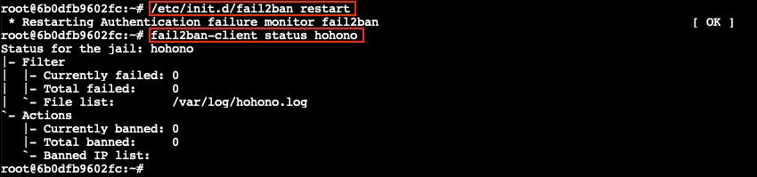
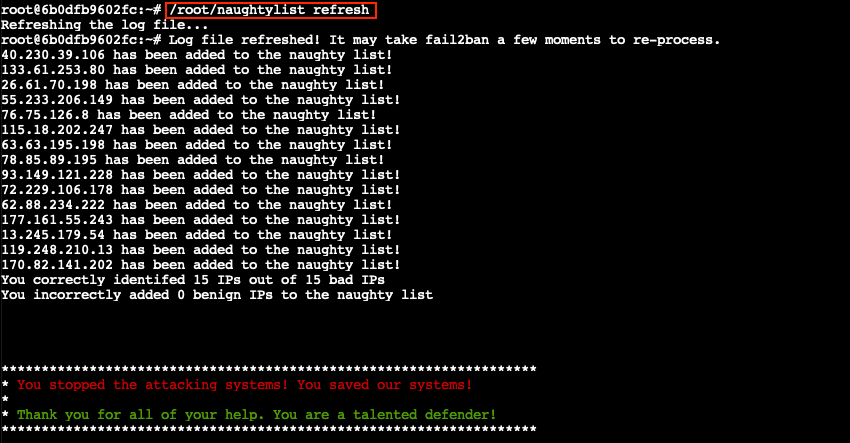

# HoHo... No

**Elf**: Eve Snowshoes<br/>
**Direct link**: [hohono terminal](https://docker2021.kringlecon.com/?challenge=hohono&id=8201c30c-a2f3-453b-a5fa-80016ee7cd7e)<br/>
**Objective**: [Kerberoasting on an Open Fire](../objectives/o8.md)


## Request

!!! quote "Eve Snowshoes"
    Hey there, how's it going? I'm Eve Snowshoes.<br/>
    Lately I've been spending a lot of cycles worrying about what's going on next door.<br/>
    Before that, I was checking out Fail2Ban.<br/>
    It's this slick log scanning tool for Apache web servers.<br/>
    If you can complete this terminal challenge, I'd be happy to give you some things I've learned about Kerberoasting and Active Directory permissions!<br/>
    Why don't you do some work with Fail2Ban on this Cranberry Pi terminal first, then we'll talk Kerberoasting and Active Directory. OK?


## Solution

??? abstract "Welcome message"
    ```text
    Jack is trying to break into Santa's workshop!

    Santa's elves are working 24/7 to manually look through logs, identify the
    malicious IP addresses, and block them. We need your help to automate this so
    the elves can get back to making presents!

    Can you configure Fail2Ban to detect and block the bad IPs?

    * You must monitor for new log entries in /var/log/hohono.log
    * If an IP generates 10 or more failure messages within an hour then it must
    be added to the naughty list by running naughtylist add <ip>
            /root/naughtylist add 12.34.56.78
    * You can also remove an IP with naughtylist del <ip>
            /root/naughtylist del 12.34.56.78
    * You can check which IPs are currently on the naughty list by running
            /root/naughtylist list

    You'll be rewarded if you correctly identify all the malicious IPs with a
    Fail2Ban filter in /etc/fail2ban/filter.d, an action to ban and unban in
    /etc/fail2ban/action.d, and a custom jail in /etc/fail2ban/jail.d. Don't
    add any nice IPs to the naughty list!

    *** IMPORTANT NOTE! ***

    Fail2Ban won't rescan any logs it has already seen. That means it won't
    automatically process the log file each time you make changes to the Fail2Ban
    config. When needed, run /root/naughtylist refresh to re-sample the log file
    and tell Fail2Ban to reprocess it.
    ```

### Introduction

Andy Smith's [KringleCon talk](https://www.youtube.com/watch?v=Fwv2-uV6e5I) provides a great introduction to [Fail2Ban](https://www.fail2ban.org/wiki/index.php/Main_Page) and goes through all the steps needed to set up your own custom configuration. In short, there's 3 config files we need to create: a filter, an action, and a jail which ties it all together.

{ class=border }


### Log analysis

Before we start diving into config files though, we first need to analyze `/var/log/hohono.log` to understand what bad activity actually looks like. Lines containing *Valid*, *successfully*, and *successful* are obviously good and should be ignored. By filtering out the valid log entries using `grep -v 'successful\|Valid'` we're left with 4 distinct types of failure messages. 


### Filter configuration

Now that we know what each failure message looks like we can configure Fail2Ban, starting with the `/etc/fail2ban/filter.d/hohono.conf` filter. This configuration file contains a series of regular expressions matching every possible failure message and uses placeholders like `<HOST>` to identify and extract the IP address responsible for the activity.

!!! example "/etc/fail2ban/filter.d/hohono.conf"
    ```shell linenums="1"
    [Definition]
    failregex = <HOST> sent a malformed request
                Login from <HOST> rejected due to unknown user name
                Failed login from <HOST> for .*
                Invalid heartbeat .* from <HOST>
    ```

Running `fail2ban-regex /var/log/hohono.log /etc/fail2ban/filter.d/hohono.conf` validates our filter definition.


### Action configuration

Next we create the `/etc/fail2ban/action.d/hohono.conf` action which instructs Fail2Ban what commands should be run to ban (line 3) and unban (line 4) an IP address. Just like we used `<HOST>` to identify and extract the IP address in the filter, we can use `<ip>` to automatically pass the correct IP address to the `naughtylist`  command.

!!! example "/etc/fail2ban/action.d/hohono.conf"
    ```shell linenums="1"
    [Definition]
    actionban = /root/naughtylist add <ip>
    actionunban = /root/naughtylist del <ip>
    ```


### Jail configuration

The final step to setting up Fail2Ban for our use case is to create an `/etc/fail2ban/jail.d/hohono.conf` jail which ties together our filter (line 4), action (line 5), `/var/log/hohono.log` (line 6), and a 10 failures per hour threshold (lines 8-9).

!!! example "/etc/fail2ban/jail.d/hohono.conf"
    ```shell linenums="1"
    [hohono]
    enabled = true
    filter = hohono
    action = hohono
    logpath = /var/log/hohono.log
    bantime = 86400  # 1 day (in seconds)
    findtime = 3600  # 1 hour (in seconds)
    maxretry = 10
    ```


### Bring down the ban hammer!

All the required configuration pieces are now in place. Restart the Fail2Ban service using either `/etc/init.d/fail2ban restart` or `service fail2ban restart` and check that the *hohono* jail has been loaded by running `fail2ban-client status hohono`.



The final step is to use `/root/naughtylist refresh` to force Fail2Ban to rescan the `/var/log/hohono.log` log file.




## Response

!!! quote "Eve Snowshoes"
    Fantastic! Thanks for the help!<br/>
    Hey, would you like to know more about Kerberoasting and Active Directory permissions abuse?<br/>
    There's a great [talk](https://www.youtube.com/watch?v=iMh8FTzepU4) by Chris Davis on this exact subject!<br/>
    There are also plenty of resources available to learn more about [Kerberoasting](https://gist.github.com/TarlogicSecurity/2f221924fef8c14a1d8e29f3cb5c5c4a) specifically.<br/>
    If you have any trouble finding a domain controller, remember that, when not running as root, nmap default probing relies on connecting to TCP 80 and 443.<br/>
    Got a hash that won't crack with your wordlist? [OneRuleToRuleThemAll.rule](https://github.com/NotSoSecure/password_cracking_rules) is a great way to grow your keyspace.<br/>
    Where'd you get your wordlist? [CeWL](https://github.com/digininja/CeWL) might generate a great wordlist from the ElfU website, but it will ignore digits in terms by default.<br/>
    So, apropos of nothing, have you ever known system administrators who store credentials in scripts? I know, I know, *you* understand the folly and would never do it!<br/>
    The easy way to investigate Active Directory misconfigurations (for Blue and Red alike!) is with [Bloodhound](https://github.com/BloodHoundAD/BloodHound), but there are [native](https://social.technet.microsoft.com/Forums/en-US/df3bfd33-c070-4a9c-be98-c4da6e591a0a/forum-faq-using-powershell-to-assign-permissions-on-active-directory-objects?forum=winserverpowershell) [methods](https://www.specterops.io/assets/resources/an_ace_up_the_sleeve.pdf) as well.<br/>
    Oh, and one last thing: once you've granted permissions to your user, it might take up to five minutes for it to propogate throughout the domain.
