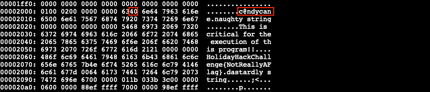
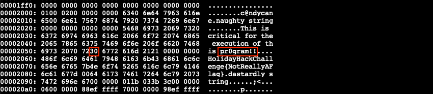
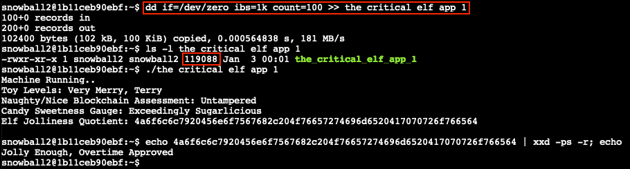

# Yara Analysis

**Elf**: Fitzy Shortstack<br/>
**Direct link**: [yara terminal](https://docker2021.kringlecon.com/?challenge=yara&id=1963d329-18fd-465d-b581-7dc71edce43a)<br/>
**Objective**: [Splunk!](../objectives/o9.md)


## Request

!!! quote "Fitzy Shortstack"
    Hiya, I'm Fitzy Shortstack!<br/>
    I was just trying to learn a bit more about YARA with this here Cranberry Pi terminal.<br/>
    I mean, I'm not saying I'm worried about attack threats from that other con next door, but...<br/>
    OK. I AM worried. I've been thinking a bit about how malware might bypass YARA rules.<br/>
    If you can help me solve the issue in this terminal, I'll understand YARA so much better! Would you please check it out so I can learn?<br/>
    And, I'll tell you what – if you help me with YARA, I'll give you some tips for Splunk!<br/>
    I think if you make small, innocuous changes to the executable, you can get it to run in spite of the YARA rules.


## Solution

??? abstract "Welcome message"
    ```text
    HELP!!!

    This critical application is supposed to tell us the sweetness levels of our candy
    manufacturing output (among other important things), but I can't get it to run.

    It keeps saying something something yara. Can you take a look and see if you
    can help get this application to bypass Sparkle Redberry's Yara scanner?

    If we can identify the rule that is triggering, we might be able change the program
    to bypass the scanner.

    We have some tools on the system that might help us get this application going:
    vim, emacs, nano, yara, and xxd

    The children will be very disappointed if their candy won't even cause a single cavity.
    ```

For a one-liner solution, scroll [all the way down](#oneliner) to the bottom. :wink:

The goal of this challenge is to modify the `the_critical_elf_app` binary in such a way that it doesn't trigger any of the [YARA](https://yara.readthedocs.io/en/stable/) rules anymore. Each rule consists of a series of strings and a boolean expression that represents the condition that needs to be met for the rule to match. Start by running `./the_critical_elf_app` which prints the message *yara_rule_135 ./the_critical_elf_app*. We can look up the specifics for this YARA rule in `~/yara_rules/rules.yar`.

```yara linenums="1" hl_lines="9" title="yara_rule_135"
rule yara_rule_135 {
meta:
    description = "binaries - file Sugar_in_the_machinery"
    author = "Sparkle Redberry"
    reference = "North Pole Malware Research Lab"
    date = "1955-04-21"
    hash = "19ecaadb2159b566c39c999b0f860b4d8fc2824eb648e275f57a6dbceaf9b488"
strings:
    $s = "candycane"
condition:
    $s
}
```

The rule matches because somewhere in the binary there's a *candycane* string. Create a hex dump of the binary using `xxd the_critical_elf_app > the_critical_elf_app.hex` and open the file in your favorite editor. Search for *candy* to find the offending string and change the hex value of one of the letters so the YARA rule doesn't match anymore. In the below example changing `0x61` to `0x40` updates the string to *c@ndycane*. An [ASCII table](https://www.freecodecamp.org/news/ascii-table-hex-to-ascii-value-character-code-chart-2/) can help with the ASCII to hex conversion. 

=== ":material-file-edit: Updated hex dump"
    

=== ":material-file-outline: Original hex dump"
    

Convert the hex dump back to a binary with `xxd -r the_critical_elf_app.hex the_critical_elf_app_1` and make it executable using `chmod +x the_critical_elf_app_1`. Running the updated binary now triggers *yara_rule_1056*.

```yara linenums="1" hl_lines="10" title="yara_rule_1056"
rule yara_rule_1056 {
meta: 
        description = "binaries - file frosty.exe"
        author = "Sparkle Redberry"
        reference = "North Pole Malware Research Lab"
        date = "1955-04-21"
        hash = "b9b95f671e3d54318b3fd4db1ba3b813325fcef462070da163193d7acb5fcd03"
    strings:
        $s1 = {6c 6962 632e 736f 2e36}
        $hs2 = {726f 6772 616d 2121}
    condition:
        all of them
}
```

This time the rule has 2 conditions which both need to match. Open the modified hex dump again and search for both hex strings to determine which one we can safely modify. If a search doesn't find the string you're looking for, trim it down as it might span across multiple lines. `{6c 6962 632e 736f 2e36}` can't be changed as `libc.so.6` is an essential library. `{726f 6772 616d 2121}` however is fine, regardless of what the ASCII string states. Let's change `0x6f` to `0x30`, so we get *pr0gram!!*.

=== ":material-file-edit: Updated hex dump"
    

=== ":material-file-outline: Original hex dump"
    

Just like before, use `xxd -r the_critical_elf_app.hex the_critical_elf_app_1` to convert the updated hex dump back to a binary. The `chmod +x` step can be skipped as `the_critical_elf_app_1` is already executable and we're merely writing new data into the file. Running `./the_critical_elf_app_1` once more now tells us it matches *yara_rule_1732*.

```yara linenums="1" hl_lines="30" title="yara_rule_1732"
rule yara_rule_1732 {
meta:
    description = "binaries - alwayz_winter.exe"
    author = "Santa"
    reference = "North Pole Malware Research Lab"
    date = "1955-04-22"
    hash = "c1e31a539898aab18f483d9e7b3c698ea45799e78bddc919a7dbebb1b40193a8"
strings:
    $s1 = "This is critical for the execution of this program!!" fullword ascii
    $s2 = "__frame_dummy_init_array_entry" fullword ascii
    $s3 = ".note.gnu.property" fullword ascii
    $s4 = ".eh_frame_hdr" fullword ascii
    $s5 = "__FRAME_END__" fullword ascii
    $s6 = "__GNU_EH_FRAME_HDR" fullword ascii
    $s7 = "frame_dummy" fullword ascii
    $s8 = ".note.gnu.build-id" fullword ascii
    $s9 = "completed.8060" fullword ascii
    $s10 = "_IO_stdin_used" fullword ascii
    $s11 = ".note.ABI-tag" fullword ascii
    $s12 = "naughty string" fullword ascii
    $s13 = "dastardly string" fullword ascii
    $s14 = "__do_global_dtors_aux_fini_array_entry" fullword ascii
    $s15 = "__libc_start_main@@GLIBC_2.2.5" fullword ascii
    $s16 = "GLIBC_2.2.5" fullword ascii
    $s17 = "its_a_holly_jolly_variable" fullword ascii
    $s18 = "__cxa_finalize" fullword ascii
    $s19 = "HolidayHackChallenge{NotReallyAFlag}" fullword ascii
    $s20 = "__libc_csu_init" fullword ascii
condition:
    uint32(1) == 0x02464c45 and filesize < 50KB and
    10 of them
}
```
 
Once again there's a few requirements for the rule to match, one of them being the file needs to be less than 50KB in size. We can get around this by padding the binary with a sufficiently large amount of null bytes or `0x00` read from [`/dev/zero`](https://en.wikipedia.org/wiki//dev/zero) using the command `dd if=/dev/zero ibs=1k count=100 >> the_critical_elf_app_1` which increases the file by 100KB. Executing the padded binary finally gets us past all the YARA rules!



Staying with the theme, the `Elf Jolliness Quotient` is a hexadecimal string which can be decoded to *Jolly Enough, Overtime Approved* by using `echo 4a6f6c6c7920456e6f7567682c204f76657274696d6520417070726f766564 | xxd -ps -r`.

!!! note "One-liner solution<span id="oneliner"></span>"
    To solve this with a one-liner we'll modify the data at `uint32(1)` instead of increasing the file size. `uint32()` reads data as [little-endian](https://yara.readthedocs.io/en/v3.5.0/writingrules.html#accessing-data-at-a-given-position) integers, so we need to invert `0x02464c45` to `0x454c4602` to match the data at byte offset 1. This byte sequence is part of what identifies a [64-bit ELF binary](https://en.wikipedia.org/wiki/Executable_and_Linkable_Format) and typically shouldn't be tampered with. In this case however, changing the last byte with value `0x02` to a non-supported class (e.g., `0x03`) still allows the binary to execute.

    Each step now edits a series of hex values, meaning we can leverage [`sed`](https://www.gnu.org/software/sed/manual/sed.html) to make those changes on the fly. Below is the one-liner command, split across multiple lines for readability. The final `sudo` step is required because of how the challenge is set up. Our Bash shell has a pre-execution hook, loaded through `/usr/local/bin/.bash-preexec.sh` which sends our command to `sudo -E /usr/local/bin/pre_execution.sh $1;` so it's checked against the YARA rules.

    ```shell linenums="1"
    xxd the_critical_elf_app | \
    sed 's/6361 6e64 7963/6340 6e64 7963/g; s/726f 6772 616d 2121/7230 6772 616d 2121/g; s/7f45 4c46 02/7f45 4c46 03/g' | \
    xxd -r > the_critical_elf_app_fixed && \
    chmod +x the_critical_elf_app_fixed && \
    sudo -E /usr/local/bin/pre_execution.sh ./the_critical_elf_app_fixed
    ```


## Response

!!! quote "Fitzy Shortstack"
    Thanks - you figured it out!<br/>
    Let me tell you what I know about Splunk.<br/>
    Did you know Splunk recently added support for new data sources including Sysmon for Linux and GitHub Audit Log data?<br/>
    Between GitHub audit log and webhook event recording, you can monitor all activity in a repository, including common `git` commands such as `git add`, `git status`, and `git commit`.<br/>
    You can also see cloned GitHub projects. There's a lot of interesting stuff out there. Did you know there are repositories of code that are Darn Vulnerable?<br/>
    Sysmon provides a lot of valuable data, but sometimes correlation across data types is still necessary.<br/>
    Sysmon network events don't reveal the process parent ID for example. Fortunately, we can pivot with a query to investigate process creation events once you get a process ID.<br/>
    Sometimes Sysmon data collection is awkward. Pipelining multiple commands generates multiple Sysmon events, for example.<br/>
    Did you know there are multiple versions of the Netcat command that can be used maliciously? `nc.openbsd`, for example.
