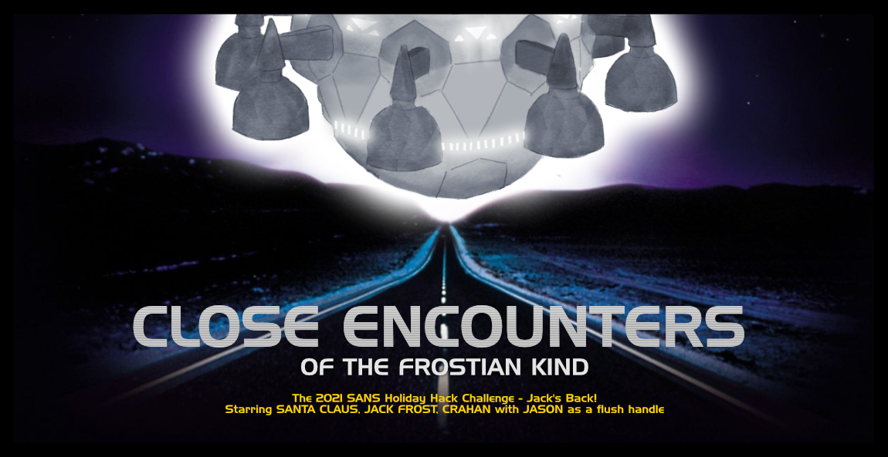
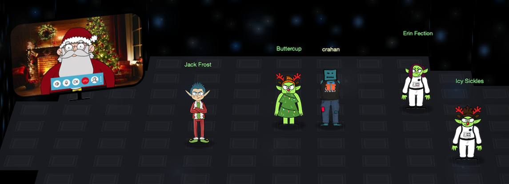

# Welcome

## Introduction

{ align=left } Hello there and welcome to my [2021 SANS Holiday Hack Challenge](https://holidayhackchallenge.com/2021/) write-up. Had you asked me at the beginning of 2021 if I'd be submitting a write-up, I might've hesitated. But each year, as the KringleCon chatter starts to build, so does my excitement, and it just reels me right back in. So, once again, I packed a suitcase, booked a flight, and headed to the North Pole to meet up with Santa, the Elves, and all my KringleCon friends! :hugging_face:

Similar to last year, there's 3 main sections. This page which contains the introduction, answers, the overall narrative, and final conclusion. [Objectives](./objectives/o1.md) contains the write-ups for the main objectives for which an answer had to be submitted and [Terminal Hints](./hints/h2.md) has the write-ups for the additional side challenges which provide you with hints to help solve the main objectives.

As always, there's a few things worth highlighting like [getting root](./hints/h10.md#getting-root) on the IMDS Exploration terminal, [bruteforcing](./hints/h13.md#solution) the Frostavator, the [minor mistake](./objectives/o13.md#slide_mistake) in Prof. Petabyte's FPGA presentation, a bit of cheating [here](./hints/h3.md#cheating) and [there](./hints/h4.md#solution), solving terminals with [one-liners](./hints/h9.md#oneliner), the behind the scenes of the [WiFi dongle](./objectives/o3.md#backend-wifi-logic), the very incomplete list of [Easter eggs](./easter_eggs.md), and all of the [custom scripts](https://github.com/crahan/HolidayHackChallenge2021/tree/main/docs/tools) used throughout the game.

!!! note "50-page submission limit"
    Each year there's a huge number of write-ups that need to be reviewed by the SANS and Counter Hack teams. To find a good middle ground between preventing information overload and creating a write-up that can stand on its own as a learning resource, some parts, like the *navigation tip* below, are collapsed by default. Skipping over these will not take away from understanding the overall solution, but feel free to expand them to get some additional information.

??? tip "Navigation tip"
    Even with less than 50 pages, there's still quite a bit of information to read through. To make things a little easier, you can use ++"P"++ or ++","++ to go to the previous section, ++"N"++ or ++"."++ to navigate to the next section, and ++"S"++, ++"F"++, or ++"/"++ to open up the search dialog.

    **TL;DR** if you keep pressing ++"N"++ or ++"."++ from this point forward, you'll hit all the content in the right order! :smile:

## Answers

!!! done "1. KringleCon Orientation - :fontawesome-solid-star::fontawesome-regular-star::fontawesome-regular-star::fontawesome-regular-star::fontawesome-regular-star:"
    Follow [Jingle Ringford's instructions](./objectives/o1.md) to open the gate.

!!! done "2. Where in the World is Caramel Santaigo? - :fontawesome-solid-star::fontawesome-regular-star::fontawesome-regular-star::fontawesome-regular-star::fontawesome-regular-star:"
    Play [the game](./objectives/o2.md) or decode the [`Cookiepella`](./objectives/o2.md#cookiepella) cookie.

!!! done "3. Thaw Frost Tower's Entrance - :fontawesome-solid-star::fontawesome-solid-star::fontawesome-regular-star::fontawesome-regular-star::fontawesome-regular-star:"
    Connect to the *FROST-Nidus-Setup* SSID and use the `/api/cooler` endpoint to [turn up the heat](./objectives/o3.md).

!!! done "4. Slot Machine Investigation - :fontawesome-solid-star::fontawesome-solid-star::fontawesome-regular-star::fontawesome-regular-star::fontawesome-regular-star:"
    [I'm going to have some bouncer trolls bounce you right out of this casino!](./objectives/o4.md)

!!! done "5. Strange USB Device - :fontawesome-solid-star::fontawesome-solid-star::fontawesome-regular-star::fontawesome-regular-star::fontawesome-regular-star:"
    [*ickymcgoop*](./objectives/o5.md)

!!! done "6. Shellcode Primer - :fontawesome-solid-star::fontawesome-solid-star::fontawesome-solid-star::fontawesome-regular-star::fontawesome-regular-star:"
    [cyber security knowledge](./objectives/o6.md)

!!! done "7. Printer Exploitation - :fontawesome-solid-star::fontawesome-solid-star::fontawesome-solid-star::fontawesome-solid-star::fontawesome-regular-star:"
    [`Troll_Pay_Chart.xlsx`](./objectives/o7.md)

!!! done "8. Kerberoasting on an Open Fire - :fontawesome-solid-star::fontawesome-solid-star::fontawesome-solid-star::fontawesome-solid-star::fontawesome-solid-star:"
    [Kindness](./objectives/o8.md)

!!! done "9. Splunk! - :fontawesome-solid-star::fontawesome-solid-star::fontawesome-solid-star::fontawesome-regular-star::fontawesome-regular-star:"
    [whiz](./objectives/o9.md)

!!! done "10. Now Hiring! - :fontawesome-solid-star::fontawesome-solid-star::fontawesome-solid-star::fontawesome-regular-star::fontawesome-regular-star:"
    [CGgQcSdERePvGgr058r3PObPq3+0CfraKcsLREpX](./objectives/o10.md)

!!! done "11. Customer Complaint Analysis - :fontawesome-solid-star::fontawesome-solid-star::fontawesome-regular-star::fontawesome-regular-star::fontawesome-regular-star:"
    [Flud Hagg Yaqh](./objectives/o11.md)

!!! done "12. Frost Tower Website Checkup - :fontawesome-solid-star::fontawesome-solid-star::fontawesome-solid-star::fontawesome-solid-star::fontawesome-solid-star:"
    [clerk](./objectives/o12.md)

!!! done "13. FPGA Programming - :fontawesome-solid-star::fontawesome-solid-star::fontawesome-solid-star::fontawesome-solid-star::fontawesome-regular-star:"
    Write an [FPGA program](./objectives/o13.md) which can generate any requested output frequency.

## NPC locations

| :material-account: Name | :material-home: Event | :material-pound: Floor | :material-map-marker: Area | :material-gamepad: Challenge | :material-format-list-bulleted: Type |
| :-------------------- | :---: | :---: | :------------------- | :------------------------------------------------- | :---: |
| Jingle Ringford       | NP    | -     | Orientation          | [KringleCon Orientation](objectives/o1.md)         | O     |
| Tangle Coalbox        | KC    | 1     | Courtyard            | [Where is Caramel Santaigo?](objectives/o2.md)     | O     |
| Piney Sappington      | KC    | 1     | Courtyard            | [Document Analysis](./hints/h2.md)                 | T     |
| Grimy McTrollkins     | NP    | -     | The North Pole       | [Thaw Frost Tower's Entrance](./objectives/o3.md)  | O     |
| Greasy GopherGuts     | NP    | -     | The North Pole       | [Grepping for Gold](./hints/h3.md)                 | T     |
| Hubris Selfington     | FF    | 1     | Frost Tower Lobby    | [Slot Machine Investigation](./objectives/o4.md)   | O     |
| Noel Boetie           | NP    | -     | The North Pole       | [Logic Munchers](./hints/h4.md)                    | T     |
| Morcel Nougat         | KC    | 2     | Speaker UNprep. Room | [Strange USB Device](./objectives/o5.md)           | O     |
| Jewel Loggins         | KC    | 2     | Talks Lobby          | [IPv6 Sandbox](./hints/h5.md)                      | T     |
| Ruby Cyster           | FF    | 16    | Jack's Office        | [Shellcode Primer](./objectives/o6.md), [Printer Exploitation](./objectives/o7.md) | O     |
| Chimney Scissorsticks | KC    | R     | NetWars              | [Holiday Hero](./hints/h6.md)                      | T     |
| Eve Snowshoes         | KC    | 3     | Santa's office       | [HoHo... No](./hints/h8.md), [Kerberoasting on an Open Fire](./objectives/o8.md) | T, O  |
| Angel Candysalt       | KC    | 1     | Great Room           | [Splunk!](./objectives/o9.md)                      | O     |
| Fitzy Shortstack      | KC    | 1     | Entry                | [Yara Analysis](./hints/h9.md)                     | T     |
| Noxious O’Dor         | FF    | 16    | Jack's Restroom      | [IMDS Exploration](./hints/h10.md), [Now Hiring!](./objectives/o10.md) | T, O  |
| Pat Tronizer          | FF    | 2     | Talks Lobby          | [Customer Complaint Analysis](./objectives/o11.md) | O     |
| Tinsel Upatree        | KC    | 1     | Kitchen              | [Strace Ltrace Retrace](./hints/h11.md)            | T     |
| Ingreta Tude          | FF    | 16    | Jack's Studio        | [Frost Tower Website Checkup](./objectives/o12.md) | O     |
| Ribb Bonbowford       | KC    | 1     | Dining Room          | [The Elf C0de](./hints/h12.md)                     | T     |
| Crunchy Squishter     | FF    | R     | Frost Tower Rooftop  | [FPGA Programming](./objectives/o13.md)            | O     |
| Grody Goiterson       | FF    | R     | Frost tower Lobby    | [Frostavator](./hints/h13.md)                      | T     |

## Conclusion

??? Abstract "Narrative"
    Listen children to a story that was written in the cold

    'Bout a Kringle and his castle hosting hackers, meek and bold

    Then from somewhere came another, built his tower tall and proud

    Surely he, our Frosty villain hides intentions 'neath a shroud

    So begins Jack's reckless mission: gather trolls to win a war

    Build a con that's fresh and shiny, has this yet been done before?

    Is his Fest more feint than folly? Some have noticed subtle clues

    Running 'round and raiding repos, stealing Santa's Don'ts and Do's

    Misdirected, scheming, grasping, Frost intends to seize the day

    Funding research with a gift shop, can Frost build the better sleigh?

    Lo, we find unlikely allies: trolls within Jack's own command

    Doubting Frost and searching motive, questioning his dark demand

    Is our Jack just lost and rotten - one more outlaw stomping toes?

    Why then must we piece together cludgy, wacky radios?

    With this object from the heavens, Frost must know his cover's blown

    Hearkening from distant planet! We the heroes should have known

    Go ahead and hack your neighbor, go ahead and phish a friend

    Do it in the name of holidays, you can justify it at year's end

    There won't be any retweets praising you, come disclosure day

    But on the snowy evening after? Still Kris Kringle rides the sleigh

!!! quote "Icy Sickles"
    We come in peace! I am Icy Sickles from ice Planet Frost. 
    Many centuries ago, we Frostian trolls sent an expedition to study your planet and peoples. 
    Jack Frost, scion of Planet Frost’s ruling family, captained that long-ago mission, which carried many hundreds of our people to your planet to conduct our research.

!!! quote "Erin Fection"
    I am Erin Fection, the pilot of this interstellar spaceship. 
    Our first expedition established a base in the land of Oz, where our researchers became known as “Munchkins.” 
    We received a message from them long ago about a Great Schism, where the Frostian expedition split into two warring factions: Munchkins and Elves. 
    Thankfully, they managed to establish an uneasy peace by relocating the Elves to the North Pole. 
    Since then, we have heard nothing from the expedition. They went interstellar radio silent. Until NOW.

!!! quote "Buttercup"
    I am Buttercup, Princess of ice Planet Frost. 
    Thanks to your help, we received the message from the device summoning us back to Earth to address the recent unpleasantness. 
    We had no idea that Jack Frost would cause such trouble! We sincerely apologize. 
    We will take Jack back home to Planet Frost, along with all the other trolls. 
    The Elves and Munchkins, of course, can remain if they opt to do so. 
    Fear not, we WILL bring Jack and any guilty trolls to justice for their infractions. They will not bother your planet any longer. 
    Again, we apologize for all the troubles he has caused, and we sincerely THANK YOU for your help! 
    And, now that you've helped us solve everything, feel free to show off your skills with [some swag](https://my-store-c4645f-2.creator-spring.com/) - only for our victors!

!!! quote "Jack Frost"
    I was just having a little fun. C’mon, man! 
    And, I was just getting started! I had such big plans! 
    I don’t want to go home!!!

!!! quote "Santa"
    The Frostians have reached out to me via video link. They’ve explained to me all that has happened. 
    I’d like to thank you for your truly excellent work in foiling Jack’s plans and ensuring that he is finally brought to justice. 
    On behalf of all of us here at the North Pole, we wish you and yours a happy and healthy Holiday Season. 
    Thank you and HAPPY HOLIDAYS from me and all of the elves.
    Ho Ho Ho!

