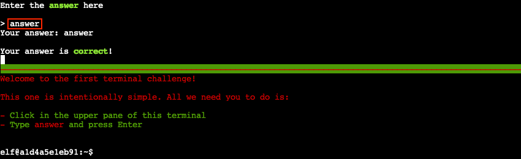
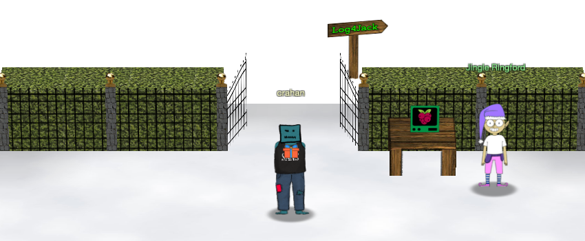

# KringleCon Orientation

**Difficulty**: :fontawesome-solid-star::fontawesome-regular-star::fontawesome-regular-star::fontawesome-regular-star::fontawesome-regular-star: 
**Direct link**: [opengate terminal](https://docker2021.kringlecon.com/?challenge=opengate&id=a6d935b4-bd4d-4f29-8e66-96a5215a2cd5) 
**Terminal hint**: -

## Objective

!!! question "Request"
    Get your bearings at KringleCon

??? quote "Jingle Ringford"
    Welcome to the North Pole, KringleCon, and the 2021 SANS Holiday Hack Challenge! I’m Jingle Ringford, one of Santa’s elves. 
    Santa asked me to come here and give you a short orientation to this festive event. 
    Before you move forward through the gate, I’ll ask you to accomplish a few simple tasks.

## Solution

To solve this challenge we just need to follow Jingle Ringford's instructions. Each task is designed to help explain part of the game mechanics: talk to Jingle Ringford, get our badge, pick up the WiFi dongle, and use the terminal to open the gate. Start by clicking on Jingle Ringford's avatar until three dots appear, indicating the end of the conversation.

!!! quote "Jingle Ringford"
    First things first, here's your badge! It's that wrapped present in the middle of your avatar. 
    Great - now you're official! 
    Click on the badge on your avatar 🎁. That’s where you will see your Objectives, Hints, and gathered Items for the Holiday Hack Challenge. 
    We’ve also got handy links to the KringleCon talks and more there for you! 
    Next, click on that USB wifi adapter - just in case you need it later.

Next, click on to the WiFi dongle to [pick it up](https://2021.kringlecon.com/badge?section=item), then click on Jingle Ringford again to continue the conversation.

!!! quote "Jingle Ringford"
    Fantastic! 
    OK, one last thing. Click on the *Cranberry Pi Terminal* and follow the on-screen instructions.

Finally, click on the [terminal](https://docker2021.kringlecon.com/?challenge=opengate&id=a6d935b4-bd4d-4f29-8e66-96a5215a2cd5) to open it, click on the top pane, enter *answer*, and press ++"Enter"++ to complete the challenge.

!!! quote "Jingle Ringford"
    Great! Your orientation is now complete! You can enter through the gate now. Have FUN!!!

{ class=border }

!!! done "Answer"
    Follow Jingle Ringford's instructions to open the gate.
