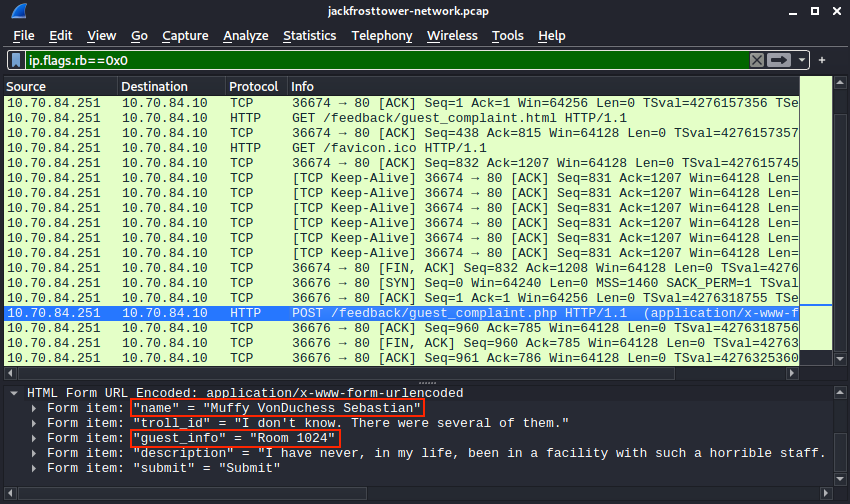
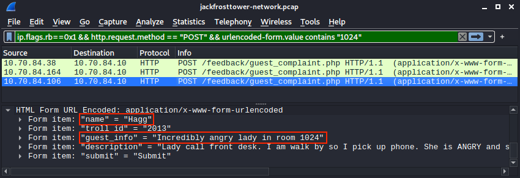

# Customer Complaint Analysis

**Difficulty**: :fontawesome-solid-star::fontawesome-solid-star::fontawesome-regular-star::fontawesome-regular-star::fontawesome-regular-star:<br/>
**Direct link**: [jackfrosttower-network.zip](https://downloads.holidayhackchallenge.com/2021/jackfrosttower-network.zip)<br/>
**Terminal hint**: [Strace Ltrace Retrace](../hints/h11.md)


## Objective

!!! question "Request"
    A human has accessed the Jack Frost Tower network with a non-compliant host. [Which three trolls complained about the human](https://downloads.holidayhackchallenge.com/2021/jackfrosttower-network.zip)? Enter the troll names in alphabetical order separated by spaces. Talk to Tinsel Upatree in the kitchen for hints.

??? quote "Pat Tronizer"
    Hrmph. Oh hey, I'm Pat Tronizer.<br/>
    I'm SO glad to have all these first-rate talks here.<br/>
    We issued a Call for Talks, but only one person responded... We put him in track 1.<br/>
    But Jack came up with an ingenious way to borrow additional talks for FrostFest! You can hardly tell where we got these great speakers!<br/>
    Anyway, I cannot believe an actual human [connected to the Tower network](https://downloads.jackfrosttower.com/2021/jackfrosttower-network.zip). It's supposed to be the domain of us trolls and of course Jack Frost himself.<br/>
    Mr. Frost has a strict policy: all devices must be [RFC3514](https://datatracker.ietf.org/doc/html/rfc3514) compliant. It fits in with our nefarious plans.<br/>
    Some human had the nerve to use our complaint website to submit a complaint!<br/>
    That website is for trolls to complain about guests, NOT the other way around.<br/>
    Humans have some nerve.


## Hints

??? hint "Wireshark Display Filters"
    Different from BPF capture filters, Wireshark's [display filters](https://wiki.wireshark.org/DisplayFilters) can find text with the `contains` keyword - and evil bits with `ip.flags.rb`.

??? hint "Evil Bit RFC"
    [RFC3514](https://datatracker.ietf.org/doc/html/rfc3514) defines the usage of the "Evil Bit" in IPv4 headers.


## Solution

To solve the challenge we first need to determine who the guest is and what room they are staying in. Then we can use their room number to filter down the list of troll complaints and find the three trolls who complained about the human. At Frost Tower devices are considered to be [RFC3514](https://datatracker.ietf.org/doc/html/rfc3514) compliant when they have the evil bit or security flag set to `0x1` in their IPv4 header.  

??? info "RFC3514 - Assigned values"
    ```text
    0x0  If the bit is set to 0, the packet has no evil intent. Hosts,
         network elements, etc., SHOULD assume that the packet is
         harmless, and SHOULD NOT take any defensive measures. (We note
         that this part of the spec is already implemented by many common
         desktop operating systems.)

    0x1  If the bit is set to 1, the packet has evil intent. Secure
         systems SHOULD try to defend themselves against such packets.
         Insecure systems MAY chose to crash, be penetrated, etc.
    ```

Open the [packet capture](../artifacts/objectives/o11/jackfrosttower-network.zip) file in Wireshark and use `ip.flags.rb == 0x0` to filter on non-compliant traffic. The filtered list is short enough to easily spot the HTTP POST request to `/feedback/guest_complaint.php`, but if you like you can make the display filter more specific by using `ip.flags.rb == 0x0 && http.request.method == "POST"` instead.



It looks like Muffy will be [speaking to the manager](../artifacts/objectives/o11/guest_complaints.txt). She submitted the complaint form without the proper evil bit value and, based on the submitted form data, she's staying in room 1024. Pivoting the search to the trolls we can now create a display filter that looks for HTTP POST requests with [form data](https://www.wireshark.org/docs/dfref/u/urlencoded-form.html) containing *1024* and which have their evil bit set to `0x1`.

```wireshark
ip.flags.rb == 0x1 && http.request.method == "POST" && urlencoded-form.value contains "1024"
```



!!! quote "Flud"
    Very cranky lady in room 1024 - Lady call front desk. Complain "employee" is rude. Say she is insult and want to speak to manager. Send Flud to room. Lady say troll call her towels thief. I say stop steal towels if is bother her.

!!! quote "Hagg"
    Incredibly angry lady in room 1024 - Lady call front desk. I am walk by so I pick up phone. She is ANGRY and shout at me. Say she has never been so insult. I say she probably has but just didn't hear it.

!!! quote "Yaqh"
    Snooty lady in room 1024 - Lady call desk and ask for more towel. Yaqh take to room. Yaqh ask if she want more towel because she is like to steal. She say Yaqh is insult. Yaqh is not insult. Yaqh is Yaqh.

Looks like Flud, Hagg, and Yaqh are the three trolls who complained about the lady who's staying in room 1024. Before moving on to the next challenge however, definitely take some time to read the remaining 12  funny [troll complaints](../artifacts/objectives/o11/troll_complaints.txt) in the packet capture. :smile:

!!! done "Answer"
    Flud Hagg Yaqh
