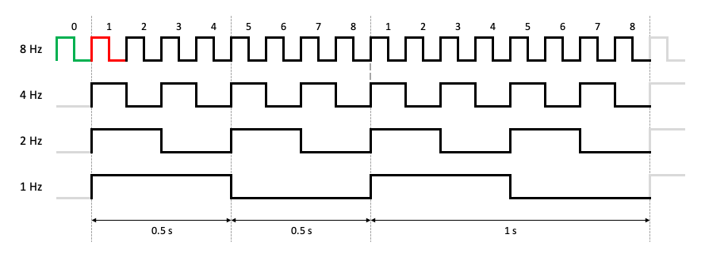
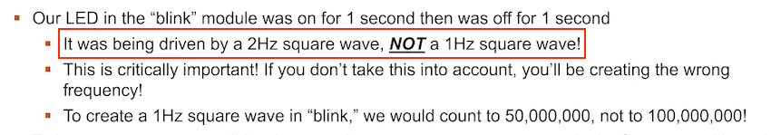
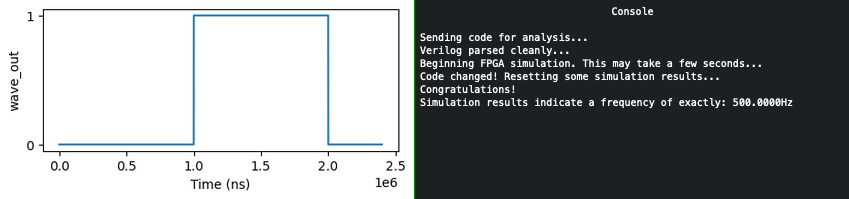
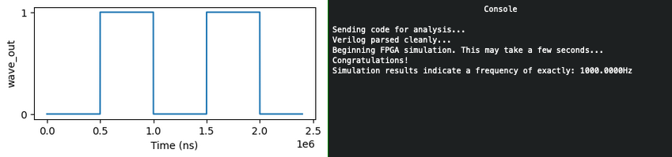
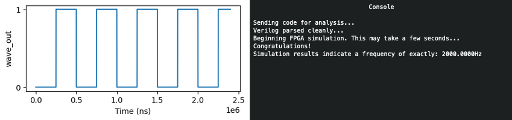
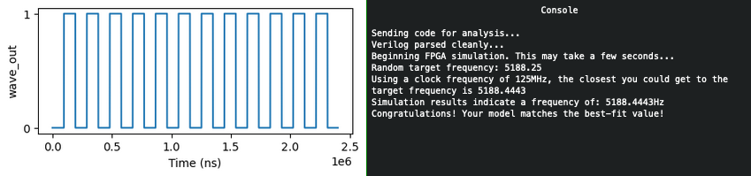
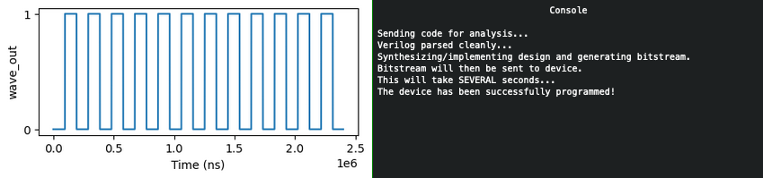

# FPGA Programming

**Difficulty**: :fontawesome-solid-star::fontawesome-solid-star::fontawesome-solid-star::fontawesome-solid-star::fontawesome-regular-star:<br/>
**Direct link**: [fpga website](https://fpga.jackfrosttower.com/?challenge=fpga&id=0c282692-27d5-41ea-b109-01de073c5fa8)<br/>
**Terminal hint**: [Frostavator](../hints/h13.md)


## Objective

!!! question "Request"
    Write your first FPGA program to make a doll sing. You might get some suggestions from Grody Goiterson, near Jack's elevator.

??? quote "Crunchy Squishter"
    Greetings Earthling! I'm Crunchy Squishter.<br/>
    Hey, could you help me get this device on the table working? We've cobbled it together with primitive parts we've found on your home planet.<br/>
    We need an FPGA though - and someone who knows how to program them.<br/>
    If you haven't talked with Grody Goiterson by the Frostavator, you might get some FPGA tips there.


## Hints

??? hint "FPGA Talk"
    Prof. Qwerty Petabyte is giving [a lesson](https://www.youtube.com/watch?v=GFdG1PJ4QjA) about Field Programmable Gate Arrays (FPGAs).

??? hint "FPGA for Fun"
    There are [FPGA enthusiast sites](https://www.fpga4fun.com/MusicBox.html).


## Solution

??? abstract "Welcome message"
    ```text
    EE/CS 302 - Exercise #4

    Hello, students! In exercise #4, we continue our FPGA journey, documenting the creation
    of the sound chip for this holiday season's new Kurse 'em Out Karen doll. Our goal is to
    make the doll say its trademark phrase. But, as I always tell you in class, we must walk
    before we run.

    Before the doll can say anything, we must first have it make noise. In this exercise you
    will design an FPGA module that creates a square wave tone at a variable frequency.

    Creating a square wave output takes our clock signal (which is also a square wave) and uses
    a counter to divide the clock to match the desired frequency. One tricky problem that we'll
    encounter is that Verilog (v1364-2005) doesn't have a built-in mechanism to round real
    numbers to integers, so you'll need to devise a means to do that correctly if you want your
    module to match frequencies accurately.

    Good luck and always remember:

    If $rtoi(real_no * 10) - ($rtoi(real_no) * 10) > 4, add 1
    ```


### Interval count

The solution follows both the blinky light example shown in Prof. Qwerty Petabyte's [presentation](https://www.youtube.com/watch?v=GFdG1PJ4QjA) as well as the [music box example](https://www.fpga4fun.com/MusicBox1.html) provided as a hint. The biggest difference is that our FPGA program needs to be able to generate any given output frequency. The looping and counting logic is largely the same however, except for 2 caveats.

??? info "Square waves have a 50% duty cycle"
    As noted by Prof. Petabyte towards the end of his [presentation](https://www.youtube.com/watch?v=GFdG1PJ4QjA), a square wave should have a half or 50% duty cycle, which means the high and low state of each cycle has to be of equal duration. In other words, if we want to generate a square output wave then we will need to count the same number of rising edges on the input clock before changing from high to low as we need to count before switching back from low to high.

The main problem we need to solve is determining how many rising edges we need to count before flipping the state of the output pin (i.e., high to low, low to high). Since the output frequency can vary, we need to come up with a suitable formula to calculate the interval. The [music box example](https://www.fpga4fun.com/MusicBox1.html) provides the answer, but let's use the image below to illustrate what we need to do.

{ class=border }

!!! warning "Minor mistake in Prof. Petabyte's presentation<span id="slide_mistake"></span>"
    The final slide in Prof. Petabytes's [presentation](https://www.youtube.com/watch?v=GFdG1PJ4QjA) contains a minor mistake. The LED in the *blink* module example wasn't being driven by a 2 Hz square wave. It was in fact a 0.5 Hz square wave, which the professor was [kind enough to confirm](https://twitter.com/QPetabyte/status/1474070594299777026). Such an awesome elf!

    { class=border }

Let's say we want to go from a 4 Hz (i.e., 4 rising edges per second) input to a 1 Hz output (i.e., 1 rising edge per second). First, we need to wait and count 2 rising edges from the 4 Hz signal before changing the output signal from high to low. Then we need to count 2 more before going back to high. In other words, between every transition of the output signal we need to count to 2.

If instead we're trying to go from 8 Hz to 4 Hz we have to count to 1 before each transition. In more general terms, to go from X rising edges per second (or Hz) to Y rising edges per second (or Hz) we need to count to X/Y/2 before flipping the state of the output. For the first example this means 4/1/2 or count to 2. For the second example this translates to 8/4/2 or count to 1.


### The program... and some caveats

Now that we know how to calculate the `interval` length we can write an FPGA program that [counts up](../tools/objectives/o13/kurseem-out-karen-countup.verilog) to `interval` or an alternative version that [counts down](../tools/objectives/o13/kurseem-out-karen-countdown.verilog) from `interval`, but as was noted previously there's 2 caveats. The first has to do with the `interval` calculation itself. To retain the highest possible precision all math should be performed with floats (lines 29-30) and the conversion to an integer should only be done on the final calculated result, using the rounding tip provided by Prof. Petabyte. 

Secondly, we need to ensure that a rising edge on the `rst` pin doesn't take away one count from the first  loop, as indicated by the red highlight in the image above. If a reset sets `counter` back to the same value our loop does (i.e., 1) then our first iteration will be one short by counting from 2 to `interval`. A reset needs to put us in the green state and change `counter` to 0 (line 42) in order for the first loop to also count from 1 to `interval`. 

!!! example "kurseem-out-karen-countup.verilog"
    ```verilog linenums="1" hl_lines="29-30 42"
    // Note: For this lab, we will be working with QRP Corporation's CQC-11 FPGA.
    // The CQC-11 operates with a 125MHz clock.
    // Your design for a tone generator must support the following 
    // inputs/outputs:
    // (NOTE: DO NOT CHANGE THE NAMES. OUR AUTOMATED GRADING TOOL
    // REQUIRES THE USE OF THESE NAMES!)
    // input clk - this will be connected to the 125MHz system clock
    // input rst - this will be connected to the system board's reset bus
    // input freq - a 32 bit integer indicating the required frequency
    //              (0 - 9999.99Hz) formatted as follows:
    //              32'hf1206 or 32'd987654 = 9876.54Hz
    // output wave_out - a square wave output of the desired frequency
    // you can create whatever other variables you need, but remember
    // to initialize them to something!

    `timescale 1ns/1ns
    module tone_generator (
        input clk,
        input rst,
        input [31:0] freq,
        output wave_out
    );
        // ---- DO NOT CHANGE THE CODE ABOVE THIS LINE ---- 
        // ---- IT IS NECESSARY FOR AUTOMATED ANALYSIS ----
        // TODO: Add your code below. 
        reg [31:0] counter;
        reg flip;
        assign wave_out = flip;
        real real_freq = freq/100.0;
        real real_interval = 125000000.0/real_freq/2.0;
        integer interval = 
            ($rtoi(real_interval * 10) - ($rtoi(real_interval) * 10) > 4)? 
            $rtoi(real_interval) + 1: $rtoi(real_interval);

        always @(posedge clk or posedge rst)
        begin
            if(rst==1)
                begin
                    // Reset to 0 so we can go from 1 to interval in each loop.
                    // If we reset to 1 as the loop does, that means our first loop would
                    // start at 2 and thus be one rising clock edge short.
                    counter <= 0;
                    flip <= 0;
                end
            else
                begin
                    if(counter == interval)
                        begin
                            counter <= 1;
                            flip <= ~flip;
                        end
                    else
                        begin
                            counter <= counter + 1;                       
                        end
                end
        end
    endmodule
    ```


### Running the simulations

=== "500 Hz"
    { class=border }

=== "1000 Hz"
    { class=border }

=== "2000 Hz"
    { class=border }

=== "Random"
    { class=border }

=== "Programmed"
    { class=border }

!!! done "Answer"
    Write an [FPGA program](../tools/objectives/o13/kurseem-out-karen-countup.verilog) which can generate any requested output frequency.
