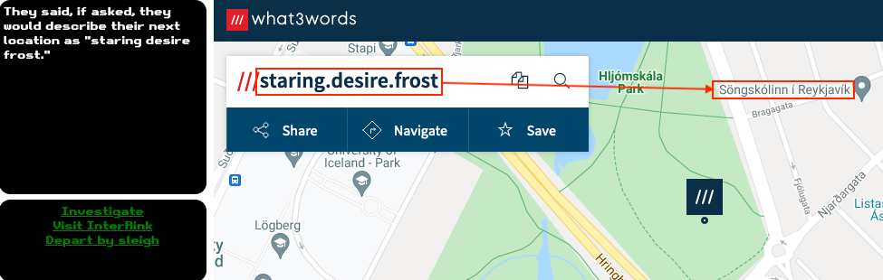
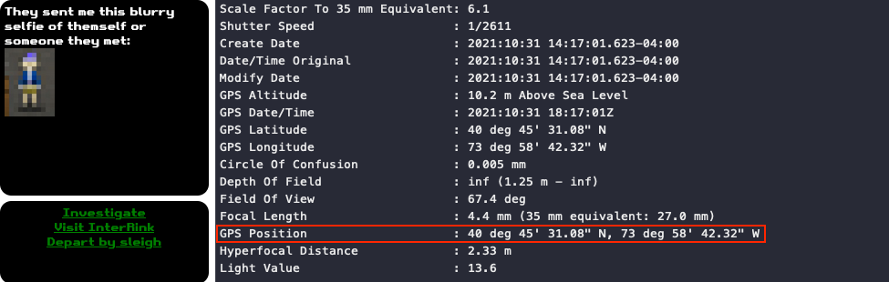
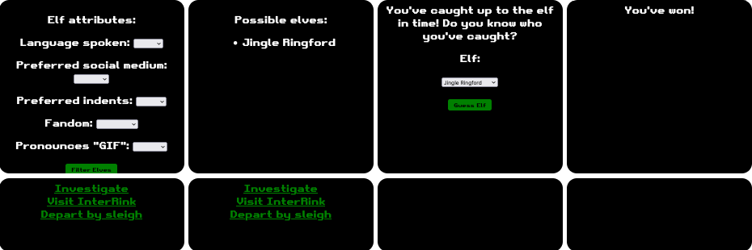
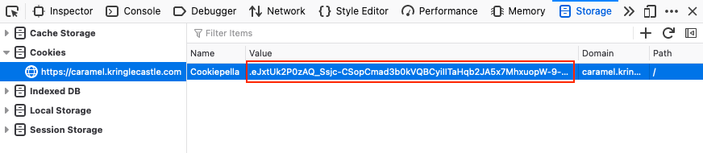
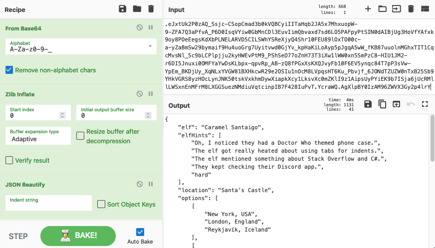

# Where in the World is Caramel Santaigo?

**Difficulty**: :fontawesome-solid-star::fontawesome-regular-star::fontawesome-regular-star::fontawesome-regular-star::fontawesome-regular-star: 
**Direct link**: [caramel website](https://caramel.kringlecastle.com?challenge=osint&id=fced6967-9a25-40fa-acd4-04a67888499e) 
**Terminal hint**: [Document Analysis](../hints/h2.md)

## Objective

!!! question "Request"
    Help Tangle Coalbox find a wayward elf in the Speaker Unpreparedness room. Talk to Piney Sappington in Santa's courtyard for hints.

??? quote "Tangle Coalbox"
    Hey there, Gumshoe. Tangle Coalbox here again. 
    I've got a real doozy of a case for you this year. 
    Turns out some elves have gone on some misdirected journeys around the globe. It seems that someone is messing with their travel plans. 
    We could sure use your open source intelligence (OSINT) skills to find them. 
    Why dontcha' log into this vintage Cranberry Pi terminal and see if you have what it takes to track them around the globe. 
    If you're having any trouble with it, you might ask Piney Sappington right over there for tips.

## Hints

??? hint "Coordinate Systems"
    Don't forget coordinate systems other than lat/long like [MGRS](https://en.wikipedia.org/wiki/Military_Grid_Reference_System) and [what3words](https://what3words.com/).

??? hint "Flask Cookies"
    While Flask cookies can't generally be forged without the secret, they can often be [decoded and read](https://gist.github.com/chriselgee/b9f1861dd9b99a8c1ed30066b25ff80b).

## Solution

The challenge is [a reference](../easter_eggs.md#where-in-the-world-is-carmen-sandiego) to the 1985 video game *Where in the World is Carmen Sandiego*. At each location you get 3 hints to help track the elf to their next location and find the elf's name by using the game's *InterRink* tool. Hints can either be location keywords which can be used with [what3words](https://what3words.com/), a blurry image from which you can extract GPS coordinates using `exiftool`, or specific elf attributes (e.g., language spoken, preferred social medium, fandom).

=== ":material-cloud-search: Using what3words"
    

=== ":material-file-marker: EXIF GPS coordinates"
    

=== ":material-account-filter: InterRink filtering"
    

!!! note "Cheating by using the cookie data"
    Alternatively you can decode the Flask cookie data and use the information to bypass all the OSINT research. Start by copying the `Cookiepella` Flask cookie data using your preferred web browser's developer tools.

    { class=border }

    Next, create a [CyberChef recipe](https://gchq.github.io/CyberChef/#recipe=From_Base64%28%27A-Za-z0-9-_%27%2Ctrue%29Zlib_Inflate%280%2C0%2C%27Adaptive%27%2Cfalse%2Cfalse%29JSON_Beautify%28%27%2520%2520%2520%2520%27%2Cfalse%29) which Base64 decodes (using a URL safe character set), zlib inflates, and cleans up the data. This will reveal a JSON string containing all the investigation hints, full itinerary, elf attributes, and even the elf's name.

    { class=border }

!!! done "Answer"
    Play the game or decode the `Cookiepella` cookie.
