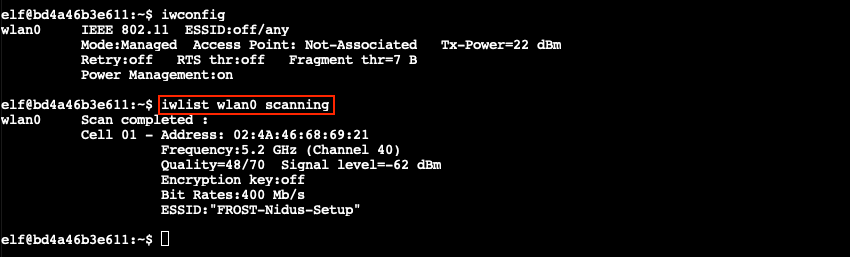
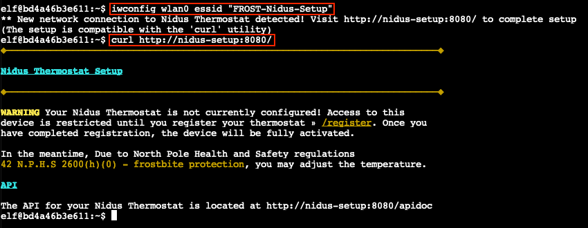
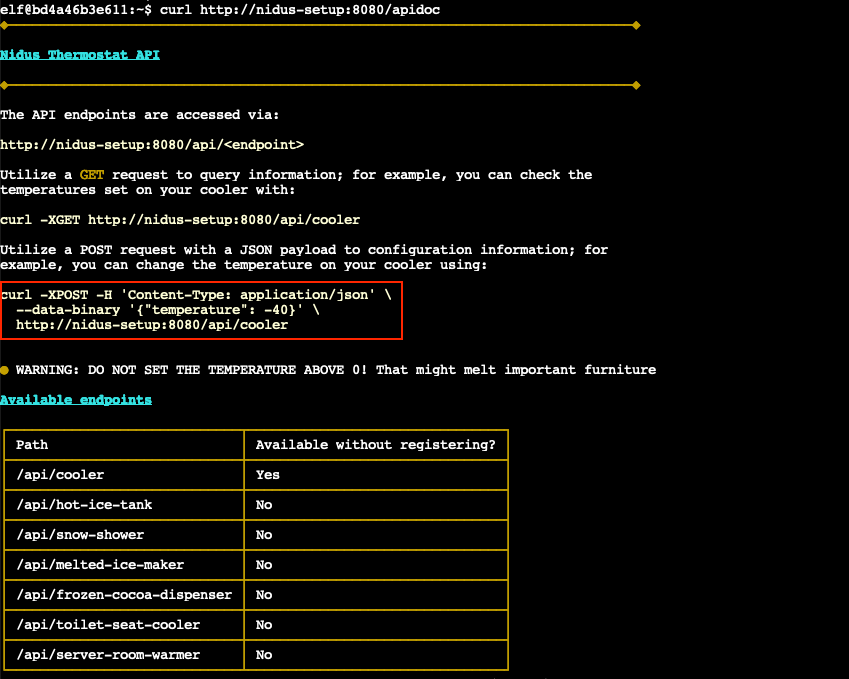
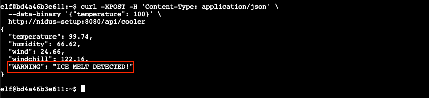

# Thaw Frost Tower's Entrance

**Difficulty**: :fontawesome-solid-star::fontawesome-solid-star::fontawesome-regular-star::fontawesome-regular-star::fontawesome-regular-star:<br/>
**Direct link**: [wifi terminal](https://docker2021.kringlecon.com/?challenge=wifi&id=44ba429d-cf86-4945-95c8-b1f31f69208f&area=approach&location=37,3)<br/>
**Terminal hint**: [Grepping for Gold](../hints/h3.md)


## Objective

!!! question "Request"
    Turn up the heat to defrost the entrance to Frost Tower. Click on the [Items](https://2021.kringlecon.com/badge?section=item) tab in your badge to find a link to the Wifi Dongle's CLI interface. Talk to Greasy GopherGuts outside the tower for tips.

??? quote "Grimy McTrollkins"
    Yo, I'm Grimy McTrollkins.<br/>
    I'm a troll and I work for the big guy over there: Jack Frost.<br/>
    I'd rather not be bothered talking with you, but I'm kind of in a bind and need your help.<br/>
    Jack Frost is so obsessed with icy cold that he accidentally froze shut the door to Frost Tower!<br/>
    I wonder if you can help me get back in.<br/>
    I think we can melt the door open if we can just get access to the thermostat inside the building.<br/>
    That thermostat uses Wi-Fi. And I'll bet you picked up a Wi-Fi adapter for your badge when you got to the North Pole.<br/>
    Click on your badge and go to the Items tab. There, you should see your Wi-Fi Dongle and a button to "Open Wi-Fi CLI." That'll give you command-line interface access to your badge's wireless capabilities.


## Hints

??? hint "Linux Wi-Fi Commands"
    The [iwlist](https://linux.die.net/man/8/iwlist) and [iwconfig](https://linux.die.net/man/8/iwconfig) utilities are key for managing Wi-Fi from the Linux command line.

??? hint "Web Browsing with cURL"
    [cURL](https://linux.die.net/man/1/curl) makes HTTP requests from a terminal - in Mac, Linux, and modern Windows!

??? hint "Adding Data to cURL requests"
    When sending a [POST request with data](https://www.educative.io/edpresso/how-to-perform-a-post-request-using-curl), add `--data-binary` to your `curl` command followed by the data you want to send.


## Solution

??? abstract "Welcome message"
    ```text
                            ATTENTION ALL ELVES

    In Santa's workshop (wireless division), we've been busy adding new Cranberry
    Pi features. We're proud to present an experimental version of the Cranberry
    Pi, now with Wi-Fi support!

    This beta version of the Cranberry Pi has Wi-Fi hardware and software
    support using the Linux wireless-tools package. This means you can use iwlist
    to search for Wi-Fi networks, and connect with iwconfig! Read the manual
    pages to learn more about these commands:

    man iwlist

    man iwconfig

    I'm afraid there aren't a lot of Wi-Fi networks in the North Pole yet, but if
    you keep scanning maybe you'll find something interesting.

                                                    - Sparkle Redberry
    ```

Stand next to Grimy McTrollkins and the thermostat and open up the [WiFi CLI](https://docker2021.kringlecon.com/?challenge=wifi&id=44ba429d-cf86-4945-95c8-b1f31f69208f&area=approach&location=37,3). Run `iwconfig` to show a list of available wireless devices, followed by `iwlist wlan0 scanning` to scan for nearby wireless networks to connect to using the `wlan0` device.



Looks like there's a wireless network called *FROST-Nidus-Setup* in the area. Connect to it using `iwconfig wlan0 essid "FROST-Nidus-Setup"` and complete the setup as instructed by running `curl http://nidus-setup:8080/`. 



Ignore the registration message and retrieve the API documentation by running `curl http://nidus-setup:8080/apidoc`. The `/api/cooler` endpoint is available even without registration and the final `curl` example provides the answer.



To solve the challenge, use `curl` to submit a POST request to the `/api/cooler` API endpoint, using a positive temperature. The thermostat will respond with a warning message stating *"ICE MELT DETECTED!"*.



!!! done "Answer"
    Set the thermostat to a positive temperature using the `/api/cooler` API endpoint.

!!! note "Backend WiFi logic<span id="backend-wifi-logic"></span>"
    For those wondering, there doesn't appear to be any other wireless networks you can connect to, but grepping for *FROST-Nidus-Setup* across all files in the wifi terminal challenge will lead you to [`/var/lib/apiserver/lib/app.rb`](../artifacts/objectives/o3/app.rb). This Ruby file contains the backend logic and includes a cool *secret* message.

    ``` title="A message from Ron Bowes"
    # If you've found this..... shhhhhhh, it's the secret behind-the-scenes stuff.
    # You don't need it to finish the challenge, but you're welcome to poke around.
    #
    # The fun part is, you can see how "runtoanswer" is executed! You can't do much
    # with it besides complete the challenge... probably. If you do find out more,
    # it'd be cool to hear!
    #
    # I maybe should have created all this as a separate user and ran the server
    # with `sudo`, but /shrug. If you find this, enjoy peeking behind the scenes!
    #
    # As a super special bonus challenge, can you figure out how the iwconfig /
    # iwlist tricks work? I'm pretty proud of it! The stuff I did also works for
    # NetworkManager / nmcli / wpa_supplicant on a VM, but getting them all working
    # together (with dbus) in a container didn't work out, sadly.
    #
    # Cheers!
    # -Ron and Counter Hack
    ```
    
    The presence of the `wlan0` network device is emulated via a custom `/lib/iwhook.so` library which is loaded when the user logs into the terminal via an `export LD_PRELOAD=/lib/iwhook.so` statement in the `/home/elf/.bashrc` file. The `iwhook.so` library will intercept all I/O and send back an emulated response to tools like `iwlist` and `iwconfig` that try to interact with the wireless device.
