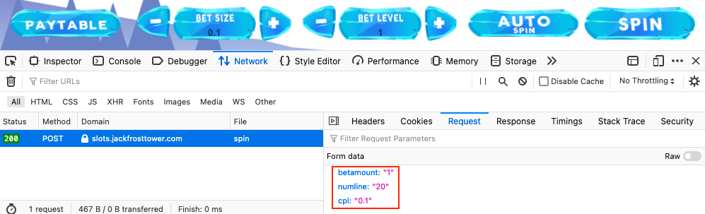

# Slot Machine Investigation

**Difficulty**: :fontawesome-solid-star::fontawesome-solid-star::fontawesome-regular-star::fontawesome-regular-star::fontawesome-regular-star: 
**Direct link**: [slots website](https://slots.jackfrosttower.com/) 
**Terminal hint**: [Logic Munchers](../hints/h4.md)

## Objective

!!! question "Request"
    Test the security of Jack Frost's [slot machines](https://slots.jackfrosttower.com/). What does the Jack Frost Tower casino security team threaten to do when your coin total exceeds 1000? Submit the string in the server data.response element. Talk to Noel Boetie outside Santa's Castle for help.

??? quote "Hubris Selfington"
    Snarf. Hrung. Phlthth. 
    I'm Hubris Selfington. 
    The big boss told me he's worried about vulnerabilities in his slot machines, especially this one. 
    Statistically speaking, it seems to be paying out way too much. 
    He asked me to see if there are any security flaws in it. 
    The boss has HUGE plans and we've gotta make sure we are running a tight ship here at Frost Tower. 
    Can you help me find the issue? 
    I mean, I could TOTALLY do this on my own, but I want to give you a chance first.

## Hints

??? hint "Intercepting Proxies"
    Web application testers can use tools like [Burp Suite](https://portswigger.net/burp/communitydownload) or even right in the browser with Firefox's [Edit and Resend](https://itectec.com/superuser/how-to-edit-parameters-sent-through-a-form-on-the-firebug-console/) feature.

??? hint "Parameter Tampering"
    It seems they're susceptible to [parameter tampering](https://owasp.org/www-community/attacks/Web_Parameter_Tampering).

## Solution

As the hints suggest, the slot machines are susceptable to parameter tampering which we can exploit by resending legitimate POST requests with modified values. Open up your web browser's developer tools on the *Network* tab and press the *Spin* button in the game to send a POST request containing a `betamount`, `numline`, and `cpl` parameter.

{: class=border }

Next, right click the POST request in the *Network* tab and select *Edit and Resend* to open up a form which allows you to modify all aspects of the original request, including the URL, request method, request headers, and request body.

{: class=border }

Finding the right parameter to tamper with requires a bit of trial and error. Entering a large enough negative value for the `numline` parameter will push your credit over 1000 though and result in a threatening message from the casino security team. 

{: class=border }

!!! done "Answer"
    I'm going to have some bouncer trolls bounce you right out of this casino!
