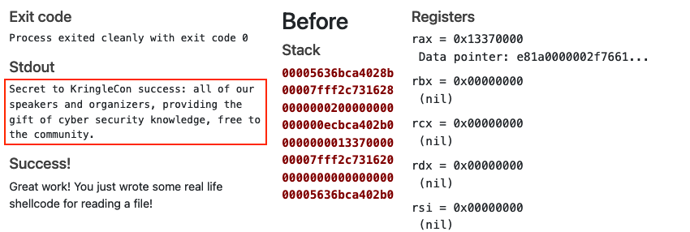

# Shellcode Primer

**Difficulty**: :fontawesome-solid-star::fontawesome-solid-star::fontawesome-solid-star::fontawesome-regular-star::fontawesome-regular-star:<br/>
**Direct link**: [tracer website](https://tracer.kringlecastle.com/)<br/>
**Terminal hint**: [Holiday Hero](../hints/h6.md)


## Objective

!!! question "Request"
    Complete the [Shellcode Primer](https://tracer.kringlecastle.com/) in Jack's office. According to the last challenge, what is the secret to KringleCon success? "All of our speakers and organizers, providing the gift of ____, free to the community." Talk to Chimney Scissorsticks in the NetWars area for hints.

??? quote "Ruby Cyster"
    Hey, I'm Ruby Cyster. Don't listen to anything my sister, Ingreta, says about me.<br/>
    So I'm looking at this system, and it has me a little bit worried.<br/>
    If I didn't know better, I'd say someone here is learning how to hack North Pole systems.<br/>
    Who's got that kind of nerve!<br/>
    Anyway, I hear some elf on the other roof knows a bit about this type of thing.


## Hints

??? hint "Shellcode Primer Primer"
    If you run into any shellcode primers at the North Pole, be sure to read the directions and the comments in the shellcode source!

??? hint "Debugging Shellcode"
    Also, troubleshooting shellcode can be difficult. Use the debugger step-by-step feature to watch values.

??? hint "Register Stomping"
    Lastly, be careful not to overwrite any register values you need to reference later on in your shellcode.


## Solution

Solving this challenge is simply a matter of following the instructions to progress through each of the 11 tutorial sections. The last step, writing shellcode which reads [`/var/northpolesecrets.txt`](../artifacts/objectives/o6/northpolesecrets.txt) and prints the contents to stdout, provides the answer. To keep the page length to a minimum, all but the final solution are collapsed by default.

??? info "1. Introduction"
    ```assembly linenums="1"
    ; Set up some registers (sorta like variables) with values
    ; In the debugger, look how these change!
    mov rax, 0
    mov rbx, 1
    mov rcx, 2
    mov rdx, 3
    mov rsi, 4
    mov rdi, 5
    mov rbp, 6

    ; Push and pop - watch how the stack changes!
    push 0x12345678
    pop rax

    push 0x1111
    push 0x2222
    push 0x3333
    pop rax
    pop rax
    pop rax

    ; This creates a string and references it in rax - watch the debugger!
    call getstring
    db "Hello World!",0
    getstring:
    pop rax

    ; Finally, return 0x1337
    mov rax, 0x1337
    ret
    ```

??? info "2. Loops"
    ```assembly linenums="1"
    ; We want to loop 5 times - you can change this if you want!
    mov rax, 5

    ; Top of the loop
    top:
    ; Decrement rax
    dec rax

    ; Jump back to the top until rax is zero
    jnz top

    ; Cleanly return after the loop
    ret
    ```

??? done "3. Getting Started"
    ```assembly linenums="1"
    ; This is a comment! We'll use comments to help guide your journey.
    ; Right now, we just need to RETurn!
    ;
    ; Enter a return statement below and hit Execute to see what happens!
    ret
    ```

??? done "4. Returning a Value"
    ```assembly linenums="1"
    ; TODO: Set rax to 1337
    mov rax, 1337

    ; Return, just like we did last time
    ret
    ```

??? done "5. System Calls"
    ```assembly linenums="1"
    ; TODO: Find the syscall number for sys_exit and put it in rax
    mov rax, 60  ; sys_exit is syscal 60

    ; TODO: Put the exit_code we want (99) in rdi
    mov rdi, 99

    ; Perform the actual syscall
    syscall
    ```

??? done "6. Calling the Void" 
    ```assembly linenums="1"
    ; Push this value to the stack
    push 0x12345678

    ; Try to return
    ret
    ```

??? done "7. Getting RIP" 
    ```assembly linenums="1"
    ; Remember, this call pushes the return address to the stack
    call place_below_the_nop

    ; This is where the function *thinks* it is supposed to return
    nop

    ; This is a 'label' - as far as the call knows, this is the start of a function
    place_below_the_nop:

    ; TODO: Pop the top of the stack into rax
    pop rax

    ; Return from our code, as in previous levels
    ret
    ```

??? done "8. Hello, World!"
    ```assembly linenums="1"
    ; This would be a good place for a call
    call get_address

    ; This is the literal string 'Hello World', null terminated, as code. Except
    ; it'll crash if it actually tries to run, so we'd better jump over it!
    db 'Hello World',0

    ; This would be a good place for a label and a pop
    get_address:
    pop rax

    ; This would be a good place for a re... oh wait, it's already here. Hooray!
    ret
    ```

??? done "9. Hello World!!"
    ```assembly linenums="1"
    ; TODO: Get a reference to this string into the correct register
    call print_helloworld  ; push the address of the string to the stack
    db 'Hello World!',0

    ; Jump over the string to this label
    print_helloworld:

    ; Set up a call to sys_write
    ; TODO: Set rax to the correct syscall number for sys_write
    mov rax, 1  ; sys_write is syscall 1

    ; TODO: Set rdi to the first argument (the file descriptor, 1)
    mov rdi, 1

    ; TODO: Set rsi to the second argument (buf - this is the "Hello World" string)
    pop rsi  ; pop the string address from the stack into rsi

    ; TODO: Set rdx to the third argument (length of the string, in bytes)
    mov rdx, 12

    ; Perform the syscall
    syscall

    ; Return cleanly
    ret
    ```

??? done "10. Opening a File"
    ```assembly linenums="1"
    ; TODO: Get a reference to this string into the correct register
    call open_file  ; push the address of the string to the stack
    db '/etc/passwd',0

    ; Jump over the string to this label
    open_file:

    ; Set up a call to sys_open
    ; TODO: Set rax to the correct syscall number
    mov rax, 2  ; sys_open is syscall 2

    ; TODO: Set rdi to the first argument (the filename)
    pop rdi  ; pop the string address from the stack into rdi

    ; TODO: Set rsi to the second argument (flags - 0 is fine)
    mov rsi, 0

    ; TODO: Set rdx to the third argument (mode - 0 is also fine)
    mov rdx, 0

    ; Perform the syscall
    syscall

    ; syscall sets rax to the file handle, so to return the file handle we don't
    ; need to do anything else!
    ret
    ```

!!! done "11. Reading a File"
    ```assembly linenums="1"
    ; TODO: Get a reference to this
    call read_file  ; push the address of the string to the stack
    db '/var/northpolesecrets.txt',0

    ; Jump over the string to this label
    read_file:

    ; TODO: Call sys_open
    pop rdi       ; pop the string address from the stack into rdi
    mov rax, 2    ; sys_open is syscall 2
    mov rsi, 0    ; set rsi to 0
    mov rdx, 0    ; set rdx to 0
    syscall

    ; TODO: Call sys_read on the file handle and read it into rsp
    mov rdi, rax   ; set rdi to the file handle which is now in rax
    mov rax, 0     ; sys_read is syscall 0
    mov rsi, rsp   ; use rsp for the buffer
    mov rdx, 1024  ; read 1024 bytes
    syscall

    ; TODO: Call sys_write to write the contents from rsp to stdout (1)
    mov rdx, rax   ; set rdx to the number of actual bytes read by sys_read
    mov rax, 1     ; sys_write is syscall 1
    mov rdi, 1     ; set rdi to file descriptor 1 or stdout
    mov rsi, rsp   ; use rsp for the buffer
    syscall

    ; TODO: Call sys_exit
    mov rax, 60  ; sys_exit is syscall 60
    mov rdi, 0   ; exit code
    syscall
    ```

{: class=border }

!!! done "Answer"
    cyber security knowledge
