# Splunk!

**Difficulty**: :fontawesome-solid-star::fontawesome-solid-star::fontawesome-solid-star::fontawesome-regular-star::fontawesome-regular-star:<br/>
**Direct link**: [bossworkshops website](https://hhc21.bossworkshops.io/en-US/account/insecurelogin?username=user&password=kringlecon)<br/>
**Terminal hint**: [Yara Analysis](../hints/h9.md)


## Objective

!!! question "Request"
    Help Angel Candysalt solve the Splunk challenge in Santa's great hall. Fitzy Shortstack is in Santa's lobby, and he knows a few things about Splunk. What does Santa call you when when you complete the analysis?

??? quote "Angel Candysalt"
    Greetings North Pole visitor! I'm Angel Candysalt!<br/>
    A euphemism? No, that's my name. Why do people ask me that?<br/>
    Anywho, I'm back at Santa's Splunk terminal again this year.<br/>
    There's always more to learn!<br/>
    Take a look and see what you can find this year.<br/>
    With who-knows-what going on next door, it never hurts to have sharp SIEM skills!<br/>


## Hints

??? hint "GitHub Monitoring in Splunk"
    Between GitHub audit log and webhook event recording, you can monitor all activity in a repository, including common `git` commands such as `git add`, `git status`, and `git commit`.

??? hint "Sysmon Monitoring in Splunk"
    Sysmon network events don't reveal the process parent ID for example. Fortunately, we can pivot with a query to investigate process creation events once you get a process ID.

??? hint "Malicious NetCat??"
    Did you know there are multiple versions of the Netcat command that can be used maliciously? `nc.openbsd`, for example.


## Solution

### Task 1

!!! question "Question"
    Capture the commands Eddie ran most often, starting with git. Looking only at his process launches as reported by Sysmon, record the most common git-related CommandLine that Eddie seemed to use. 

If you ignore the `docker ps` top result, the [4th sample Splunk search](https://hhc21.bossworkshops.io/en-US/app/SA-hhc/search?q=search%20index%3Dmain%20sourcetype%3Djournald%20source%3DJournald%3AMicrosoft-Windows-Sysmon%2FOperational%20EventCode%3D1%20user%3Deddie%20%0A%7C%20stats%20count%20by%20CommandLine%20%0A%7C%20sort%20-%20count) we're provided pretty much answers this question. To narrow down the results to just git-related command lines however, we can either use the `Image` or the `CommandLine` field (line 3).

```splunk linenums="1" hl_lines="3" title="Splunk search query"
index=main sourcetype=journald source=Journald:Microsoft-Windows-Sysmon/Operational
| where EventCode=1 and user="eddie"
| where Image like "%git%"
| stats count by Image CommandLine
| sort - count
```

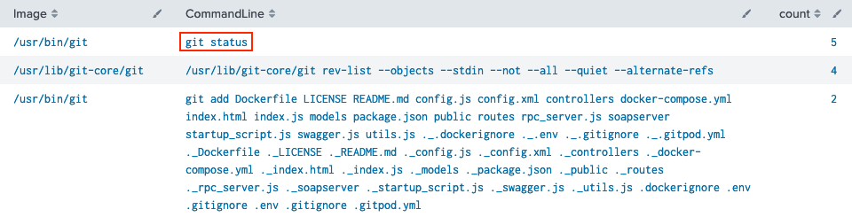{ class=border }

!!! done "Answer"
    `git status`


### Task 2

!!! question "Question"
    Looking through the git commands Eddie ran, determine the remote repository that he configured as the origin for the 'partnerapi' repo. The correct one!

This question expands on the previous search query. We search for [Sysmon Event ID 1](https://ossemproject.com/dd/dictionaries/linux/sysmon/event-1.html) process creation events, but this time filter not only on binary names that match *git* but also require the command line to contain *partnerapi* (line 3). Inverting the sort order by using `- _time` puts the most recent and correct `git remote add` command at the top.

```splunk linenums="1" hl_lines="3" title="Splunk search query"
index=main sourcetype=journald source=Journald:Microsoft-Windows-Sysmon/Operational
| where EventCode=1 and user="eddie"
| where Image like "%git%" and CommandLine like "%partnerapi%"
| sort - _time
| table _time CommandLine
```

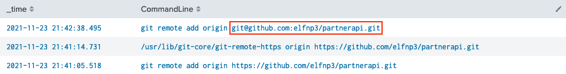{ class=border }

!!! done "Answer"
    git@github.com:elfnp3/partnerapi.git


### Task 3

!!! question "Question"
    The 'partnerapi' project that Eddie worked on uses Docker. Gather the full docker command line that Eddie used to start the 'partnerapi' project on his workstation.

Once again we can reuse much of the Splunk query we've been working with so far. Instead of looking for `git` commands however, we now pivot to `docker` commands (line 3). Sorting by process execution time returns an ordered timeline which tells us that the first `docker` command run after any activity related to *partnerapi* is `docker compose up`.

```splunk linenums="1" hl_lines="3" title="Splunk search query"
index=main sourcetype=journald source=Journald:Microsoft-Windows-Sysmon/Operational
| where EventCode=1 and user="eddie"
| where Image like "%docker%" or CommandLine like "%partnerapi%"
| sort _time
| table _time CommandLine
```

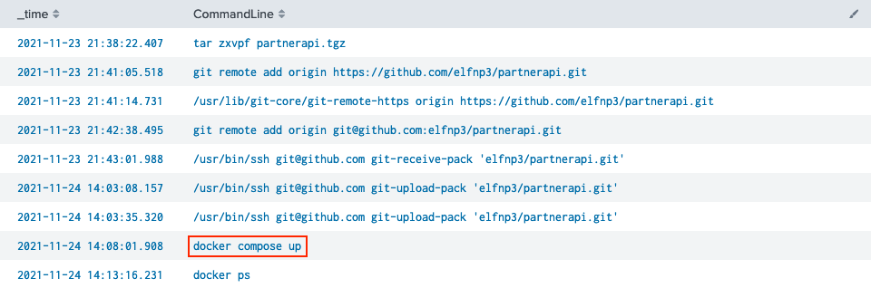{ class=border }

!!! done "Answer"
    `docker compose up`


### Task 4

!!! question "Question"
    Eddie had been testing automated static application security testing (SAST) in GitHub. Vulnerability reports have been coming into Splunk in JSON format via GitHub webhooks. Search all the events in the main index in Splunk and use the sourcetype field to locate these reports. Determine the URL of the vulnerable GitHub repository that the elves cloned for testing and document it here. You will need to search outside of Splunk (try GitHub) for the original name of the repository.

To answer this question we need to pivot to the *github_json* source type. Use the fields in the left sidebar to find a suitable candidate like `repository.html_url`. Clicking the field name will pop up a dialog containing all possible values.

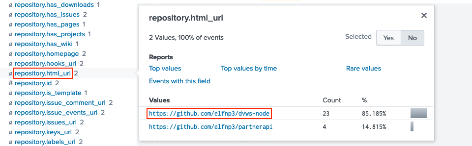{ class=border }

We already know about [https://github.com/elfnp3/partnerapi](https://github.com/elfnp3/partnerapi), so we focus on the [https://github.com/elfnp3/dvws-node](https://github.com/elfnp3/dvws-node) repository which, upon closer inspection, appears to have been cloned from [https://github.com/snoopysecurity/dvws-node](https://github.com/snoopysecurity/dvws-node).

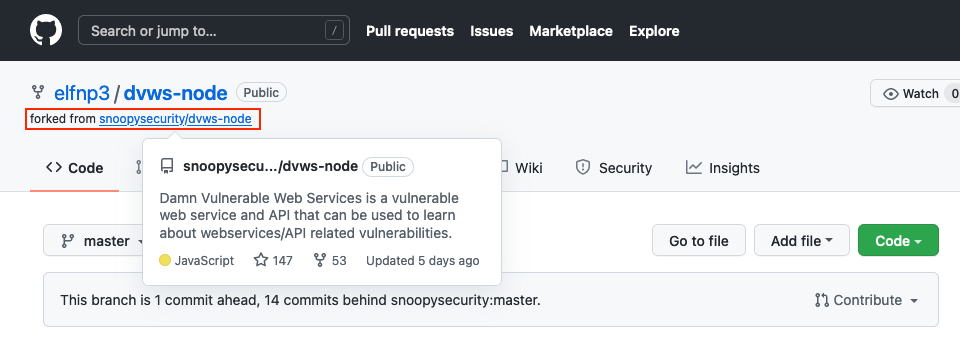{ class=border }

!!! done "Answer"
    [https://github.com/snoopysecurity/dvws-node](https://github.com/snoopysecurity/dvws-node)


### Task 5

!!! question "Question"
    Santa asked Eddie to add a JavaScript library from NPM to the 'partnerapi' project. Determine the name of the library and record it here for our workshop documentation.

Back to [Sysmon Event ID 1](https://ossemproject.com/dd/dictionaries/linux/sysmon/event-1.html) process creation events we go! Searching for any command lines containing *git commit* or *npm install* (line 3) returns a timeline of relevant process activity, neatly sorted from oldest to newest. The log message in the final command provides the library name we're looking for, `holiday-utils-js`.

```splunk linenums="1" hl_lines="3" title="Splunk search query"
index=main sourcetype=journald source=Journald:Microsoft-Windows-Sysmon/Operational
| where EventCode=1 and user="eddie"
| search CommandLine IN ("*git commit*", "*npm install*")
| sort _time
| table _time CommandLine
```

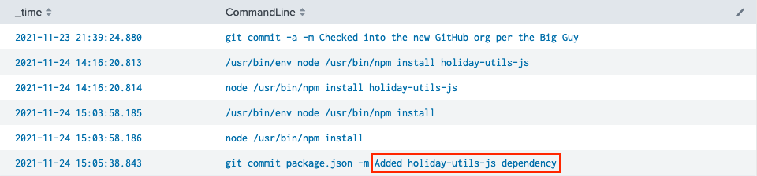{ class=border }

!!! done "Answer"
    `holiday-utils-js`


### Task 6

!!! question "Question"
    Another elf started gathering a baseline of the network activity that Eddie generated. Start with [their search](https://hhc21.bossworkshops.io/en-US/app/SA-hhc/search?q=search%20index%3Dmain%20sourcetype%3Djournald%20source%3DJournald%3AMicrosoft-Windows-Sysmon%2FOperational%20EventCode%3D3%20user%3Deddie%20NOT%20dest_ip%20IN%20(127.0.0.*)%20NOT%20dest_port%20IN%20(22%2C53%2C80%2C443)%20%0A%7C%20stats%20count%20by%20dest_ip%20dest_port&display.page.search.mode=smart&dispatch.sample_ratio=1&workload_pool=&earliest=0&latest=now) and capture the full process_name field of anything that looks suspicious.

We switch from [Sysmon Event ID 1](https://ossemproject.com/dd/dictionaries/linux/sysmon/event-1.html) process creation events to [Sysmon Event ID 3](https://ossemproject.com/dd/dictionaries/linux/sysmon/event-3.html) network events. The only thing we have to change in the provided query is the final line and count by `process_name` instead of `dest_ip` and `dest_port` (line 5).

```splunk linenums="1" hl_lines="5" title="Splunk search query"
index=main sourcetype=journald source=Journald:Microsoft-Windows-Sysmon/Operational
| where EventCode=3 and user="eddie" 
| where NOT dest_ip like ("127.0.0.%")
| where NOT dest_port IN (22,53,80,443)
| stats count by process_name
```

Would you look at that! If it isn't the reverse shell's best buddy, [netcat](https://www.infosecademy.com/netcat-reverse-shells/)! :thinking_face:

{ class=border }

!!! done "Answer"
    `/usr/bin/nc.openbsd`


### Task 7

!!! question "Question"
    Uh oh. This documentation exercise just turned into an investigation. Starting with the process identified in the previous task, look for additional suspicious commands launched by the same parent process. One thing to know about these Sysmon events is that Network connection events don't indicate the parent process ID, but Process creation events do! Determine the number of files that were accessed by a related process and record it here.

Now that we've identified suspicious activity we can expand our Splunk searches to all users and confirm this isn't happening on any other hosts. We start by searching for `/usr/bin/nc.openbsd` process details (line 3) and print the parent process ID.

```splunk linenums="1" hl_lines="3" title="Splunk search query"
index=main sourcetype=journald source=Journald:Microsoft-Windows-Sysmon/Operational
| where EventCode=1
| where Image="/usr/bin/nc.openbsd"
| table Image CommandLine ParentImage ParentProcessId 
```

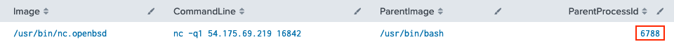{ class=border }

Next, we use process ID 6788 to search for any other processes that have the same parent process ID (line 3).

```splunk linenums="1" hl_lines="3" title="Splunk search query"
index=main sourcetype=journald source=Journald:Microsoft-Windows-Sysmon/Operational
| where EventCode=1
| where ParentProcessId=6788
| table Image CommandLine ParentProcessId
```

It looks like 6 different files were accessed using a single `cat` command.

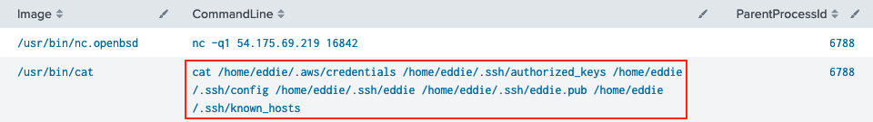{ class=border }

!!! done "Answer"
    6


### Task 8

!!! question "Question"
    Use Splunk and Sysmon Process creation data to identify the name of the Bash script that accessed sensitive files and (likely) transmitted them to a remote IP address. 

The final task is similar to the previous one. We need to move up the process tree by alternating our searches between finding the parent process ID for the current process and using that value as the input for the next search, and the next, etc. Start with process ID 6788 from the previous task (line 3). 

```splunk linenums="1" hl_lines="3" title="Splunk search query"
index=main sourcetype=journald source=Journald:Microsoft-Windows-Sysmon/Operational
| where EventCode=1
| where ProcessId=6788
| table Image ProcessId CommandLine ParentImage ParentProcessId
```

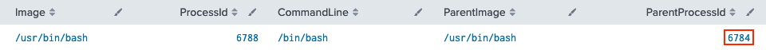{ class=border }

Use process ID 6784 as input for the next search and grab its parent process ID (line 3).

```splunk linenums="1" hl_lines="3" title="Splunk search query"
index=main sourcetype=journald source=Journald:Microsoft-Windows-Sysmon/Operational
| where EventCode=1
| where ProcessId=6784
| table Image ProcessId CommandLine ParentImage ParentProcessId
```

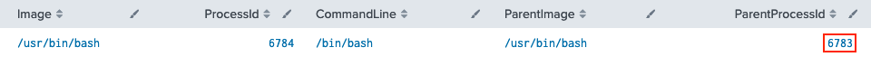{ class=border }

A final search for process ID 6783 gives us the `preinstall.sh` Bash script we're looking for!

```splunk linenums="1" hl_lines="3" title="Splunk search query"
index=main sourcetype=journald source=Journald:Microsoft-Windows-Sysmon/Operational
| where EventCode=1
| where ProcessId=6783
| table Image ProcessId CommandLine ParentImage ParentProcessId
```

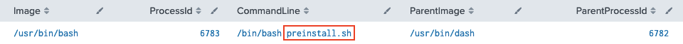{ class=border }

!!! done "Answer"
    `preinstall.sh`


### Gee whiz, we made it!

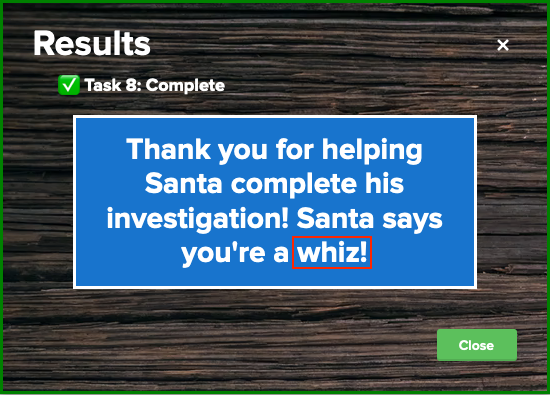{ class=border }

!!! done "Answer"
    whiz
